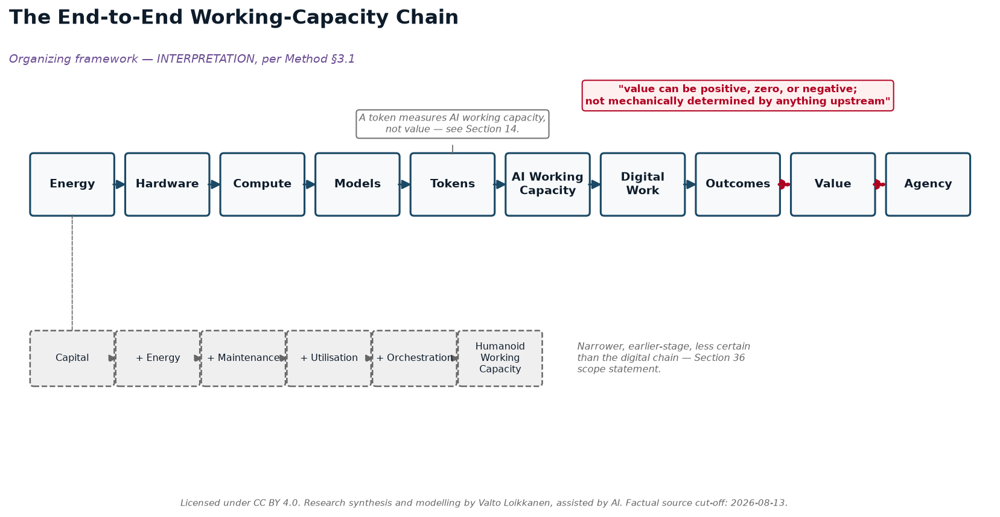

# Miksi tekoälyyn investoidaan biljoonia?

### Luvut ja talous tekoälyn työkapasiteetin vallankumouksen takana — sähköstä ja infrastruktuurista tokeneihin, robotteihin, arvoon, omistukseen ja toimijuuteen.

**Kirjoittaja:** Valto Loikkanen
**Tila:** v1.0 tutkimuspaketti
**Tutkimus aloitettu:** 12. elokuuta 2026
**Faktapohjan katkopäivä:** 2026-08-13
**Lisenssi:** CC BY 4.0 — Attribution 4.0 International, kattaen tämän paperin alkuperäisen tekstin, kaaviot ja mallirakenteen. Lukijat voivat kopioida, jakaa uudelleen, remiksata, mukauttaa ja rakentaa tämän materiaalin päälle mihin tahansa tarkoitukseen, myös kommersiaalisesti, kunhan lähde mainitaan. **Tämä lisenssi ei koske** lainattuja kolmannen osapuolen lausuntoja, kolmannen osapuolen yritysten/tuotteiden nimiä ja logoja, tai kolmannen osapuolen ulkoisista lähteistä siteerattua dataa — katso `LICENSE` repositorion juuresta täydellistä laajuusmäärittelyä varten.
**Suositeltu attribuutio:** "Tutkimussynteesi ja mallinnus: Valto Loikkanen, tekoälyn avustuksella."
**Suositeltu viittaustapa:** katso `CITATION.cff` repositorion juuresta.

---

## Sisällysluettelo

- Etumateriaali (osiot 1-5)
- Osa I — Kysymys tekoälybuumin takana (osiot 6-9)
- Osa II — Ensimmäiset periaatteet: energiasta tokeneihin (osiot 10-15)
- Osa III — Tokeneista työkapasiteettiin (osiot 16-20)
- Osa IV — Arvo, informaatio ja johtajuus (osiot 21-25)
- Käsitteellinen silta — Tekoälytyökapasiteetista uuteen arvoon (numeroimaton, osien IV ja V välissä)
- Osa V — Omistus, pääsy ja mahdolliset markkinarakenteet (osiot 26-30)
- Osa VI — Skaalaskenaariot ja konkreettiset esimerkit (osiot 31-36)
- Osa VII — Mitä tämä voi tarkoittaa eri lukijoille (osiot 37-42)
- Päätäntö (osiot 43-45)

---

## 1. Tiivistelmä

Vuodesta 2023 lähtien, ja jyrkästi vuodesta 2025–2026 lähtien, pieni joukko yrityksiä, johtajia ja rahoituslaitoksia on sitoutunut satoihin miljardeihin — ja nyt, omien julkilausuttujen ambitioidensa mukaan, potentiaalisesti biljooniin — dollareihin tekoälyinfrastruktuuria varten: siruihin, datakeskuksiin, sähkösopimuksiin ja niitä tukeviin rahoitusrakenteisiin. Tämän paperin varsinainen kysymys ei ole "onko tämä kupla" — se on **mitä pitäisi olla totta, jotta tämä kulutus olisi taloudellisesti järkevää, ja kuinka suuri osa siitä on itsenäisesti tarkistettavissa tänään versus vain väitettyä sellaisten tahojen taholta, jotka hyötyvät siitä, että asiaan uskotaan.** Tämä paperi jäljittää rahan ja sen takana olevan logiikan, yhden todennettavan kerroksen kerrallaan, olettamatta kummankaan puolen — että se olisi ilmiselvästi perusteltua tai ilmiselvästi kupla — pitävän paikkaansa.

Ketju kulkee: **sähkö → laitteisto → laskenta → mallit → tokenit → tekoälytyökapasiteetti → digitaalinen työ → tulokset → arvo → toimijuus.** Kukin nuoli on todellinen muunnos, jolla on omat kustannuksensa ja oma epävarmuutensa. Sähkö muuttuu käytettäväksi vasta, kun se käynnistää sirut; sirut merkitsevät vasta, kun ne ajavat malleja; mallit merkitsevät vasta, kun ne tuottavat tokeneita; tokenit merkitsevät vasta, kun ne on organisoitu työkapasiteetiksi — kyky saada jotain oikeasti aikaan, jota muotoilevat mallin suorituskyky, infrastruktuuri, informaatio/konteksti, työkalut, orkestrointi, luotettavuus ja ihmisen ohjaus. Työkapasiteetti merkitsee vasta, kun se on kohdistettu todelliseen työhön; ja — tämä on askel, jonka useimmat ennusteet ohittavat — työ merkitsee vasta, kun se tuottaa jonkun kannalta arvokkaan *tuloksen*. Arvo ei ole aiempien askelten mekaaninen ulostulo. Se voi olla positiivinen, nolla tai negatiivinen, ja mikään määrä halpaa laskentaa ei muuta sitä.

Fyysiselle työlle on syntymässä rinnakkainen ketju: **pääoma + energia + huolto + käyttöaste + orkestrointi → humanoidirobottien fyysinen työkapasiteetti** — samaa logiikkaa sovellettuna robotteihin tokenien sijaan, huomattavasti aikaisemmassa ja epävarmemmassa kommersiaalisen kypsyyden vaiheessa, kuten Osassa V tarkastellaan.



Tässä koottujen lukujen perusteella (Osasta I eteenpäin) otsikkotason rahoitussitoumukset ovat todellisia ja itsenäisesti vahvistettuja: 10. elokuuta 2026 Nvidia ja kuusi rahoituslaitosta — Apollo, Blackstone, BlackRock, Brookfield, Goldman Sachs ja KKR — ilmoittivat rahoitusalustoista, joiden tarkoitus on mobilisoida yli 500 miljardia dollaria [HAVAITTU FAKTA] kolmannen osapuolen pääomaa tekoälyinfrastruktuuriin, ja BlackRockin Larry Fink totesi julkisesti, että lopullinen luku voisi nousta "biljooniin dollareihin tulevien vuosien aikana" [LÄHTEESEEN KOHDISTETTU LAUSUNTO, Fink]. Jensen Huangin oma ilmoittama gigawattikohtainen rakennuskustannus — "jotain sellaista kuin 50, 60 miljardia dollaria" [LÄHTEESEEN KOHDISTETTU LAUSUNTO, Huang] — asettuu tämän paperin löytämien riippumattomien analyytikkoarvioiden yläpäähän, mutta on niiden kanssa laajasti yhteensopiva. Se, mitä *ei* voida itsenäisesti todistaa tässä vaiheessa, on se, jatkuuko kysyntä, jota nämä johtajat kuvaavat — historiallinen käyttösuhde, joka osoittaa käyttäjäkohtaisen tokenkulutuksen nousseen noin miljoonakertaiseksi kuuden ja puolen vuoden aikana, johdettu vertaamalla OpenAI:n omia ilmoitettuja vuosien 2019 ja 2026 käyttölukuja [JOHDETTU LASKELMA], sekä Sam Altmanin omaan lähteeseen kohdistettuun väitteeseen edelleen tulevasta miljoonakertaisesta laajentumisesta [LÄHTEESEEN KOHDISTETTU LAUSUNTO, Altman], ja OpenAI:n omaan tarkastamattomaan sisäiseen telemetriaan, joka osoittaa sen koodausagentin Codexin muodostavan nyt 99,8 % sen viikoittaisesta sisäisestä tuotostokenimäärästä [LÄHTEESEEN KOHDISTETTU LAUSUNTO, OpenAI] — millään sen puolestapuhujien kuvaamalla tahdilla, tai tuottaako se arvoa suhteessa sitoutettuun pääomaan.

Tämä paperi ei ratkaise tätä kysymystä, eikä yritäkään. Sen sijaan se erottaa toisistaan kerrokset, jotka tavallisesti niputetaan yhdeksi harhaanjohtavaksi luvuksi — raaka energiakustannus, laitteistoamortisoitu kustannus, rahoitettu omaisuuskustannus, täysi infrastruktuurikustannus, käyttöasteella oikaistu kustannus, tokenituotantokustannus ja työkuormakustannus — ja pitää viimeisen, tärkeimmän askelen, *tuloksen ja arvon*, näkyvästi ja pysyvästi erillään kaikista näistä (Osat II–IV). Se myös tarkastelee, omilla luvuillaan ja väittämättä olevansa vastaus, yhtä ehdokasarkkitehtuuria sille, kuka lopulta *omistaa* tämän rakennushankkeen luoman infrastruktuurin, informaation ja agentit (Osa V) — koska kulutettavat biljoonat eivät ole vain veto kyvykkyyteen; ne ovat veto tiettyyn kontrollin allokaatioon.

**Kymmenen sekunnin ydinviesti:** Biljoonia sitoutetaan, koska pieni joukko hyvässä asemassa olevia ihmisiä uskoo, että halpa, runsas tekoälytyökapasiteetti on tulossa ja tulee olemaan arvokkaampaa kuin sen rakentaminen maksaa — mutta työkapasiteetti ei ole samaa kuin arvo, ja mikään luvuissa ei todista tätä uskoa oikeaksi.

---

## Kirjoittajasta, näkökulmasta ja menetelmästä

Valto Loikkanen on kansainvälinen yrittäjä, järjestelmäarkkitehti ja tekoälynatiivien tuotteiden rakentaja, joka luo konkreettisia tuotteita, hankkeita ja avoimia viitekehyksiä todellisille markkinoille.

Yli vuosikymmenen ajan hänen työnsä on sijoittunut yrittäjyyden, innovaation sekä digitaalisten alustojen ja ekosysteemien risteykseen: kuinka uudet teknologiat muuttuvat hyödyllisiksi tuotteiksi, uusiksi hankkeiksi, skaalautuviksi markkinoiksi ja vahvistetuksi uudeksi arvoksi. Hän on osallistunut startup- ja innovaatioekosysteemityöhön yli 30 ekosysteemissä kansainvälisesti, ohella työtä digitaalisessa rahoituksessa, alustatalousssa, henkilökohtaisessa datassa, asiakaskokemuksessa ja tekoälyssä.

Hankkeiden ja tuotteiden rakentamisen ohella hänet on kutsuttu kansainväliseksi asiantuntijaksi neuvomaan hallituksia, ministeriöitä, kaupunkeja, yliopistoja, Euroopan komission aloitteita ja kansainvälisiä innovaatiokonsortioita. Tämä työ on kattanut yrittäjyys- ja innovaatioekosysteemejä, digitaalista murrosta, kansainvälistä yhteistyötä, riskirahoituksen saatavuutta, alustataloutta sekä tutkimus- ja innovaatio-ohjelmia, mukaan lukien konsortio- ja innovaatiohankkeiden arviointia.

Hänen nykyiseen työhönsä kuuluu henkilökohtainen tekoäly ja henkilökohtaisen datan arkkitehtuuri Prifinan kautta; tekoälynatiivi tuote-, asiakaskokemus- ja neuvonantotyö ValtoAI:n kautta; sekä avoimet PIOS- ja EIOS-viitekehykset. PIOS tutkii omistajan hallitsemaa henkilökohtaista informaatiota ja tekoälyinfrastruktuuria; EIOS soveltaa vastaavia periaatteita organisaatioihin, hallittuun informaatioon ja agenttivalmiiseen toimintakontekstiin.

Tämä tausta muodostaa tämän paperin takana olevan näkökulman: ei vain sen, miten tekoälyinfrastruktuuria ja työkapasiteettia voidaan rahoittaa, rakentaa ja operoida, vaan miten niistä voi tulla hyödyllistä työtä, vahvistettua uutta arvoa, toteutettavaa markkinatoimintaa ja erilaisia omistuksen ja suvereniteetin muotoja.

Tämä paperi on itsenäistä avointa tutkimusta, ei sijoitus-, hankinta-, oikeudellista, politiikka- tai teknologianeuvontaa. Se yhdistää julkisesti saatavilla olevaa näyttöä, lähteeseen kohdistettuja toimialalausuntoja, läpinäkyviä laskelmia, skenaario-oletuksia ja tulkintaa. Tekoälytyökaluja käytettiin kirjoittajan ohjauksessa tutkimuksen, mallinnuksen, kirjoittamisen ja konsistenssin tarkistamisen nopeuttamiseksi; niitä ei käsitellä lähdeauktoriteettina.

Tarkoituksena on tarjota malli, jota lukijat voivat tarkastella, haastaa, toistaa, parantaa ja mukauttaa omaan kontekstiinsa — ei esittää vakiintunutta ennustetta tai yhtä ennalta määrättyä lopputulosta.

**Avoin ilmoitus:** kirjoittajan nykyiseen työhön kuuluu henkilökohtaisen datan omistus, henkilökohtainen tekoäly, avoin infrastruktuuri sekä osuustoiminnalliset tai hajautetut omistusmallit. Nämä näkökulmat vaikuttavat tässä tutkimuksessa tarkasteltuihin kysymyksiin. Paperi pyrkii siksi tekemään oletukset, vaihtoehdot, hyödyt, rajoitteet ja kompromissit näkyviksi sen sijaan, että se esittäisi jonkin yhden mallin universaalisti parempana. (Tämä avoin ilmoitus toistetaan, lisäspesifisyydellä nimettyjen hankkeiden ja viitekehysten osalta, Menetelmä §3.4:ssä.)

---

## 2. Tämän tutkimuksen käyttäminen

*Lyhyempi, yksisivuinen versio tästä ohjeistuksesta — sekä mitä tämä tutkimus voi ja ei voi vahvistaa, ja miten sitä voi haastaa tai laajentaa — on saatavilla erillisenä tiedostona `00-how-to-use-this-research.md`. Katso myös `20-appendix-known-limitations.md` kokoava luettelo elävistä epävarmuustekijöistä, joita tämän osion näyttöluokkakuri nostaa esiin läpi paperin.*

*Huomautus tämän dokumentin visuaaleista, vain PDF:ää käyttäville lukijoille: tämä paperi upottaa neljä sen kantavinta kaaviota (päästä-päähän-työkapasiteettiketju, omistusrakennekaavio, skaalaspektri ja uuden arvon silta) suoraan käyttökohtaansa. Loput 11-kaaviosarjan kaavioista, esitysdiat ja Excel-työkirja ovat vain repositoriossa saatavilla olevia liitteitä — katso `README.md`:n lukupolkuohjeistus, jos luet tätä repositoriosta erillisen PDF:n sijaan.*

Tämä paperi on kirjoitettu kuudelle lukijalinssille. **Yhtäkään linssiä ei priorisoida muiden yli** — tämä on tarkoituksellinen toimituksellinen valinta, ei laiminlyönti, ja se pätee läpi paperin kaikkien osien, ei vain tässä. Jokainen linssi löytää erilaiset osiot itselleen kantavimmiksi; kaikki ovat tervetulleita lukemaan koko teoksen, siirtymään suoraan omaan osioonsa, tai käyttämään työkirjoja itsenäisinä työkaluina.

- **Yksityishenkilö.** Kiinnostunut siitä, mitä henkilökohtaisen tekoälytyökapasiteetin omistaminen maksaa verrattuna vuokraamiseen, ja mitä "oman tekoälyn omistaminen" (Osa V) käytännössä tarkoittaisi sinulle. Aloita Osasta III (kustannustasotaulukot, kotitaloustaso) ja Osasta V (omistusarkkitehtuuri).
- **PK-yritys / omistajajohtaja.** Kiinnostunut siitä, kannattaako omistettu tai osuustoiminnallinen tekoälylaskenta liiketoiminnalle, ja missä tekoäly muuttaa kilpailudynamiikkaa palvelutuotannossa. Aloita Osasta III (osuustoiminnallinen ja ammattimainen taso) ja Osassa V viitatusta PK-yritys/kasvuyritys-argumentista.
- **Rahoitus- / infrastruktuurisijoittaja.** Kiinnostunut hyperskaalarahoituksen luvuista, gigawattikohtaisista kustannuksista ja kuilusta johtajien lausuntojen ja riippumattomasti auditoitujen lukujen välillä. Aloita Osasta I (rahoitusilmoitus) ja Osasta IV (sijoitusteesitasot) — ja huomaa joka skenaario-osiossa toistuva neuvontaa koskeva vastuuvapauslauseke.
- **Julkishallinto / alue / yhteisö.** Kiinnostunut sähköverkon kysyntävaikutuksista, rahoituksen keskittymisestä ja politiikkarelevanteista omistusarkkitehtuurikysymyksistä (esim. alueellinen osuustoiminnallinen infrastruktuuri vs. keskitetyt megaalustat). Aloita Osasta I (tehonkysyntäluvut) ja Osasta V.
- **Tekoälyn rakentaja / operaattori.** Kiinnostunut laitteistobenchmarkeista, $/token-tuotantokustannuksista ja käyttöintensiteetin muuntamisesta työkapasiteetiksi. Aloita Osasta III (työkirjataulukot) ja Osasta II (token/työkapasiteettiketju).
- **Opettaja / tutkija / toimittaja.** Kiinnostunut itse näyttöluokitusmenetelmästä, lähderekisteristä ja työstetyistä korjauksista (esim. vähittäis- vs. omistettu tuotantosekaannus alla Osiossa 4). Aloita tästä Menetelmä-osiosta, sitten täydestä lähderekisteristä.

Jokainen tämän paperin numerotaulukko kantaa omat näyttöluokkamerkintänsä tekstin sisällä; lukijat, jotka haluavat rakentaa oman versionsa mistä tahansa mallista, voivat siirtyä suoraan mukana tuleviin työkirjoihin (Globaali perustaso, Tekoälytyökapasiteetin muuntotyökirja, Tokenitehtaan skenaariot, Sijoitusteesin muistiinpanot, Humanoidirobottien työkapasiteetti ja Paikallistettu/EUR-Suomi-malli), joista kukin dokumentoi kaavansa selkeästi, jotta lukija voi vaihtaa mihin tahansa syötteeseen omat vahvistetut lukunsa.

---

## 3. Menetelmä, näyttöluokat ja varaukset

Tämä paperi syntetisoi julkisia lausuntoja, virallista dokumentaatiota ja itsenäisesti todennettavia lukuja yhdeksi yhtenäiseksi taloudelliseksi malliksi. Se tutkittiin ja laadittiin faktapohjan katkopäivällä 2026-08-13; jokainen faktaväite tarkistettiin elävää tai ensisijaista lähdettä vasten sinä päivänä tai välittömästi sitä ennen aina kun mahdollista, ja jokainen tarkistuksessa esiintyvä puute todetaan suoraan sen peittelemisen sijaan. Useimmat väitteet tarkistettiin alun perin 2026-08-12 tai sitä ennen, ja pieni määrä erityisiä korjauksia (DGX Station -osuustoiminnallisen kustannuksen selvennys ja vahvistettu 0,123 $/M-tokens GB300-luku) vahvistettiin itsenäisesti 2026-08-13 ja taivutettiin samaan lähderekisteriin erillisen lisäyksen sijaan — yksittäiset viittauspäivät läpi tämän paperin heijastavat sitä päivää, jolloin kukin lähde tosiasiassa tarkistettiin.

### 3.1 Viisi näyttöluokkaa

Jokainen tämän paperin asiasisältöinen lausuma on luokiteltavissa täsmälleen yhteen viidestä luokasta, merkittynä tekstin sisällä tai taulukkojen selitteissä:

1. **HAVAITTU FAKTA** — ensisijainen dokumentaatio, viralliset spesifikaatiot/hinnoittelu, viranomaisilmoitukset, sääntely tai suora tallenne/litteraatti, itsenäisesti tarkistettu elävää/ensisijaista lähdettä vasten sinä päivänä tai välittömästi ennen 2026-08-12, tarkalla viittauksella.
2. **LÄHTEESEEN KOHDISTETTU LAUSUNTO** — mitä nimetty johtaja, organisaatio tai lähde sanoo julkisesti ja tallenteella. Tätä *ei* automaattisesti käsitellä itsenäisesti todistettuna faktana — jopa se, että jokin vahvistaa, että joku sanoi juuri ne sanat, on erillinen, kapeampi väite (itsessään HAVAITTU FAKTA lausunnon olemassaolosta) siitä, onko taustalla oleva väite totta.
3. **JOHDETTU LASKELMA** — läpinäkyvää aritmetiikkaa siteeratuista HAVAITTU FAKTA- tai LÄHTEESEEN KOHDISTETTU LAUSUNTO -syötteistä, kaava aina näytettynä, ei vain tulosta.
4. **SKENAARIO-OLETUS** — näkyvä, muokattava parametri, jota käytetään mahdollisen tapauksen tutkimiseen (havainnollistava sähkönhinta, rahoituskorko tai käyttöastetaso). Todettu selkeästi oletuksena, ei markkinalukuna, huomautuksella siitä, mitä se kontrolloi.
5. **TULKINTA** — selkeästi merkitty selitys siitä, miten faktat, lausunnot ja skenaariot voivat liittyä toisiinsa. Ei koskaan esitetty ikään kuin se olisi fakta.

Mikään tässä paperissa ei toista pitkiä sanatarkkoja lainauksia mistään litteraatista tai artikkelista; lainaukset ovat lyhyitä (yksi lause, harvoin kaksi) ja aina viitattuja. Yhtäkään lukua, lainausta tai URL-osoitetta ei ole keksitty — kun jotain ei ole voitu vahvistaa, se merkitään VARMISTAMATTOMAKSI tai luokitellaan LÄHTEESEEN KOHDISTETUKSI LAUSUNNOKSI, ei annettu sille keksittyä vahvistusta. Täydellinen lähderekisteri — väitekohtainen kirjanpito, joka kattaa 67 yksittäistä tarkistusta kymmenessä tutkimusklusterissa (A–J) — julkaistaan tämän paperin ohella, jotta jokainen luku voidaan jäljittää lähteeseensä ja luottamustasoonsa.

### 3.2 Työstetty menetelmäkorjaus: vähittäishinta ei ole tuotantokustannus

Yksi hankkeen puolivälissä tehty erityinen korjaus säilytetään tässä tarkoituksella, opetusesimerkkinä eikä siloteltuna. Aiempi kierros tässä tutkimuksessa virheellisesti hinnoitteli hypoteettisen omistetun laskentatilan käyttäen huippulaboratorioiden vähittäis-API-hintoja (OpenAI:n, Anthropicin, Googlen julkaisemat $-per-miljoona-token-hinnat) ikään kuin ne olisivat kustannuspohja. Ne eivät ole. Vähittäis-API-hinnat ovat valmis, korotettu, omistusoikeudellisen mallin *tuotteen* hinta — ne sisältävät laboratorion T&K-amortisoinnin, turvallisuustyön, katteen ja luotettavuustakuut. Ne eivät kerro mitään siitä, mitä avoimen painotuksen päättelyn (esim. DeepSeek, Qwen, Kimi) ajaminen omistetulla tai vuokratulla laitteistolla oikeasti maksaa.

Korjattu kehikko, käytetty johdonmukaisesti läpi Osien III ja IV: **omistettu tuotantokustannus** (sähkö + amortisoitu/rahoitettu laitteisto + tila/toiminta, ajaen avoimen painotuksen malleja) pidetään rakenteellisesti erillään **vähittäisviitehinnoittelusta** (mitä huippulaboratoriot veloittavat pääsystä omiin omistusoikeudellisiin malleihinsa) joka taulukossa. Näiden kahden ero voi legitiimisti olla yhdestä kahteen suuruusluokkaa kumpaan tahansa suuntaan riippuen käyttöasteesta, mallivalinnasta ja siitä, mitä lasketaan "kustannukseksi" — tämä kuilu on itse asiassa pointti erillään pitämisessä, ei virhe, joka tulisi täsmäyttää pois. Sama kuri ulottuu vaadittuun taloudellisten kerrosten erotteluun, jota käytetään läpi paperin: raaka energiakustannus → laitteistoamortisoitu tuotantokustannus → rahoitettu omaisuuskustannus → täysi käyttöinfrastruktuurikustannus → kapasiteetti-/käyttöastekustannus → tokenituotantokustannus → työkuorma-/tekoälytyökapasiteettikustannus → tulos ja arvo. Näitä kerroksia ei koskaan niputeta yhdeksi luvuksi, ja viimeistä askelta — tulosta ja arvoa — ei koskaan käsitellä mekaanisesti edeltävien määrittämänä.

### 3.3 Varaukset

Tämä paperi käsittelee Jensen Huangia, Sam Altmania ja Mark Zuckerbergia kolmena itsenäisenä, eri intresseiltä poikkeavana lähteenä, jotka synteesoidaan ja esitetään rinnakkain — ei koskaan hyväksyttynä, ei koskaan kumottuna. Se ei julista keskittämistä, hajauttamista, avointa lähdekoodia tai mitään omistusmallia universaalisti parempana. "0,123 $ per miljoona tokenia" -GB300-päättelykustannusluku, alun perin merkitty VARMISTAMATTOMAKSI tämän tutkimuksen aikana, vahvistettiin itsenäisesti suoraan NVIDIAn omalta sivustolta 2026-08-13 — se kuvaa 72-GPU:n GB300 NVL72 -telinettä nopeudella 116 tokenia/sek/user käyttäen NVIDIA Dynamoa ja TensorRT-LLM:ää, ja sitä käytetään tässä paperissa vain tässä laajuudessa, ei koskaan sovellettuna työasemaan tai pöytätietokoneluokan laitteeseen. Kaksi muuta laajasti toistettua lukua — "2.8 million tokenia/sek per megawatt" -läpimenoluku ja "NVIDIAn viiteagenttinen työkuorma 32K syöte + 8K tuotos tokenia per vuoro" — pysyvät VARMISTAMATTOMINA mitä tahansa tämän tutkimuksen löytämää ensisijaista lähdettä vasten, ja niitä ei käytetä missään ikään kuin vahvistettuina. Kun luku tulee nimetyltä johtajalta, jolla on suora taloudellinen intressi siihen, että väitteeseen uskotaan (esimerkiksi Huangin gigawattikohtainen kustannusarvio tai Finkin tulevaisuuteen suuntautuva pääomankeräyksen luku), tämä huomautetaan käyttökohdassa, ei vain tässä.

### 3.4 Avoin ilmoitus

Kirjoittajalla on kommersiaalisia ja edunajointi-intresseja henkilökohtaiseen tekoälyinfrastruktuuriin ja osuustoiminnallisiin/omistuspohjaisiin tekoälymalleihin Prifinan (henkilökohtainen tekoäly ja henkilökohtaisen datan arkkitehtuuri), Digiolen (Talking Product AI), ValtoAI:n (tekoälynatiivi tuote-, asiakaskokemus- ja neuvonantotyö) ja avointen PIOS- ja EIOS-viitekehysten (PIOS: omistajan hallitsema henkilökohtainen informaatio ja tekoälyinfrastruktuuri; EIOS: vastaavat periaatteet sovellettuna organisaatioihin, hallittuun informaatioon ja agenttivalmiiseen toimintakontekstiin) kautta. Tämä paperi synteesoi kolmannen osapuolen julkisia lausuntoja ja itsenäisesti todennettavia lukuja; sitä ei tilattu, eikä sitä pidä lukea Nvidian, OpenAI:n, Anthropicin, Googlen, Metan, Y Combinatorin, CNBC:n tai minkään nimetyn yksilön hyväksymänä. Osassa V käsitelty osuustoiminnallinen/omistusarkkitehtuuri on yksi ehdokasmalli arvioituna omilla luvuillaan; lukijoiden tulisi punnita kirjoittajan ilmoitettua intressiä tähän lopputulokseen sen mukaisesti.

### 3.5 Neuvontaa koskeva vastuuvapauslauseke

Tämä materiaali on koulutuksellista tutkimusta ja skenaarioanalyysiä. Se ei ole sijoitus-, oikeudellista, vero-, hankinta- tai politiikkaneuvontaa. Kaikki tämän paperin ja siihen liittyvien työkirjojen skenaariomallit ovat muokattavia havainnollistuksia, rakennettu näkyville, todetuille oletuksille, ei ennusteita tai suosituksia — raja, joka toistetaan selkeästi joka sijoitusteesi- tai skaalaskenaarioosiossa läpi paperin, ei vain tässä.

### 3.6 Elävä viitemalli — viitekehys on pysyvä, luvut eivät

Tätä paperia ja siihen liittyviä työkirjoja ylläpidetään elävänä viitemallina, ei jäädytettynä raporttina. Kahta kerrosta tulisi lukea eri tavoin:

- **Käsitteellinen viitekehys on tarkoitettu pysyväksi.** Ydinketju (sähkö → laitteisto → laskenta → mallit → tokenit → tekoälytyökapasiteetti → digitaalinen työ → tulokset → arvo → toimijuus), tekoälyn kypsyysakselit (Neuvoo → Työskentelee yhdessä → Delegoi → Johtaa; Yksilö → Tiimi → Tekoälytyövoima) ja vaadittu näyttöluokka- ja kerroserotelu-kuri eivät odoteta muuttuvan, ellei parempi näyttö tai päättely sitä vaadi.
- **Numeeriset syötteet odotetaan muuttuvan jatkuvasti.** Laitteistohinnat, mallin tehokkuus, sähkönhinnat, rahoituskustannukset, vähittäistokenhinnat ja inhimillisen työvoiman kustannukset (työnantajan ja laskutettava, Osio 19) — kaikki liikkuvat, usein nopeasti. Jokainen $/M-token-, $/tekoäly-työtunti- tai inhimillisen kustannuksen luku tässä paperissa on riippuvainen todetuista, päivätyistä, muokattavista oletuksista (katso Oletusrekisteri, `11-appendix-assumption-register.md`), ei kiinteä fakta.

Suositeltu tapa esittää mikä tahansa luku tästä paperista on siksi ei *"tekoälytyökapasiteetti maksaa X"* vaan *"näillä todetuilla ehdoilla, tässä mallin versiossa, laskelma antaa X:n."* Lukijoiden, jotka julkaisevat tai lainaavat tiettyä lukua tästä paketista, tulisi tunnistaa skenaario, oletukset ja — käytännön salliessa — mallin versio tai päivä, josta se on otettu (katso `CHANGELOG.md` versiohistoriaa varten), jotta tänään tehty viittaus pysyy ymmärrettävänä myös sen jälkeen, kun kanoninen malli itse on edistynyt.

---

# Osa I — Kysymys tekoälybuumin takana

*Näyttöluokkalyhenteet käytössä läpi tämän osion, johdonmukaisesti muun paperin kanssa: **[FAKTA]** = Havaittu fakta · **[LÄHDE]** = Lähteeseen kohdistettu lausunto · **[LASKELMA]** = Johdettu laskelma · **[OLETUS]** = Skenaario-oletus · **[TULKINTA]** = Tulkinta. Täydelliset määritelmät esitetään Menetelmä-osiossa.*

## 6. Miksi tekoälyyn investoidaan biljoonia?

10. elokuuta 2026 Nvidia allekirjoitti yhteisymmärryspöytäkirjat kuuden maailman suurimman varainhoitajan ja investointipankin — Apollo Global Managementin, Blackstonen, BlackRockin, Brookfield Asset Managementin, Goldman Sachsin ja KKR:n — kanssa "mobilisoidakseen yli 500 miljardia dollaria kolmannen osapuolen pääomaa" tekoälyinfrastruktuuriin hyperskaalaajien, huippulaboratorioiden ja yritysten puolesta **[FAKTA — CNBC, Hugh Son, 10.8.2026, vahvistettu Fortunen toimesta seuraavana päivänä]**. Samassa suorassa lähetyksessä BlackRockin toimitusjohtaja Larry Fink kertoi CNBC:n Becky Quickille: "meidän täytyy kerätä 500 miljardia dollaria... mutta tulemme joutumaan keräämään biljoonia dollareita tulevien vuosien aikana" **[LÄHDE — Fink, CNBC Closing Bell Overtime -litteraatti, 10.8.2026]**. Nvidian toimitusjohtaja Jensen Huang, samassa paneelissa, asetti yksikköhinnan tälle rakennushankkeelle: "jokainen gigawatti on jotain sellaista kuin 50, 60 miljardia dollaria," kattaen energian, maan, kuoren ja laskennan **[LÄHDE — Huang, sama litteraatti]**.

Tämä on lukijan varsinainen kysymys, todettuna suoraan sen oletetuksi tulemisen sijaan — ja se ei ole "onko tämä kupla." Se on: **mitä pitäisi olla totta, jotta kuusi maailman riskikuriltaan tiukinta pääoman allokoijaa rationaalisesti sitoutuisivat tämän kokoluokan summiin, tallenteella, julkisesti, teknologiaan, jonka vähittäistuotteet (katso Osio 8, ja hinnoittelun yksityiskohdat Osassa II) maksavat vielä muutamasta dollarista useisiin kymmeniin dollareihin per miljoona tokenia** **[FAKTA/LÄHDE — katso Osio 8:n hinnoittelutaulukko, Osa II]**, ja kuinka suuri osa tästä "mitä pitäisi olla totta" -kysymyksestä on itsenäisesti tarkistettavissa tänään versus väitettyä osapuolten taholta, joilla on suora panos vastauksessa. Kolme rakenteellisesti erilaista vastausta on tarjolla kolmelta rakenteellisesti erilaiselta lähteeltä, ja tämän paperin tehtävä on asettaa ne rinnakkain, testata se, mikä on testattavissa, ja antaa lukijan nähdä, mikä jää avoimeksi — ei valita voittajaa tai julistaa vetoa jo voitetuksi tai hävityksi. Huang ja hänen ympärillään olevat rahoittajat kuvaavat laskentaa uutena omaisuusluokkana, verrattavissa sähköverkkoihin tai teleoperaattoreiden mastoihin. Sam Altman kuvaa älykkyyden itsensä muuttumista hyödykemäiseksi hyödykkeeksi, jonka laskeva kustannus ajaa omaa kysyntäänsä. Mark Zuckerberg kuvaa superälykkyyttä jonakin, joka pitäisi lopulta olla henkilökohtaista — yksilön omistamaa ja hallitsemaa, ei keskittynyttä mihinkään yhteen yritykseen. Mikään näistä ei ole itsestäänselvästi totta, mikään ei ole itsestäänselvästi väärää, ja mikään ei ole neutraali: kukin tarjotaan osapuolen taholta, jolla on suora taloudellinen tai strateginen panos siihen, että siihen uskotaan. Osio 8 esittää nämä kolme muodollisesti, näyttöluokan mukaan merkittyinä; paperin loppuosa (Osat II–V) testaa jokaisen väitteen luvut sitä vasten, mikä oikeasti voidaan vahvistaa — sähkö-, laitteisto-, tokenikustannus- ja omistusaritmetiikka, joka joko tukee tai rasittaa siitä kerrottua tarinaa.

## 7. Mitä pitäisi olla totta — kupla, infrastruktuurimurros, tai molemmat

**[TULKINTA]** Sen sijaan, että pakotettaisiin valinta "tämä on keinottelukupla" ja "tämä on aito infrastruktuurimurros" välillä, tämä osio kysyy, mitä kumpikin kehys vaatisi ollakseen totta, ja tarkistaa kunkin vaatimuksen sitä vasten, mitä tämä tutkimus oikeasti pystyi vahvistamaan. Molemmilla kehyksillä on todellista, siteerattavaa tukea, ja — tärkeää — ne eivät sulje toisiaan pois: infrastruktuurimurrokset ovat historiallisesti sisältäneet ylirakentamista, väärin hinnoiteltua riskiä ja pääomaa, joka ei selviä murroksesta, vaikka taustalla oleva teknologia selviäisikin (1990-luvun valokuituverkon rakentaminen on vakioanalogia, vaikka tämä paperi ei itsenäisesti vahvista tämän vertauksen lukuja ja kohtelee sitä yleisesti käytettynä tulkintakehyksenä, ei todistettuna ennakkotapauksena).

**Näyttö, joka tukee "infrastruktuurimurros"-tulkintaa:**
- Huang kehystää muutoksen nimenomaisesti infrastruktuuri-/investointitermeissä: Nvidian sirut ovat, hänen omin sanoin, "sijoituskelpoinen omaisuus" **[LÄHDE — CNBC, Hugh Son, "Nvidia lines up $500 billion in financing as CEO Jensen Huang tells CNBC his chips are 'investable asset'," 10.8.2026]**.
- 500 miljardin dollarin rahoitusrakenne itsessään on todellinen, allekirjoitettu joukko yhteisymmärryspöytäkirjoja kuuden nimetyn laitoksen kanssa, ei huhu tai projektio **[FAKTA]**.
- Itsenäiset, ei-Nvidia-sidonnaiset ennusteet Yhdysvaltain datakeskusten tehonkysynnästä tarjoavat tukevaa kontekstia: Boston Consulting Group on raportoidusti projisoinut 50–80 GW:n tekoälyvetoisen tehovajeen vuoteen 2030 mennessä, ja S&P Global raportoi hyperskaalaajien datakeskusten vetävän jo 64.4 GW Yhdysvaltain verkosta vuonna 2025 **[LÄHDE — molemmat löydetty koostetun hakuyhteenvedon kautta, ei itsenäisesti uudelleenhaettu ensisijaisista raporteista tässä tutkimuskierroksessa]**. Se, että näiden itsenäisten lukujen suuruusluokka on suuntaisesti yhteensopiva Finkin ">70 GW" -väitteen kanssa, on tämän paperin oma tulkinta siitä, miten kaksi datapistettä liittyvät toisiinsa, ei itsenäisesti todistettu vastaavuus niiden välillä **[TULKINTA]**.
- Toinen, erillinen infrastruktuurisopimus ilmoitettu seuraavana päivänä — IBM:n ja Together AI:n 240 miljoonaa dollaria -monivuotinen sopimus omistetusta Nvidia HGX B300 -päättelyklusterista IBM Cloudissa — osoittaa pääoman sitoutumista päättelykapasiteettiin kuuden yrityksen rahoitustarinan ulkopuolella kokonaan, mikä on todiste laajuudesta yhden orkestroidun narratiivin sijaan **[FAKTA — IBM Newsroom -lehdistötiedote, 11.8.2026]**.

**Näyttö, joka tukee joidenkin väitteiden kohtelemista kuplan tasoisella skeptisyydellä:**
- 50–60 miljardin dollarin per-gigawatti-luku ja "yli 70 GW" ja "biljoonia dollareita" -luvut lausui Huang ja Fink itse, live, tallenteella — Huang myy hinnoiteltavia siruja, ja Finkin yritys on hyötymässä kerättävän pääoman sijoittamisesta ja hallinnoinnista. Nämä ovat LÄHTEESEEN KOHDISTETTUJA LAUSUNTOJA kiinnostuneilta osapuolilta, ei auditoituja kolmannen osapuolen kustannustutkimuksia **[LÄHDE]**.
- Itsenäiset 2025–2026 analyytikkoarviot per-gigawatti-tekoälyrakennuskustannukselle klusteroituvat jonkin verran Huangin lukua alempana — noin 49 miljardia dollaria/GW (Morgan Stanley), 47 miljardia dollaria/GW (Foxconn), 38 miljardia dollaria/GW (Epoch.ai), ja 35 miljardia dollaria/GW (Bernstein), koostettujen hakutulosten mukaan, joita ei ole yksittäisesti uudelleenvahvistettu ensisijaisia analyytikkomuistioita vasten tässä tutkimuskierroksessa **[LÄHDE, matalan luottamuksen lähde]** — mikä asettaa Huangin 50–60 miljardia dollaria -luvun ajankohtaisen vaihteluvälin yläpäähän, joskaan ei rajusti sen ulkopuolelle.
- Sam Altmanin oma kehys "kysyntä kasvaa 10-kertaisesti vuodessa" (katso Osio 9 tämän täsmällisen luvun lähdeongelmasta) on tulevaisuuteen suuntautuva, omaan intressiin sidottu väite eikä vakiintunut fakta tulevasta kysynnästä **[LÄHDE]**. Toisinaan parafraasina esitetty väite, että Huang sanoisi tekoälytokenien olevan "uskomattoman kannattavia" huippulaboratorioille, ei voitu jäljittää tiettyyn, päivättyyn ensisijaiseen litteraattikohtaan tämän paperin tutkimuskierroksessa — taustalla oleva tuntemus (että huippulaboratorion tokenitalous on laboratorioille suotuisa) tulisi lukea vahvistamattomana, toisen käden kuvauksena eikä vahvistettuna suorana lainauksena **[LÄHDE, vahvistamaton sanamuoto/alkuperä]**.
- Tämän paperin oma kustannustasomallinnus (Osa II) osoittaa, että omistettu tuotantokustannus avoimen painotuksen päättelylle voi laskea 1–2 suuruusluokkaa vähittäishuippulaboratorion API-hintojen alapuolelle riippuen käyttöasteesta ja laitteistosukupolvesta **[LASKELMA/TULKINTA — Tokenitehtaan skenaariotyökirja, Julkaisuomaisuus #10, Osio 2]** — kuilu, joka on niin leveä, että "kuinka tuottoisa token oikeasti on" riippuu kokonaan siitä, kummalla puolella kuilua, ja millä käyttöasteoletuksella, keskustellaan. Nopea laitteiston arvonalenema (Nvidian oma markkinointi väittää Vera Rubinin tuottavan "jopa 10 kertaa enemmän tokeneita per megawatti" kuin GB200 **[LÄHDE — Nvidian tuotesivu]**) tarkoittaa, että tänään sitoutettu pääoma tämän vuoden laitteistotaloudella on itsessään veto sille, että tämän vuoden luvut pitävät paikkansa ensi vuoden siruja vastaan.

**Tämän paperin ottama kurinalainen kanta:** infrastruktuurimurrostapaus ja kuplariskitapaus ammentavat päällekkäisistä faktoista, eivät kilpailevista. Sama 500 miljardin dollarin rahoitussitoumus voi samanaikaisesti olla todellista infrastruktuurirakentamista *ja* sisältää pääomaa, joka on väärin hinnoiteltu suhteessa riskiin, koska ne ovat eri väitteitä, joihin vastaa eri näyttö — yhteen vastaa allekirjoitettujen yhteisymmärryspöytäkirjojen olemassaolo, toiseen se, pitävätkö niihin sisäänrakennetut kysyntä- ja margiinioletukset paikkansa. Osan II kustannuskerrosmallinnus ja Osan V omistusarkkitehtuurikeskustelu palaavat tähän jännitteeseen luvuilla, ei narratiivilla.

## 8. Mitä johtavat laboratoriot, Nvidia, infrastruktuurirahoittajat ja alustayritykset ovat julkisesti sanoneet

Alla synteesoidut kolme lähdettä käsitellään itsenäisinä, eri intresseiltä poikkeavina äänina — ei punnittuina toisiaan vastaan oikeellisuuden osalta. Kukin esitetään omalla rakenteellisella kehyksellään, vahvimmilla todennettavilla lainauksillaan ja kunkin väitteen näyttöluokalla.

| Lähde | Rakenteellinen kehys | Edustava tallenteella oleva lausunto | Näyttöluokka | Ensisijainen lähde |
|---|---|---|---|---|
| Jensen Huang (Nvidia) + kuuden yrityksen rahoituspaneeli (Solomon/Goldman Sachs, Fink/BlackRock, Gray/Blackstone, Zelter/Apollo, Flatt/Brookfield, Szlezak/KKR) | **Laskenta infrastruktuurina** — tekoälylaskenta rahoituskelpoisena, tuottoa tuottavana omaisuusluokkana, verrattavissa sähköön tai teleliikenteeseen | Nvidian sirut ovat "sijoituskelpoinen omaisuus" | LÄHDE | CNBC, Hugh Son, "Nvidia lines up $500 billion in financing as CEO Jensen Huang tells CNBC his chips are 'investable asset'," 10.8.2026 |
| Sam Altman (OpenAI) | **Älykkyys hyödykkeenä** — kyvykkyydestä tulee halpaa ja runsasta, käytön kasvaessa hinnan laskiessa, mukaillen hyödyke-/hyödykekysyntäkäyriä | "Kustannus käyttää annettua tekoälytasoa laskee noin 10-kertaisesti joka 12 kuukauden aikana, ja alemmat hinnat johtavat paljon enemmän käyttöön" | LÄHDE | blog.samaltman.com, "Three Observations" (tämä nimenomainen väite koskee *kustannuksen laskua*, ei suoraa kysynnänkasvuvauhdin lukua — katso Osio 9) |
| Mark Zuckerberg (Meta) | **Superälykkyys henkilökohtaisena** — kyvykkyys jaettuna ja yksilöiden hallitsemana yhteen yritykseen keskittymisen sijaan | "Ehdotamme filosofiaa, joka perustuu yksilön voimaannuttamiseen hyvinvoinnin lähteenä, keksimiseen superälykkyyden ensisijaisena tarkoituksena, ja valtatasapainoon turvallisuuden perustana" | FAKTA (että Zuckerbergin essee toteaa tämän sanatarkasti) / LÄHDE (väitteenä siitä, miten tekoäly *pitäisi* tai *tulee* kehittymään) | about.fb.com, "The Future is for Everyone," julkaistu 10.8.2026 |

Useita rakenteellisia päällekkäisyyksiä on syytä nimetä ilman kannanottoa siihen, mikä kehys on "oikea":

- **Kaikki kolme käyttävät infrastruktuuri-/hyödykeanalogiaa**, mutta soveltavat sitä pinon eri kerrokseen: Huang fyysiseen laskentarakentamiseen, Altman älykkyys-/kustannuskäyrään sen päällä, Zuckerberg henkilökohtaiseen agenttikerrokseen molempien päällä. Tämä on yhteensopiva — ei todiste — tämän paperin ydinanalyyttisen ketjun kanssa (sähkö → laitteisto → laskenta → mallit → tokenit → tekoälytyökapasiteetti → digitaalinen työ → tulokset → arvo → toimijuus): kukin johtaja puhuu sen kerroksen näkökulmasta, jolla hänen liiketoimintansa sijaitsee.
- **Kaikki kolme kehystävät jakautumisen/keskittymisen keskeisenä riskinä, mutta sijoittavat riskin eri paikkaan.** Altman: kuvaa tulevaisuutta, jonka hän sanoo pitäisi estää — "saat parannuskeinon syöpään, saat materiaalista runsautta, mutta sinulla ei ole vapautta, sinulla ei ole toimijuutta, se on täydellinen valvontavaltio" — kehystettynä ylireagoinnin seurauksena tekoälyn turvallisuuteen, eli kontrollin keskittymänä, joka tapahtuu yksilön vapauden ja toimijuuden kustannuksella **[LÄHDE — Altman, YC Startup School -päätössessio, Chase Center, San Francisco, 26.7.2026, lainattu news.com.au/europesays.com-uutisoinnin kautta; vahvistettu sisällöltään, sanaa "valvontavaltio" lukuun ottamatta, CC BY 4.0 -osallistujamuistiinpanoilla, github.com/Princeu3/yc-startup-school-2026-notes]**. Zuckerberg: avoin lähdekoodi kehystettynä nimenomaisesti "positiiviseksi ja tärkeäksi voimaksi ihmisten voimaannuttamisessa ja keskittymisen estämisessä" **[FAKTA — sanatarkasti, about.fb.com-essee]**. Huang ja rahoituspaneeli eivät tee nimenomaista keskittymisargumenttia tälle paperille tarkastellussa litteraatissa; heidän kehyksensä koskee pääoman mobilisoimista laajassa mittakaavassa, mikä itsessään on erilainen keskittymisen muoto (rahoituskontrollin keskittymä pienen määrän varainhoitajien keskuuteen) — kohta, jota tämän paperin Osa V palaa, väittämättä, että Huangin vaikeneminen asiasta muodostaisi kannan.
- **Yhtäkään kolmesta väitteestä ei ole itsenäisesti auditoitu.** Huangin per-gigawatti-kustannus, Finkin kysyntäennuste, Altmanin kustannuslaskukäyrä ja kysyntänarratiivi, sekä Zuckerbergin "täysin yksityinen tila... jota edes Meta ei näe" -sitoumus ovat kaikki nimettyjen osapuolten tallenteella olevia lausuntoja omista suunnitelmistaan, tuotteistaan tai uskomuksistaan — ei kolmannen osapuolen vahvistamia faktoja. Se, että ne sanottiin, tallenteella, on itsenäisesti vahvistettu kaikkien kolmen osalta (HAVAITTU FAKTA kunkin lausunnon olemassaolosta); se, osoittautuvatko taustalla olevat väitteet todeksi, on eri kysymys, jota tämä paperi ei ratkaise niiden puolesta.

## 9. Ero julkisten lausuntojen, kysyntäsignaalien, taloudellisten väitteiden ja ennusteiden välillä

Toistuva virhemalli tekoälykommentaarissa on käsitellä näitä neljää kategoriaa vaihdettavina. Ne eivät ole, ja niiden erillään pitäminen muuttaa sen, mitä kukin tämän paperin näyttö saa todistaa.

**Julkiset lausunnot** ovat yksinkertaisesti sitä, mitä nimetty henkilö tai organisaatio sanoi, tallenteella. Se, että lausunto tehtiin, on usein HAVAITTU FAKTA (tarkistettavissa litteraattia tai ensisijaista tekstiä vasten); se, mitä lausunto *väittää*, on LÄHTEESEEN KOHDISTETTU LAUSUNTO, kunnes itsenäisesti vahvistettu. Esimerkki: Zuckerbergin essee toteaa sanatarkasti, että Meta rakentaa "täysin yksityisen tilan, jossa edes Meta ei näe tai myönnä pääsyä tietoihisi" **[FAKTA, että tämä lause esiintyy ensisijaisessa lähteessä; LÄHDE väitteenä siitä, mitä Meta tosiasiassa toimittaa]**.

**Kysyntäsignaalit** ovat käyttödataa — ihanteellisesti kolmannen osapuolen mittaamaa, mutta käytännössä, tässä tutkimuskorpuksessa, lähes aina itseraportoitua sellaisen yrityksen taholta, jonka liiketoiminta hyötyy vahvalta näyttävästä signaalista. OpenAI:n oma blogikirjoitus toteaa, että Codex saavutti "99,8 % viikoittaisista tuotostokeneista, jotka generoitiin OpenAI:n sisällä," että toukokuuhun 2026 mennessä "70,2 %... teki [pyynnön], jonka arvioitiin ylittävän tunnin [ihmistyötä]" ja "25,6 %... ylittää kahdeksan tuntia," ja että kesäkuuhun 2026 mennessä sen intensiivisimmät käyttäjät "generoivat säännöllisesti yli 60 tuntia Codex-agenttivuoroja päivässä" **[LÄHDE — OpenAI, "How agents are transforming work," 25.6.2026; riippumaton lehdistöuutisointi huomauttaa nimenomaisesti, että "jokainen luku tulee OpenAI:lta itseltään" ilman kolmannen osapuolen auditointia]**. Tämä on todellista, siteerattavaa näyttöä siitä, että sisäinen käyttö kasvoi — mutta se kuvaa OpenAI:n omien työntekijöiden käyttävän OpenAI:n omaa tuotetta, ei itsenäisesti mitattua markkinalaajuista kysyntäkäyrää, ja tämän paperin Osa II ja Osa III käyttävät sitä vain suuntaa-antavana syötteenä käyttöintensiteettivyöhykkeisiin, ei validoituna kasvuvauhtina.

**Taloudelliset väitteet** ovat näistä neljästä itsenäisesti tarkistettavimpia, kun ne koskevat allekirjoitettuja instrumentteja: 500 miljardin dollarin kuuden yrityksen rahoitusyhteisymmärryspöytäkirja ja 240 miljoonan dollarin IBM/Together AI -klusterisopimus ovat molemmat vahvistettuja, todellisia, päivättyjä sitoumuksia **[FAKTA]**. Mutta allekirjoitetun rahoitusrakenteen olemassaolo on eri väite kuin se, että kyseinen rakenne on riittävästi hinnoiteltu, täysin nostettu tai lopulta tuottava — mitä kumpaakaan tämän paperin lähdemateriaali ei salli sen vahvistaa.

**Ennusteet** ovat nimenomaisesti tulevaisuuteen suuntautuvia ja kantavat vähiten todistusarvoa näistä neljästä, vaikka hyvin perillä olevat ihmiset esittäisivät ne luottavaisesti. Finkin "yli 70 gigawattia" ja "biljoonia dollareita tulevien vuosien aikana" ovat ennusteita, ei mittauksia **[LÄHDE]**. Altmanin YC Startup School -huomautukset maailmanlaajuisesta päättelykysynnästä ovat hyödyllinen tapaustutkimus siitä, miksi lähdetarkkuus on tässä tärkeää: itsenäisesti vahvistetut osallistujamuistiinpanot tästä nimenomaisesta puheenvuorosta kuvaavat vain varauksellisen, määrittelemättömän väitteen — "hän odottaa maailmanlaajuisen kysynnän jatkavan kasvuaan monien vuosien ajan," käyttäen sähkönhintaanalogiaa, ilman ilmoitettua prosenttilukua **[LÄHDE — vahvistettu CC BY 4.0 -osallistujamuistiinpanojen kautta, github.com/Princeu3/yc-startup-school-2026-notes]**. Usein toistettu "10x a year" -kysynnänkasvuluku jäljittyy luotettavimmin ei tähän puheenvuoroon, vaan *eri* Altman-väitteeseen erillisessä blogikirjoituksessa annetun älykkyystason *kustannuksen* laskusta noin 10x per 12 kuukautta, jonka hän linkittää — Jevonsin paradoksin tyylisen argumentin kautta — korkeampaan käyttöön, toteamatta, että käyttö itsessään kasvaa millään tietyllä vauhdilla **[LÄHDE — blog.samaltman.com, "Three Observations," Forbesin uutisoimana]**. Tämä paperi käsittelee kustannuslaskuluvun ja kysynnänkasvuluvun kahtena erillisenä, erikseen lähteistettynä väitteenä, ja ei esitä "10x/vuosi-kysyntä" -kehystä jonakin, jonka on vahvistettu sanotun nimenomaan Startup School -puheenvuorossa.

Käytännön sääntö, jota tämä paperi seuraa, toistettuna tässä ja sovellettuna johdonmukaisesti Osissa II–V: se, että lausunto on todellinen (joku sanoi sen), ei koskaan korota taustalla olevaa väitettä faktaksi; itseraportoitu kysyntäsignaali on näyttöä kyseisen yrityksen sisäisestä käytöstä, ei markkinalaajuisesta kysynnästä; allekirjoitettu rahoitusinstrumentti on näyttöä sitoutetusta pääomasta, ei sen lopullisesta tuotosta; ja ennuste — kuinka pätevä ennustaja tahansa — pysyy ennusteena, merkittynä ja käsiteltynä sellaisena läpi tämän paperin kustannus- ja skenaariomallinnuksen Osassa II, Osassa III ja Osassa IV.

---

Tämä osio ammentaa jaetusta lähderekisteristä (klusterit C, D, E) ja tähän julkaisupakettiin sisältyvistä työkirjoista (Globaali perustaso -työkirja, Julkaisuomaisuus #7; Tekoälytyökapasiteetin muuntotyökirja, Julkaisuomaisuus #9; Tokenitehtaan skenaariotyökirja, Julkaisuomaisuus #10; Sijoitusteesin muistiinpanot, Julkaisuomaisuus #12) ennakoiviin viittauksiin Osiin II–V. Yhtään uutta lukua ei tuotu esiin vahvistetun lähderekisterin ulkopuolelta.

---

# Osa II — Ensimmäiset periaatteet: energiasta tokeneihin

*Tämä Osa on paperin todistuksellinen selkäranka: se kulkee läpi ydinanalyyttisen ketjun avausosien, joka esiteltiin Osassa I — sähkö → laitteisto → laskenta → mallit → tokenit → tekoälytyökapasiteetti — ja näyttää aritmetiikan kunkin linkin takana käyttäen vain siteerattua lähderekisteriä ja mukana tulevia työkirjoja (**Globaali perustaso -työkirja**, julkaisuresurssi #7, ja **Tokenitehtaan/Tekoälytehtaan skenaariotyökirja**, julkaisuresurssi #10). Osiot 10–15 eivät vielä käsittele tulosta, arvoa tai omistusta — niitä käsitellään myöhemmin paperissa (arvoa Osan II jälkeisissä osioissa; omistusarkkitehtuuria Osassa V) — koska, kuten läpi tämän paperin todetaan, työkapasiteetti ei ole arvo, ja mitään tässä Osassa ei pitäisi lukea toisin väittävänä.*

**Läpi käytetty näyttöluokkaselite:** **[FAKTA]** = Havaittu fakta · **[LÄHDE]** = Lähteeseen kohdistettu lausunto · **[LASKELMA]** = Johdettu laskelma (kaava aina näytettynä) · **[OLETUS]** = Skenaario-oletus (muokattava, ei markkinaluku) · **[TULKINTA]** = Tulkinta.

---

## 10. Sähkö, teho, energia, PUE ja "tokenia per watti"

Ketju alkaa yksikköerottelusta, joka hämärtyy jatkuvasti julkisessa keskustelussa: **teho** (kW tai MW — kyky tehdä työtä hetkessä) versus **energia** (kWh tai MWh — teho ylläpidettynä ajan yli). Gigawatti tekoälyinfrastruktuuria on teholuku; se, mitä se todella tuottaa vuodessa, riippuu siitä, kuinka moni näistä kilowattitunneista ostetaan, millä hinnalla, ja kuinka suuren osan vuodesta laitteisto todella toimii — käyttöastekysymys, jota käsitellään Osiossa 12.

**Telinekohtainen teho, havaittuna vertailukohtana.** NVIDIAn oma GB300 NVL72 -tuotesivu ei julkaise tehonkulutuslukua ollenkaan **[FAKTA]** (nvidia.com/en-us/data-center/gb300-nvl72/, tarkistettu 2026-08-12). Auktoritatiivisin tässä hankkeen lähderekisterissä löydetty tehonkulutusluku tulee OEM-kumppanin spesifikaatiolomakkeelta: Lenovon GB300 NVL72 -viitedokumentti toteaa, että jokainen teline "kuluttaa 135 kW TDP; jopa 155 kW huipussaan riippuen työkuormasta" **[FAKTA]** (Lenovo Press LP2357, tarkistettu 2026-08-12). Kyseinen teline sisältää 72 Blackwell Ultra -GPU:ta ja 36 Grace-CPU:ta, 1 440 PFLOPS:n tiheällä FP4-laskennalla (NVIDIA toteaa tämän nousevan noin 10 800 PFLOPS:iin "harvuudella," erillinen, korkeamman kertoimen luku, jota ei pitäisi lainata vaihdettavana tiheän luvun kanssa) **[FAKTA]**.

**Mitä PUE lisäisi — ja miksi tämä paperi ei lainaa sille tiettyä lukua.** Power Usage Effectiveness (PUE) mittaa koko tilan energiankulutuksen (IT-kuorma *plus* jäähdytys, tehonmuunnoshäviöt ja muut yleiskustannukset) jaettuna vain IT-kuormalla — PUE 1.3, esimerkiksi, tarkoittaa, että rakennus kuluttaa 30% enemmän energiaa kuin itse laskenta. Yhtäkään GB300-luokan tilan PUE-lukua ei löydetty tai itsenäisesti vahvistettu missään tämän hankkeen lähderekisterissä. Lukijoiden tulisi käsitellä yllä olevat telinekohtaiset TDP-luvut **vain IT-kuormatehona**; minkä tahansa todellisen tilan kokonaisenergiankulutus on korkeampi kertoimella, jota tämä paperi ei pysty täsmentämään ilman vahvistettua lähdettä. Kun alla olevat työkirjat mallintavat "sähkökustannusta," ne mallintavat IT-kuormatehoa oletetulla vähittäis-/teollisuushinnalla, ei PUE-oikaistua kokonaistilakustannusta — tämä todetaan rajoitteena, ei ratkaistuna.

**Läpimeno: "2.5M tokenia/sekond" -luku, korjattuna.** NVIDIAn oma kehittäjäblogi raportoi MLPerf Inference v6.0 Offline-skenaarion tuloksen 2 494 310 tokenia/sek DeepSeek-R1:llä, jonka NVIDIA itse otsikoi "2.5M token/s" **[FAKTA]** (developer.nvidia.com, tarkistettu 2026-08-12). Kriittinen vivahde, vahvistettu suoraan NVIDIAn omasta tekstistä: tämä on **aggregaatti neljän toisiinsa liitetyn GB300 NVL72 -järjestelmän yli (yhteensä 288 GPU:ta)**, ei yksittäinen 72-GPU:n teline. NVIDIAn oma GPU-kohtainen luku samalle Offline-skenaariolle on 9 821 tokenia/sek/GPU (v6.0), nousten 5 842 tokenia/sek/GPU:sta v5.1:ssä — 1.68x sukupolvenvälinen kasvu **[FAKTA]**. Server-skenaario (interaktiivinen) näyttää 8 064 tokenia/sek/GPU (v6.0) versus 2 907 (v5.1), 2.77x kasvu **[FAKTA]**. "2.5M tokenia/sekond" käyttäminen *yksittäisen telineen* lukuna vääristäisi NVIDIAn omaa benchmarkia noin 3.5x; tämä paperi ja siihen liittyvät työkirjat skaalaavat sen oikein.

**Tokenia per watti.** Havaitun GPU-kohtaisen Offline-läpimenon kertominen telineen 72 GPU:lla antaa implikoidun yksittäisen telineen läpimenon 9 821 × 72 ≈ **707 112 tokenia/sek [LASKELMA]**. Jakaminen OEM-havaitulla telinetehon (135 kW TDP / 155 kW huipussaan) antaa:

- 135 kW:lla: 707 112 ÷ 135 ≈ **5 238 tokenia/sek per kW ≈ 5.2M tokenia/sek per MW [LASKELMA]**
- 155 kW:lla (huipussaan): 707 112 ÷ 155 ≈ **4 562 tokenia/sek per kW ≈ 4.6M tokenia/sek per MW [LASKELMA]**

Tämä on *teoreettinen ekstrapolaatio offline-maksimiläpimenobenchmarkista*, ei luku, jonka NVIDIA tai SemiAnalysis olisi julkaissut suoraan tälle täsmälliselle kokoonpanolle — sitä ei pitäisi sekoittaa SemiAnalysiksen omaan elävään InferenceX "compare-per-dollar" -kojelautaan, joka raportoi tokenia-per-MW *tiettyjen interaktiivisuus- (viive-) tavoitteiden* kohdalla eikä rajoittamattomalla maksimiläpimenolla. Tämän paperin lähderekisterissä itsenäisesti tarkistetuissa interaktiivisuuspisteissä InferenceX näyttää noin 1.67M–3.89M tokenia/sek/MW GB300:lle, joka ajaa DeepSeek-R1:tä, riippuen siitä, kuinka paljon käyttäjäkohtaista viivettä sallitaan **[FAKTA-läheinen, interpoloitu elävästä kojelaudasta]**. Usein toistettu "2.8M tokenia/sek/MW" -luku sopii tähän havaittuun vaihteluväliin, mutta sitä ei löytynyt sanatarkasti SemiAnalysiksen sivustolta tämän tarkistuksen aikaan, ja sitä tulisi käsitellä **varmistamattomana täsmällisenä julkaistuna lukuna** eikä vahvistettuna. **[TULKINTA]** Kuilu ~5.2M/MW-teoreettisen maksimilaskelman ja ~1.7–3.9M/MW-interaktiivisuusrajoitettujen kojelautalukujen välillä havainnollistaa yleistä sääntöä: "tokenia per watti" ei ole yksi luku tietylle sirulle — se riippuu siitä, kuinka paljon käyttäjäkohtaista viivettä olet valmis vaihtamaan läpimenoon, aivan kuten tehtaan yksiköt-per-tunti riippuu linjanopeudesta versus virhetoleranssista.

**Globaali perustaso -työkirja** (julkaisuresurssi #7) kantaa samat HAVAITUT syötteet hyperskaalatason rakenteeseen, jakaen benchmarkin oikein todellisen 4-telineen/288-GPU:n aggregaatin yli sen sijaan, että "2.5M tok/s" väärin liitettäisi yksittäiseen telineeseen, kuten siellä nimenomaisesti merkitään.

---

## 11. Laitteisto tuotannollisena pääomana

Ketjun seuraava linkki — laitteisto — ymmärretään parhaiten ei kuluttajaelektroniikkana vaan **tuotannollisena pääomana**, samassa kategoriassa kuin voimalaitos, kuorma-autokanta tai tehtaan tuotantolinja. Jensen Huang kehysti Nvidian sirut tällä tavoin CNBC:n Closing Bell Overtime -ohjelmassa 10. elokuuta 2026, kuvaten yhtiön tekoälytehdas-alustaa "sijoituskelpoinen omaisuus" -termillä — ilmaisu, jonka CNBC:n oma otsikko liittää häneen ("Nvidia lines up $500 billion in financing as CEO Jensen Huang tells CNBC his chips are 'investable asset'") — perustellen tämän sillä, että alusta on tuottava ja tuloa tuottava **[LÄHDE]** (CNBC-artikkeli, tarkistettu 2026-08-12). Tämän täsmällisen ilmaisun lisäksi tämä paperi ei toista pidempää sanatarkkaa jaksoa lähetyksestä tässä, koska mikään merkintä tämän hankkeen lähderekisterissä ei itsenäisesti vahvista pidempää monilauseista lainausta itse litteraatista. Tämä on Huangin oma karakterisointi yhtiönsä tuotteesta — tallenteella oleva väite osapuolelta, joka myy siruja, ei itsenäisesti auditoitu taloudellinen luokitus, ja se esitetään tässä yhtenä punnittavana syötteenä, ei vakiintuneena faktana.

**Pääomapino, tasoittain — mitä oikeasti havaitaan olevan olemassa ja maksavan:**

| Taso | Mitä se on | Pääomakustannus | Näyttöluokka |
|---|---|---|---|
| Kuluttaja/kotitalous | 1× NVIDIA DGX Spark: GB10 Grace Blackwell -superchippi, 128GB yhtenäistä muistia, jopa 1 PFLOP FP4, 240W virtalähde | 4 699 $ (Founders Edition -suositushinta, nostettu 3 999 $:stä helmikuussa 2026) | **[FAKTA]** — nvidia.com ja NVIDIA Developer Forums -hinnanmuutosilmoitus, molemmat tarkistettu 2026-08-12 |
| Ammattimainen/PK-yritys | 1× NVIDIA HGX B300: 8× Blackwell Ultra SXM -GPU:ta, 2.1 TB muistia, 144 PFLOPS harva / 108 PFLOPS tiheä NVFP4 | **Ei julkisesti hinnoiteltu NVIDIAn taholta** | **[OLETUS]** — virallista hintaa tai tehonkulutusspesifikaatiota ei ole olemassa; mikä tahansa tälle tasolle käytetty luku on havainnollistava paikkamerkki, merkittynä sellaisena molemmissa mukana tulevissa työkirjoissa |
| Hyperskaala | 1 teline GB300 NVL72: 72 Blackwell Ultra -GPU:ta, 36 Grace-CPU:ta, 20 TB HBM3e, 130 TB/s NVLink, 135–155 kW | ~4 $M/teline (havainnollistava — **ei** virallinen NVIDIA-hinta, taustatutkimuksesta kannettu analyytikkotyylinen arvio) | **[OLETUS]**, selkeästi erillään yllä olevista HAVAITUISTA spesifikaatioista |

**Rahoitus toimialan mittakaavassa.** Samassa 10. elokuuta 2026 lähetyksessä Nvidia ilmoitti yhteisymmärryspöytäkirjoista kuuden yrityksen kanssa — Apollo Global Management, Blackstone, BlackRock, Brookfield Asset Management, Goldman Sachs ja KKR — tavoitteena mobilisoida yli 500 miljardia dollaria kolmannen osapuolen pääomaa hyperskaalaajille, huippulaboratorioille ja yrityksille **[FAKTA]** (vahvistettu suoraan CNBC:n omaa artikkelitekstiä vasten ja vahvistettu samana päivänä Fortunen toimesta, tarkistettu 2026-08-12). Huang totesi lähetyksessä, että "jokainen gigawatti on jotain sellaista kuin 50, 60 miljardia dollaria" rakentaa, kattaen energian, maan, tehon/kuoren ja laskennan **[LÄHDE]** — hänen oma lukunsa, ei auditoitu kustannus. Larry Fink, liittyen etänä, toisti saman gigawattikohtaisen luvun ja lisäsi, että Yhdysvallat yksin tarvitsee "over 70 gigawatts" ja että rahoitustarpeet kasvavat alkuperäisestä 500 miljardia dollaria kohti "biljoonia dollareita tulevien vuosien aikana" **[LÄHDE]**. Riippumattomat analyytikkoarviot, löydetty koostetun haun kautta (ei yksittäisesti uudelleenvahvistettu ensisijaisia muistioita vasten tässä hankkeessa), asettavat Huangin luvun uskottavaksi-korkeaksi eikä poikkeavaksi: Morgan Stanley ~49 miljardia dollaria/GW, Foxconn ~47 miljardia dollaria/GW, Bernstein ~35 miljardia dollaria/GW, Epoch.ai ~38 miljardia dollaria/GW etukäteispääomakustannus **[toissijainen, matalamman luottamuksen vahvistus]**. Tätä gigawattikohtaista lukua ja sen rahoitusrakennetta kehitetään edelleen sijoitusskenaariotasona mukana tulevissa **Sijoitusteesin skenaariomuistiinpanoissa** (julkaisuresurssi #12, taso 4) — joka käyttö siellä, kuten tässä, kantaa nimenomaisen neuvontaa koskevan rajan, joka toistetaan Osiossa 12 alla.

**Arvonaleneminen on laitteistotason ominaisuus, ei vain rahoituksen.** NVIDIAn oma markkinointi seuraavan sukupolven Vera Rubin NVL72:lle väittää "jopa 10 kertaa enemmän tokeneita per megawatti" ja "yksi kymmenesosa kustannuksesta per miljoona tokenia" verrattuna GB200 NVL72:een **[LÄHDE — myyjän väite]**. SemiAnalysiksen itsenäinen benchmark-pohjainen analyysi on huomattavasti varovaisempi ja työkuormariippuvainen: verrattuna nykyiseen (heinäkuu 2026) GB200-lähtötasoon, etu on noin 1.5–3x halvempi per token; verrattuna GB300:aan, läpimeno-per-MW-kuilut vaihtelevat noin 2x:stä matalalla interaktiivisuudella noin 5.4x:ään korkealla interaktiivisuudella **[LÄHDE — itsenäinen mutta benchmark-johdettu, ei identtinen myyjän väitteen kanssa]**. Tämän osion kannalta tärkeä pointti: nykyiseen laitteistosukupolveen sitoutettu pääoma on sitoutettu käyrää vastaan, jonka myyjä ja itsenäinen analyytikko yhtä mieltä liikkuvan nopeasti, ja juuri tästä syystä Osio 12 käsittelee "korvausvarausta" erillisenä kustannuskerroksena eikä taivuta sitä yksinkertaiseen arvonalenemaan.

---

## 12. Rahoitus, arvonaleneminen, korko, käyttöaste, toiminta, korvausvaraus

Tämän paperin menetelmä vaatii, että näitä kerroksia ei koskaan niputeta yhdeksi luvuksi:

| Kerros | Mitä se kattaa |
|---|---|
| Raaka energiakustannus | $/kWh mittarilla |
| Laitteistoamortisoitu tuotantokustannus | pääomakustannus ÷ odotettu elinikä, ei rahoitusta |
| Rahoitettu omaisuuskustannus | pääomakustannus + korko, per rahoitusaika |
| Täysi käyttöinfrastruktuurikustannus | + tilan teho, jäähdytys, verkotus |
| Kapasiteetti-/käyttöastekustannus | yllä oleva kustannus ÷ *todellinen* (ei maksimaalinen) käyttöaste |
| Tokenituotantokustannus | $/M tokens omistetussa tilassa |
| Työkuorma-/tekoälytyökapasiteettikustannus | $/M tokens muunnettuna $/agentti-tunniksi |
| Tulos ja arvo | **ei** mekaanisesti määräytynyt mistään yllä olevasta |

**Rahoituskaava [LASKELMA], käytetty identtisesti kaikilla tasoilla molemmissa mukana tulevissa työkirjoissa:**
`Kuukausimaksu M = P × i / (1 − (1+i)^-n)`, jossa P = rahoitettu pääoma, i = kuukausittainen korkokanta, n = kuukausittaisten maksujen määrä. Vuosimaksuvariantti, `Vuosimaksu = P × r / (1 − (1+r)^-n)` vuosikorolla r ja n vuosina, käytetään silloin, kun silmämääräinen vuositason luku on luettavampi; nämä kaksi konventiota eivät ole vaihdettavia, ja molemmat työkirjat merkitsevät, kumpaa käytetään missä taulukossa.

**Rahoitusajan herkkyys, hyperskaalataso, VAIN PÄÄOMA+RAHOITUS+SÄHKÖ — ei paperin kanoninen hyperskaalaluku (Tokenitehtaan skenaariotyökirjasta, Osio 4.1) [LASKELMA]**, rakennettu HAVAITTUJEN telinespesifikaatioiden ja MLPerf-benchmarkin päälle Osiosta 10 yllä, **[OLETUS]** 16 $M pääomaluku 4-telineen/288-GPU:n asennukselle, ja **[OLETUS]** 0,10 $/kWh sähkönhinta 90% käyttöasteella. Tämä taulukko eristää vain rahoitusaikavivun ja jättää tarkoituksellisesti pois **toimintakustannus-/yleiskustannuskerroksen** (tila, jäähdytys, henkilöstö, verkotus, korvausvaraus), joka tämän paperin kanonisessa hyperskaalaluvussa 0,091–0,312 $/M tokens (keskiarvo 0,133 $/M, Osio 34) sisältyy — alla olevat matalammat luvut ovat osittaiskerroksen havainnollistus, ei halvempi vaihtoehtoinen mittaus koko hyperskaalakustannuksesta:

| Rahoitettu aika | Annuiteettikerroin AF(n,8%) | Vuotuinen rahoitettu pääoma | + tilan teho/vuosi | Kokonaisvuosikustannus (vain pääoma+rahoitus+sähkö) | Kustannus per M tokens (osittaiskerros) |
|---|---|---|---|---|---|
| 3 vuotta | 2.577 | 6 206 900 $ | 447 800 $ | 6 654 700 $ | ~0,094 $/M |
| 4 vuotta | 3.312 | 4 832 600 $ | 447 800 $ | 5 280 400 $ | ~0,074 $/M |
| 5 vuotta | 3.993 | 4 007 300 $ | 447 800 $ | 4 455 100 $ | ~0,063 $/M |
| 7 vuotta | 5.206 | 3 073 000 $ | 447 800 $ | 3 520 800 $ | ~0,050 $/M |

**[TULKINTA]** Pidemmät rahoitusajat mekaanisesti alentavat rahoitetun pääoman token-kohtaista kustannusta — mutta ne myös lisäävät maksettua kokonaiskorkoa ja lukitsevat nykyisen laitteistosukupolven pidemmäksi aikaa Osiossa 11 kuvattua nopeaa arvonalenemiskäyrää vastaan (Vera Rubinin väitetty moninkertainen parannus GB300:aan verrattuna). Tämä taulukko näyttää aritmeettisen kompromissin; se ei suosittele mitään tiettyä aikaa. Kanonisen keskimääräisen toimintakustannusluvun (500 000 $/vuosi, Osio 34) lisääminen mihin tahansa yllä olevaan riviin ja uudelleenlaskeminen tuo tuloksen takaisin 0,091–0,312 $/M kanoniseen vaihteluväliin — tämä on sama malli näytettynä kapeammalla täydellisyyskerroksella, ei kilpaileva lähtötaso.

**Käyttöaste on tavallisesti suurin yksittäinen vipu, kaikilla mittakaavoilla.** **Humanoidirobottien työkapasiteettityökirja** (julkaisuresurssi #11) osoittaa tämän puhtaasti tokenintuotantokontekstin ulkopuolella: pitäen rahoitus- ja huolto-oletukset kiinteinä, pääomalaitteen siirtäminen 2 000:sta 8 000:een tuottavaan tuntiin vuodessa leikkaa kustannuksen per tunti noin 3.5–4x kaikilla hintapisteillä tämän työkirjan mallissa, koska kiinteä pääoma- ja rahoituskustannus pysyy vakiona, kun nimittäjä (tunnit) kasvaa **[LASKELMA/TULKINTA]**. Sama mekanismi hallitsee DGX Sparkia, HGX B300 -solmua tai GB300-telinettä: joutokäyntikapasiteetti on puhdas uponnut kustannus, koska rahoitus kertyy toimiiko laitteisto tai ei.

**Korvausvaraus.** Kumpikaan mukana tuleva työkirja ei käsittele laitteistopääomaa kertaostoksena, jolla on rajoittamaton hyötyaika. Globaali perustaso -työkirjan hyperskaalataso ristiintarkistaa nimenomaisesti tasapoiston (16 $M ÷ 5 vuotta = 3,2 $M/vuosi, implikoiden ~0,045 $/M tokens) rahoitettua lukua vastaan yllä (~0,063 $/M tokens 5 vuodella), eristäen rahoituspreemion ~0,011–0,0114 $/M tokens puhtaan poiston yli **[LASKELMA]** — läpinäkyvä, erotettava rivikohta eikä hiljaa "kustannukseen" leivottu luku.

*Rajahuomautus, toistettuna kuten vaaditaan joka skaala-/sijoitusvetoisessa osiossa tässä paperissa: mikään tämän osion luvuista ei ole suositus ostaa, rahoittaa tai välttää mitään tiettyä laitteistotasoa, rahoitusaikaa tai käyttöastestrategiaa. Ne ovat muokattavia skenaariohavainnollistuksia kustannusrakenteesta, ei ennustetta minkään todellisen tilan taloudesta, ja eivät sijoitus-, oikeudellista, vero- tai hankintaneuvontaa.*

---

## 13. Laskenta, mallit ja päättely — mitä oikeasti tuotetaan

Se, mitä Osioiden 11–12 pääomapino oikeasti *tuottaa*, on laskentasyklejä muunnettuna, koulutetun mallin kautta, päättelytuotokseksi. Kaksi erillistä toimintaa sekoitetaan arkikielessä, eikä niitä pitäisi sekoittaa tässä: **koulutus** (pääoma- ja energiaintensiivinen prosessi, jossa mallin parametrit sovitetaan dataan, tyypillisesti ajettuna kerran tai säännöllisesti per mallisukupolvi) ja **päättely** (jo koulutetun mallin ajaminen uutta syötettä vastaan tuotoksen tuottamiseksi — jatkuva, käyttökertakohtainen toiminta, jota tämän paperin kustannustaulukot mallintavat). Kaikki Osioissa 10–12 ja mukana tulevissa työkirjoissa käsittelee päättelypuolen tuotantokustannusta, ei koulutuskustannusta, jota tämä paperi ei yritä mallintaa.

**MLPerf-benchmark-konteksti on merkityksellinen sille, mitä "tuotos" tarkoittaa.** Osiossa 10 lainattu DeepSeek-R1-tulos on peräisin MLPerf Inference v6.0:n **Offline**-skenaariosta — maksimiläpimenobenchmark ilman pyyntökohtaista viiverajoitusta — versus **Server**-skenaario, joka toteuttaa interaktiivisen viivetavoitteen ja, kuten yllä näytetty, tuottaa noin 18% alemman GPU-kohtaisen läpimenon (8 064 vs. 9 821 tokenia/sek/GPU) **[FAKTA]**. Todellisia käyttäjiä palveleva tuotantopäättelytila sijoittuu jonnekin tälle käyrälle riippuen siitä, kuinka paljon viivettä se on valmis asettamaan; tämä on sama interaktiivisuuskompromissi, joka on jo merkitty Osion 10 tokenia-per-watti-keskustelussa, esiintyen tässä uudelleen, koska se myös hallitsee sitä, *kuinka paljon laskentaa annetun telineen voidaan sanoa "tuottavan."*

**Laskenta joustavana, monivuokralaishyödykkeenä.** Huang on väittänyt laajemmin, että GPU-infrastruktuuri toimii joustavana resurssina, joka on käytettävissä useiden pilvipalveluntarjoajien kautta eikä yksittäiseen ostajaan sidottuna hyödykkeenä — parafraasi Huangin yleisestä kannasta, ei vahvistettu suora lainaus, koska mikään merkintä tämän hankkeen lähderekisterissä ei itsenäisesti vahvista tätä täsmällistä lauseketta alkuperäistä CNBC-litteraattia vasten **[LÄHDE/TULKINTA — parafraasi, ei sanatarkka]**. Sitä havainnollistavat konkreettisesti kaksi todellista, HAVAITTUA markkinatransaktiota: OpenRouter, päättelynreitityksen markkinapaikka, raportoi omalla elävällä sivustollaan (tarkistettu 2026-08-12) käsittelevänsä "200T+ Monthly Tokens" "400+ Models" ja "70+ Providers" kautta **[FAKTA — itseraportoitu, ei itsenäisesti auditoitu]**; ja IBM ja Together AI allekirjoittivat 240 miljoonaa dollaria -monivuotisen sopimuksen, ilmoitettuna 11. elokuuta 2026, omistetusta NVIDIA HGX B300 -pohjaisesta päättelyklusterista IBM Cloudissa, saatavilla Q1 2027 **[FAKTA]** (IBM Newsroom -lehdistötiedote, tarkistettu 2026-08-12). NVIDIA lainataan samassa ilmoituksessa kuvaamassa "tekoälytehtaita" "olennaisena yritysinfrastruktuurina — kuten sähkö ja teleliikenne" **[LÄHDE]** — mukaillen Huangin omaa kehystä yllä — ja lehdistöuutisointi liittää NVIDIAlle väitteen, että klusteri toimittaa "30x more AI factory output" **[LÄHDE — lähteettömiä myyjän markkinointilukuja; yhtäkään benchmark-metodologiaa tai lähtötasoa ei löytynyt hakemisesta huolimatta, ja tätä ei pitäisi esittää vahvistettuna lukuna]**.

**Se, mitä "tuotetaan," konkreettisesti, on tokeneita** — yksikkö, jota käsitellään Osiossa 14 — mutta on syytä todeta tässä selkeästi, että token on *tietyn mallin tuotos-/käsittelyyksikkö, ajettuna tietyllä interaktiivisuusasetuksella tietyllä laitteistolla*, ei vaihdettava universaali yksikkö: 100 000 tokens pienestä avoimen painotuksen mallista matalalla interaktiivisuudella ja 100 000 tokens huippumallista agenttisessa monivuoroisessa työnkulussa edustavat hyvin eri määriä taustalla olevaa laskentaa, energiaa ja — kuten Osio 14 painottaa — potentiaalista arvoa.

---

## 14. Tokenit — mitä ne mittaavat, mitä ne eivät mittaa, ja miksi hinta-per-token ei ole arvo

Token mittaa **tekoälytyökapasiteettia** — mallin käsittelyn tai tuotoksen yksikkö — samalla tavalla kuin kilowattitunti mittaa energiakapasiteettia. Se ei ole kiinteä taloudellisen arvon, suoritetun työn tai saavutetun tuloksen yksikkö; tämä erottelu, esitelty Osan I ydinketjussa, on kantava jokaiselle dollariluvulle tässä Osassa ja käsitellään uudelleen paperin myöhemmässä tuloksen ja arvon käsittelyssä.

**Miksi omistettua tuotantokustannusta ja vähittäis-API-hintaa ei koskaan saa niputtaa yhteen sarakkeeseen.** Tämä on tarkoituksella säilytetty itsekorjaus Tokenitehtaan skenaariotyökirjassa eikä siloteltu pois: aiempi kierros tämän hankkeen omassa tutkimuslangassa virheellisesti hinnoitteli omistettua laskentaa käyttäen vähittäishuippulaboratorion API-hintoja ikään kuin ne olisivat kustannuspohja. Ne eivät ole. Vähittäis-API-hinnoittelu on **valmis, korotettu, omistusoikeudellisen mallin tuotteen hinta** — se sisältää laboratorion T&K-amortisoinnin, turvallisuustyön, katteen ja luotettavuustakuut. **Omistettu tuotantokustannus** on sähkö + amortisoitu/rahoitettu laitteisto + tilan toiminta, tyypillisesti ajaen avoimen painotuksen malleja (esim. Qwen, DeepSeek, Kimi) omistetulla tai osuustoiminnallisella laitteistolla. Työkirjan oma analogia: "generate your own power" versus "buy from the grid" — molemmat ovat legitiimejä, mutta niiden sekoittaminen hinnoittelee väärin sen, kumpaa mallinnetaan.

**Vähittäisviitehinnoittelu, HAVAITTU/LÄHTEESEEN KOHDISTETTU tilanteen mukaan 2026-08-12:**

| Mallisukua | Syöte $/MTok | Tuotos $/MTok | Näyttöluokka |
|---|---|---|---|
| Claude Sonnet 5 (Anthropic) | 2,00 $ | 10,00 $ | **[FAKTA]** — Anthropicin oma nykyinen hinnoittelusivu; aiemmin suunniteltu syyskuun 2026 korotus 3 $/15 $:een on peruutettu |
| Claude Opus 5 (Anthropic) | 5,00 $ | 25,00 $ | **[FAKTA]** |
| Claude Fable 5 (Anthropic) | 10,00 $ | 50,00 $ | **[FAKTA]** |
| GPT-5.6 Terra (OpenAI) | 2,00 $ | 12,00 $ | **[LÄHDE]** — tekoälytiivistetyn OpenAI:n dokumentaation haun kautta, ei raaka ensisijainen teksti; vahvistettu kahden itsenäisen haun kautta |
| GPT-5.6 Sol (OpenAI) | 5,00 $ | 30,00 $ | **[LÄHDE]**, sama varaus |
| Gemini 3.1 Pro Preview (Google), ≤200K tokens | 2,00 $ | 12,00 $ | **[FAKTA]** — merkitty edelleen "Preview," ei yleisesti saatavilla |

**Omistettu tuotantokustannus, tasoittain (Globaali perustaso -työkirja, siteerattu ei uudelleenjohdettu tässä):**

| Taso | $/M tokens | Näyttöluokka |
|---|---|---|
| Kotitalous (1× DGX Spark) | 1,37–11,89 $ (10–80% käyttöaste, kanoninen Globaali perustaso -työkirjan §2.4-luku) | **[LASKELMA]** FAKTA-laitteistohinnan + OLETUS-sähkön/käyttöasteen päälle |
| Osuustoiminnallinen (10× DGX Spark, 50 jäsentä) | 1,99–7,62 $ (20–85% käyttöaste, kanoninen Globaali perustaso -työkirjan §3.4-luku) | **[LASKELMA]**, sama sekoitus |
| Hyperskaala (GB300 NVL72, 4-telineen aggregaatti) | 0,091–0,312 $, keskiarvo 0,133 $ — tämän paperin kanoninen koko-kerroksen luku, sisältäen pääoman, rahoituksen, sähkön ja toimintakustannukset (Globaali perustaso -työkirja §5.6) | **[LASKELMA]** FAKTA-benchmarkin + OLETUS-pääomakustannuksen päälle |

**[TULKINTA]** Omistetut tuotantokustannukset hyperskaalatasolla asettuvat noin yhdestä kahteen suuruusluokkaa yllä olevien vähittäisviitehintojen alapuolelle; kotitalous- ja osuustoiminnallinen taso asettuvat lähemmäs — ja matalan käyttöasteen päässä, sisällä — halvimman vähittäislattian vaihteluväliä (Osion 33 Luna-tason vertailu), koska kiinteä rahoituskustannus hallitsee yksittäistä pientä laitetta paljon enemmän kuin se hallitsee hyperskaalatelinettä. **Korjattu 2026-08-13:** aiempi versio tästä osiosta aliarvioi kotitalous-/osuustoiminnalliset luvut (aiemmin 0,6–2 $ ja 0,77–1,20 $/M) ja yliarvioi, kuinka yhtenäisesti "1–2 suuruusluokkaa vähittäishintaa alempi" -kuilu koskee kaikkia — tämä kuilu on todellinen ja suuri hyperskaalatasolla, mutta kapeampi, tasoriippuvainen ja käyttöasteriippuvainen kotitalous-/osuustoiminnallisella tasolla (katso Osion 35 täysi tasojenvälinen taulukko). Tämä kuilu on *odotettu*, ei todiste virheellisestä hinnoittelusta kummalla puolella — se on juuri se "generate your own power vs. buy from the grid" -erottelu, jota työkirja vaatii pitämään erillään. Osio 15 ja työkirjojen Osio 8 (taloudellisten kerrosten läpikäynti) näyttävät miksi: vähittäishinnat kantavat kustannuskerroksia — T&K, turvallisuustarkistus, kate, luotettavuus-SLA:t — joita paljas omistetun laitteiston laskelma ei koskaan sisällä.

**Hinta-per-token ei ole arvo, havainnollistettuna tarkoituksella epämukavalla vertailulla.** Tokenitehtaan skenaariotyökirjan Osio 5 vertaa bruttotuloa per MWh sähköä Bitcoin-louhinnan (kitkaton, protokollatason markkina, jonka **[FAKTA]** Luxor-raportoitu spot-hashhinta 31,73–32,05 $ per PH/s/day noin 10.–12. elokuuta 2026 välillä) ja hypoteettisen tekoäly-token-tuotoksen välillä, arvotettuna vähittäisviitehinnoilla. Havainnollistavalla 240W/50 tok/s -laitteella, 1 MWh tuottaa noin 750 million output tokens **[LASKELMA OLETUS-syötteiden päälle]**; myytynä vähittäis-Sonnet 5 -luokan hinnoittelulla (~6 $/M sekoitettuna) se on noin 4 500 $/MWh, jättäen jopa tehokkaat Bitcoin-louhintafleetit (~95 $+/MWh alle 14 J/TH -tehokkuudella) kauas taakse **[LASKELMA]**. **Korjattu 2026-08-13:** jos samat 750 million tokens arvotetaan sen sijaan omistetulla tuotantokustannuksella, tulos riippuu voimakkaasti siitä, mikä taso — se ei ole yhtenäisesti "Bitcoinin alapuolella," kuten aiempi versio tästä kohdasta väitti (joka sisälsi myös paljaan 1 000x yksikkövirheen, näyttäen per-MWh-luvut noin tuhat kertaa liian pieninä). Kotitaloustason kanonisella 1,37–11,89 $/M, samat 750 million tokens ovat arvoltaan **1 028 $–8 918 $ per MWh-ekvivalentti** — *yli* jopa tehokkaiden Bitcoin-louhintafleettien, ei niiden alapuolella. Vain hyperskaalatason kanonisella 0,091–0,312 $/M luku laskee **68–234 $:aan per MWh-ekvivalentti**, mikä sijoittuu tehokkaan fleetin Bitcoin-vaihteluvälin sisään (~95 $+/MWh) sen selkeästi alapuolelle jäämisen sijaan. **Tämä ei ole nimenomaisesti kannattavuusväite kummastakaan toiminnasta**; korjattu aritmetiikka tekee päinvastaisen havainnollistavan pointin kuin alkuperäinen luonnos: tokenin tuotantokustannusarvo per sähköyksikkö ei automaattisesti alita Bitcoinin arvoa — se, mikä taso mallinnetaan, muuttaa vastauksen, ja hinta-per-token ei silti kerro mitään siitä, onko *työ*, jonka se mahdollistaa, minkään arvoista.

---

## 15. Molekyylistä tokeniin — fyysinen/taloudellinen tuotantoketju

Vetäen Osiot 10–14 yhdeksi jäljitettäväksi poluksi, käyttäen Tokenitehtaan skenaariotyökirjan työstettyä EUR-esimerkkiä (Osio 8) havainnollistuksena, nopeudella 34.6 tokenia/sek **[OLETUS — korjattu 2026-08-13. Tämän hankkeen suoraan vahvistetun DGX Spark -läpimenon vaihteluvälin (30.8–38.4 tok/s, NVIDIA Developer Forums, Qwen3.5-122B-A10B-benchmark-ketju) keskikohta, korvaten aiemman luonnoksen 65 tok/s -luvun, joka itsessään oli tukemattoman "50–83 tok/s" -vaihteluvälin keskikohta — mikään rekisterin lähde ei koskaan tukenut 83 tok/s -ylärajaa, ja tämä on korjattu molemmissa, tässä paperissa ja mukana tulevassa työkirjassa, sen kantamisen jatkamisen sijaan]** ja 100% käyttöasteella — 34.6 × 31 536 000 sekuntia/vuosi ≈ 1 091,1 miljoonaa tokens/vuosi **[LASKELMA]**:

| Kerros | Mitä sisältyy | Kaava | Tulos (€/M tokens) | Luokka |
|---|---|---|---|---|
| 1. Raaka energiakustannus | Vain sähkö | 315 €/vuosi ÷ 1 091,1M | **0,289 €/M** | **[LASKELMA]** |
| 2. Laitteistoamortisoitu tuotantokustannus | + tasapoisto, ei korkoa | (874 €+315 €) ÷ 1 091,1M | **1,090 €/M** | **[LASKELMA]** |
| 3. Rahoitettu omaisuuskustannus | Tasapoisto korvattu 8%/5 vuoden rahoitusmaksulla | (1 095 €+315 €) ÷ 1 091,1M | **1,292 €/M** | **[LASKELMA]** |
| 4. Täysi käyttöinfrastruktuurikustannus | + havainnollistava tuki-/ohjelmisto-/tilayleiskustannus | (1 095 €+315 €+218,5 €) ÷ 1 091,1M | **1,492 €/M** | **[LASKELMA]** **[OLETUS]**-syötteen päälle |
| 5. Kapasiteetti-/käyttöastekustannus | Sama pino 50% käyttöasteella 100%:n sijaan | (kiinteät kustannukset ennallaan; sähkö ja tokenit molemmat puolittuvat) ÷ 545.6M | **2,696 €/M** | **[LASKELMA]** |
| 6. Tokenituotantokustannus | = €/M-token-luku sillä kerroksella/käyttöasteella, joka valitaan | — | (yksi yllä olevista) | **[LASKELMA]** |
| 7. Työkuorma-/tekoälytyökapasiteettikustannus | Muuntaa tokenikustannuksen $/käyttövyöhyketunniksi, Tekoälytyökapasiteetin muuntotyökirjassa (julkaisuresurssi #9) kehitetyn käyttöintensiteettitikkaan mukaisesti | tokens/hr × (€/M-token rate) ÷ 1 000 000 | esim. 1,492 €/M ja 60 000 tok/hr: 0,090 €/hr; 1M tok/hr: 1,49 €/hr | **[LASKELMA]** **[OLETUS]**-vyöhykkeen päälle |
| 8. Tulos ja arvo | Tuottiko se tekoälytyökapasiteetin tunti mitään, joka on enemmän, vähemmän tai ei mitään verrattuna sen kustannukseen | **ei mekaanisesti johdettu kerroksista 1–7** | — | **[TULKINTA]** vain |

**[TULKINTA]** Tämän taulukon lukeminen ylhäältä alas on fyysis-taloudellinen ketju pienoiskoossa: polttoaineen molekyyli tai yksikkö uusiutuvaa tuotantoa muuttuu toimitetuksi sähköksi (kerros 1); toimitettu sähkö plus rahoitettu pii muuttuu toimivaksi telineeksi (kerrokset 2–4); toimiva teline annetulla käyttöasteella muuttuu tokenituotantokustannukseksi (kerrokset 5–6); tokenituotantokustannus, ristiin käyttöintensiteettiOLETUKSEN kanssa, muuttuu kustannukseksi per tekoäly-työtunti (kerros 7) — yksikkö, jossa Osioiden 11–14 laitteisto- ja rahoitusaritmetiikka lopulta muuttuu vertailukelpoiseksi ihmisen työtunnin kanssa. Kerros 8 ei ole tarkoituksella kaava. Jokainen dollari- tai euroluku Osioissa 10–14 vastaa kysymykseen "mitä tunti tai miljoona tokenia tekoälytyökapasiteettia maksaa tuottaa" — mikään niistä ei vastaa kysymykseen "mikä se tunti tai se miljoona tokenia on arvoltaan," mikä riippuu siitä, mitä sillä oikeasti tehtiin, ja käsitellään, ei aritmeettisesti mallinnettuna, myöhemmin tässä paperissa.

*Pysyvä rajahuomautus, toistettuna kuten vaaditaan joka skaalaskenaario-osiossa tässä paperissa: jokainen taulukko tässä Osassa on skenaario, rakennettu näkyville, muokattaville oletuksille — käyttöasteet, sähkönhinnat, rahoitusajat ja vähittäishintapisteet voidaan kaikki muuttaa, ja niin tehdessä muuttuu jokainen alavirran luku. Mikään Osassa II ei muodosta sijoitus-, oikeudellista, vero-, hankinta- tai politiikkaneuvontaa, ja mikään tässä oleva luku ei ole ennuste siitä, mitä mikä tahansa tietty tila, osuuskunta tai toiminta todella maksaa tai tienaa.*

---

**Suhde muihin Osiin:** Osion 10 teho-/läpimenoluvut ja Osion 12 rahoitus- ja käyttöastearitmetiikka ovat suoria syötteitä neljälle omistus-/tuotantotasolle, jotka kehitetään laajemmin Osan V omistusarkkitehtuurikeskustelussa ja erillisissä Sijoitusteesin skenaariomuistiinpanoissa (julkaisuresurssi #12). Osion 14 token-ei-ole-arvo-erottelu on saranakohta, jonka ympäri tämän paperin myöhempi tuloksen, arvon ja toimijuuden käsittely kääntyy — mitään tässä esitettyä ei pitäisi lukea ennakoivan tämän keskustelun johtopäätöksiä.

---

# Osa III — Tokeneista työkapasiteettiin

*Jatkuu suoraan Osassa II vahvistetuista tuotantokustannustasoista (Globaali perustaso -työkirja, julkaisuresurssi #7): Kotitalous-, Osuustoiminnallinen-, Ammattimainen- ja Hyperskaalatason $/miljoona-token-luvut, sekä vähittäis-API-vertailukerros. Tämä osa muuntaa nämä $/miljoona-token-luvut $/tekoäly-työtunniksi ja kysyy sitten, mitä tämä tunti oikeasti on arvoltaan verrattuna ihmistyöhön — pohjustaen Osan IV tuloksen ja arvon käsittelyä sekä Osan V omistusarkkitehtuurikeskustelua. Ammentaa ensisijaisesti Tekoälytyökapasiteetin muuntotyökirjasta (julkaisuresurssi #9).*

**Pysyvä rajahuomautus (toistettu tässä, ei vain alkutekstissä):** joka skenaariotaulukko tässä Osassa on muokattava havainnollistus, rakennettu näkyville, ilmoitetuille oletuksille — käyttöasteet, käyttöintensiteettivyöhykkeet, laitteistohinnat ja ihmistyövoiman kustannuskaistat voidaan kaikki muuttaa, ja niin tehdessä muuttuu jokainen alavirran luku. Mikään Osassa III ei ole sijoitus-, oikeudellista, vero-, hankinta- tai politiikkaneuvontaa, eikä mikään alla oleva luku ole ennuste siitä, mitä mikä tahansa tietty henkilö, tiimi tai toimipiste todella tulee käyttämään tai ansaitsemaan.

---

## 16. Käyttöintensiteetti: chat, kopilotti, delegoitu agentti, tekoälytiimi, raskas orkestrointi

Token on mitattava yksikkö mallin käsittelyä tai tuotosta — se mittaa tekoälytyökapasiteettia karkeasti samalla tavalla kuin kilowattitunti mittaa energiakapasiteettia. Se **ei ole** kiinteä yksikkö arvolle, laadulle tai "yhdelle työtunnille". Ennen kuin tokenit voidaan muuttaa $/tunti-luvuksi, se nopeus, jolla niitä kulutetaan, täytyy kiinnittää, ja tämä nopeus vaihtelee reilusti yli kolme suuruusluokkaa riippuen siitä, miten henkilö tai organisaatio oikeasti käyttää tekoälyä.

Julkaisuresurssi #9 määrittelee neljä käyttöintensiteettivyöhykettä, joista kukin on **SKENAARIO-OLETUS** — havainnollistava vaihteluväli, ei yksittäinen mitattu tilasto:

| # | Vyöhyke | Mitä se kuvaa | Tokenia/tekoäly-työtunti (matala–keski–korkea) | Luokka |
|---|---|---|---|---|
| 1 | **Chat/neuvonantaja** | Ihminen kysyy, tekoäly vastaa; ihminen lukee, päättää ja toteuttaa. Tekoäly ei koskaan kosketa maailmaa suoraan. | 10 000 – 20 000 – 30 000 | OLETUS |
| 2 | **Aktiivinen tekoälytyötoveri (kopilotti)** | Ihminen ja tekoäly työstävät samaa tehtävää yhdessä reaaliajassa — yhteismuokkaus, yhteisluonnostelu, pariohjelmoinnin tyylinen jatkuva edestakainen työskentely. | 60 000 – 90 000 – 120 000 | OLETUS |
| 3 | **Delegoitu yksittäinen agentti** | Ihminen määrittää tuloksen/tavoitteen; yksi agentti toimii itsenäisesti pidemmän ajan, kun ihminen valvoo sen sijaan, että osallistuisi yhteisluonnosteluun. | 200 000 – 400 000 – 600 000 | OLETUS |
| 4 | **Raskas moniagenttiorkestrointi (tekoälytiimi)** | Ihminen ohjaa laivuetta — useita rinnakkaisia agentteja ajaen samanaikaisesti yhden ihmisen kelloaikatunnin sisällä, ei yhtä agenttia ajaen nopeasti. | 1 000 000 – 5 000 000 – 12 000 000+ | OLETUS |

Nämä rajat ovat yksittäisin, merkittävin muokattava syöte tässä Osassa: minkä tahansa vyöhykkeen luvun siirtäminen uudelleenskaalaa jokaisen seuraavan $/tekoäly-työtunti-luvun. Ne ovat havainnollistavia, ei mitattuja keskiarvoja millekään tietylle tuotteelle, yritykselle tai henkilölle.

Vyöhykkeen 4 avoin yläraja ei ole mielivaltainen. Sitä on informoinut — vaikkakaan ei tarkasti kalibroinut — **OpenAI:n omaan itse raportoituun, auditoimattomaan sisäiseen telemetriaan** sen Codex-koodausagenttituotteesta, julkaistuna sen 25. kesäkuuta 2026 blogikirjoituksessa "How agents are transforming work" ja itsenäisesti haettuna Wayback Machine -arkiston kautta sen jälkeen, kun eläväsivu palautti Cloudflare-eston [LÄHTEESEEN KOHDISTETTU LAUSUNTO, lähderekisteriklusteri J]:

- Codex vastasi **99,8 %:sta** OpenAI:n omista viikoittaisista sisäisistä tuotostokeneista vuoden 2026 puoliväliin mennessä, verrattuna ei-Codex-chat-käyttöön.
- Toukokuuhun 2026 mennessä **70,2 %** otetuista yksittäisistä Codex-käyttäjistä oli tehnyt vähintään yhden pyynnön, jonka OpenAI itse arvioi vastaavan enemmän kuin yhtä ihmistyötuntia; **25,6 %** oli tehnyt vähintään yhden pyynnön, joka arvioitiin ylittävän kahdeksan ihmistyötuntia.
- Kesäkuuhun 2026 mennessä **99. persentiilin** käyttäjät tuottivat säännöllisesti yli **60 tuntia Codex-agenttivuoroaikaa yhden kalenteripäivän aikana**, jakautuneena useiden rinnakkaisten agenttien kesken.

**Korjattu 2026-08-13:** aiempi versio tästä kohdasta päätteli, että 60+ agenttivuorotuntia, tuotettuna *yhden kuluneen kalenteripäivän sisällä*, on suoraa näyttöä siitä, että kymmeniä agentteja ajaa rinnakkain *yhden ihmisen kelloaikatunnin sisällä*. Tämä päättely ei pidä paikkaansa — kalenteripäivässä on 24 kelloaikatuntia, niin että 60 agenttivuorotuntia jakautuneena koko päivän ylle voisi periaatteessa tulla jopa vain noin 2.5 agentista, joita ajetaan jatkuvasti koko päivän, mikä ei itsessään kerro mitään samanaikaisuudesta yhden tunnin sisällä. Tilasto säilytetään tässä vain siitä, mitä se oikeasti osoittaa: kestävää, raskasta rinnakkaista käyttöä 99. persentiilin käyttäjien keskuudessa, aggregoituna koko päivälle, pitkällä ja nopeasti kasvavalla hännällä (yli kahdeksan ihmistyötuntia arvioitujen pyyntöjen osuus reportedly kasvoi karkeasti kaksitoistakertaiseksi noin kuuden kuukauden aikana saman raportin mukaan). Vyöhykkeen 4 avoin yläraja ("12 000 000+") on **[SKENAARIO-OLETUS]**, valittu riittävän leveäksi aidosti raskaille rinnakkaisorkestrointiskenaarioille implikoimatta väärää tarkkuutta — se on havainnollistava, ei tästä tilastosta laskettu, ja lukijan, jolla on todellista samanaikaisuus- tai token-kulutuslokia tietylle raskaan orkestroinnin työnkululle, tulisi korvata se suoraan mitatulla luvulla.

Kolme laajuusvarausta pätevät, todettuna suoraan sen sijaan, että ne silotellaan pois:

1. Nämä luvut kuvaavat **OpenAI:n omia sisäisiä työntekijöitä, jotka käyttävät OpenAI:n omaa koodausagenttituotetta**. Ne ovat näyttöä siitä, että äärimmäistä moniagenttikäyttöä on olemassa ja se kasvaa — ne eivät ole yleispopulaatiotilasto, eivät kolmannen osapuolen auditoituja, eivätkä välttämättä edusta käyttöä muissa organisaatioissa, muissa työkaluissa tai muussa kuin koodaustyössä.
2. Erikseen levinnyt väite "NVIDIAn viitteellisestä agenttisesta työkuormasta, 32 000 syöte- + 8 000 tuotostokenia per vuoro" ei löytynyt missään NVIDIAn ensisijaisessa materiaalissa laajasta hausta huolimatta, ja se on nimenomaisesti **suljettu pois** näistä vyöhykkeistä sen sijaan, että se esitettäisiin ikään kuin vahvistettuna [lähderekisteriklusteri J].
3. Se, että OpenAI julkaisi nämä täsmälliset luvut, on itsessään **HAVAITTU FAKTA** (väite on olemassa, sanatarkasti, ensisijaisessa dokumentissa); taustalla oleva todellisuus, jota luvut kuvaavat, pysyy **LÄHTEESEEN KOHDISTETTUNA, itse raportoituna, auditoimattomana väitteenä** — erottelu, jonka tämän paperin näyttöluokkajärjestelmä vaatii pitämään näkyvissä läpi tekstin, ei vain alaviitteessä.

**Orkestrointi ei luo erilaista tuntia — se luo useita työtunteja rinnakkain.** Vyöhykkeen 4 korkea token-määrä tulee kokonaan siitä, *kuinka monta agenttia ajaa samanaikaisesti*, ei siitä, että yksittäinen agentti käsittelisi tokeneita eri nopeudella kuin vyöhykkeet 1–3. Ilmaistuna omana tiivistettynä taulukkonaan, koska se on helppo hukata yhteen "tokenia/tunti"-lukuun:

| Työkapasiteetti | Tekoäly | Ihminen |
|---|---|---|
| 1 työtunti | 1 tekoälyagentti × 1 tunti = 1 agenttitunti | 1 henkilö × 1 tunti = 1 ihmistyötunti |
| 10-agentin/hengen tiimitunti | 10 tekoälyagenttia × 1 tunti = 10 agenttituntia | 10 henkilöä × 1 tunti = 10 ihmistyötuntia |
| 1 työpäivä | 1 agentti × 8 tuntia = 8 agenttituntia | 1 henkilö × 8 tuntia = 8 ihmistyötuntia |
| 10-agentin/hengen tiimipäivä | 10 agenttia × 8 tuntia = 80 agenttituntia | 10 henkilöä × 8 tuntia = 80 ihmistyötuntia |

Tiimin työkapasiteetti on työntekijöitä × tunteja, molemmilla puolilla, poikkeuksetta — 10-agentin orkestrointitunti ei ole "yksi agentti työskentelemässä kymmenen kertaa nopeammin," yhtä vähän kuin 10 hengen tiimitunti on "yksi henkilö työskentelemässä kymmenen kertaa nopeammin." Molemmat ovat kymmenen itsenäistä yksikköä työkapasiteettia sovellettuna samaan yhteen kelloaikatuntiin. Vyöhykkeen 4 yllä oleva 1 000 000–12 000 000+ tokenia/tunti -vaihteluväli on tämä sama aritmetiikka tiivistettynä yhdeksi per-kelloaikatunti-luvuksi kustannusmallinnuksen mukavuuden vuoksi — hyödyllinen infrastruktuurikysynnän arviointiin (Osa III tarvitsee yhden luvun per vyöhyke kerrottavaksi $/M-tokeneilla), ei väite siitä, että raskas orkestrointi olisi laadullisesti erilainen tunti kuin vyöhykkeet 1–3. Vyöhykkeen 4 luvun lukeminen "yhtenä hyvin nopeana tuntina" sen sijaan, että se luettaisiin "monena rinnakkaisena tavallisena tuntina", on yksinkertaisin tapa lukea tämä taulukko väärin.

Kysyntä millä tahansa vyöhykkeellä ei jakaudu tasaisesti ihmisten tai organisaatioiden kesken. Kuten paperin Tekoälyn kypsyyskehys väittää [TULKINTA, kirjoittajan oma käsitteellinen malli — katso Osa I/IV], token-kulutus henkilöä tai organisaatiota kohden skaalautuu karkeasti *kyvykkyyden laajuuden × delegoinnin syvyyden × rinnakkaisen orkestroinnin asteen* mukaan, ei mallin laadun yksinään. Pieni joukko erittäin kypsiä käyttäjiä tai tiimejä toimimassa vyöhykkeellä 4 voi kääpiöidä paljon suuremman populaation aggregoidun kulutuksen, kun tämä populaatio istuu vyöhykkeellä 1 — mikä on yksi syy siihen, miksi yksinkertaiset "keskikäyttäjä × keskimääräiset tokenit" -ekstrapolaatiot pyrkivät aliarvioimaan todellisen aggregoidun kysynnän tekoälytyökapasiteetille.

---

## 17. Silta tokeneista tekoäly-työtunteihin

Kun käyttöintensiteettivyöhyke on kiinnitetty, sen muuntaminen dollariluvuksi on mekaanista — mutta vain, jos tuotantokustannustaso pidetään erillään käyttövyöhykkeestä, aivan kuten paperin vaadittu taloudellisten kerrosten erottelu vaatii:

```
raaka energiakustannus → laitteistoamortisoitu tuotantokustannus → rahoitettu omaisuuskustannus → täysi käyttöinfrastruktuurikustannus
→ kapasiteetti-/käyttöastekustannus → tokenituotantokustannus → työkuorma-/tekoälytyökapasiteettikustannus
→ tulos ja arvo  (EI mekaanisesti määräytyvä mistään tämän rivin yläpuolelta)
```

Osa II vahvisti "tokenituotantokustannus"-kerroksen ($/miljoona-token-luvut per taso). Tämä osio lisää "työkuorma-/tekoälytyökapasiteettikustannus"-kerroksen sen päälle, käyttäen yhtä kaavaa läpi:

```
$/tekoäly-työtunti = (tokenia/tunti ÷ 1 000 000) × ($/miljoona tokenia kyseisellä tuotantotasolla)
```

**[JOHDETTU LASKELMA — kaava näytettynä, ei vain tulos.]** Ristiin Osan II tasolukujen ja Osion 16 käyttövyöhykkeiden (lattia = parhaan tapauksen käyttö × halvin taso; keski = keskitapaus × keskitapaus; katto = pahimman tapauksen käyttö × kalliin taso — havainnollistava kaista, ei yhteistodennäköisyysennuste) kanssa saadaan alla oleva yhteenveto. Kotitalous-, Osuustoiminnallinen- ja Vähittäis-API-keskisarakkeet on siirretty suoraan Julkaisuresurssi #9:stä. **Ammattimainen-sarake on poistettu** vahvistamista odotettaessa (katso taulukon huomautus alla), ja **Vähittäis-API Luna-lattia- / Fable-kattosarakkeet on lisätty tässä**, käyttäen samaa yksinkertaista syöte+tuotos-keskiarvosekoituskonventiota, joka on jo vahvistettu Tokenitehtaan skenaariotyökirjassa §6 (esim. "~6 $/M sekoitettuna" Claude Sonnet 5:lle, laskettuna (syöte + tuotos) ÷ 2), niin että kohdan 3 alla nimetyt lattia ja katto ovat näkyvissä todellisina lukuina, ei vain proosassa nimettynä:

| Käyttöintensiteettivyöhyke | Kotitalous | Osuustoiminnallinen | Ammattimainen* | Hyperskaala† | Vähittäis-API — Luna-lattia‡ | Vähittäis-API — keski | Vähittäis-API — Fable-katto‡ |
|---|---|---|---|---|---|---|---|
| 1. Chat/neuvonantaja | 0,063 $ | 0,064 $ | — | 0,0027 $ | 0,018 $ | 0,18 $ | 0,76 $ |
| 2. Aktiivinen tekoälytyötoveri | 0,285 $ | 0,288 $ | — | 0,012 $ | 0,081 $ | 0,81 $ | 3,42 $ |
| 3. Delegoitu yksittäinen agentti | 1,268 $ | 1,280 $ | — | 0,053 $ | 0,36 $ | 3,60 $ | 15,20 $ |
| 4. Raskas moniagenttiorkestrointi | 15,85 $ | 16,00 $ | — | 0,665 $ | 4,50 $ | 45,00 $ | 190,00 $ |

*Ammattimainen taso (yksittäinen HGX B300 -solmu) näytetään "—":na eikä lukuna tässä läpiajossa. NVIDIA ei julkaise julkista hintaa tai tehonkulutusspesifikaatiota tälle SKU:lle (Osa II §7 merkitsee pääoman/tehon **SKENAARIO-OLETUS-paikkamerkeiksi**, ei havaituiksi luvuiksi), ja tämän taulukon aiempi luonnos oli täyttänyt Ammattimainen-sarakkeen käyttäen GB300/Hyperskaala-vuorovaikutteisuusdataa aitojen HGX B300 -syötteiden sijaan — mikä teki Ammattimaisesta *halvemman* näyttävän kuin Hyperskaala joka vyöhykkeellä, ristiriidassa kohdan 1 mittakaavaetulogiikan kanssa alla. Sen sijaan, että tämä ristiriita kannettaisiin eteenpäin, sarake on jätetty tyhjäksi vahvistettua HGX B300 -hinta-/tehotarjousta odotettaessa; kun se on saatavilla, korjatun Ammattimainen-luvun tulisi sijoittua Osuustoiminnallinen- ja Hyperskaala-sarakkeiden väliin, ei Hyperskaalan alapuolelle. (Huomautus rinnakkaisen Tekoälytyökapasiteetin muuntotyökirjan, julkaisuresurssi #9, lukijoille: sen omassa C.1-matriisissa näytetään Ammattimainen-sarake, rakennettuna samojen vahvistamattomien pääoma-/tehopaikkamerkkien päälle, minkä juuri takia tätä sarakea käsitellään tässä matalammalla luottamuksella eikä toisteta ikään kuin se olisi yhtä vakaa.)

†**Korjattu 2026-08-13:** Hyperskaala-luvut käyttävät tämän paperin kanonista, koko kerroksen 0,133 $/M-token-keskitapausluokkaa (pääoma + rahoitus + sähkö + käyttömenot; katso Globaali perustaso -työkirja §5.6 ja Tekoälytyökapasiteetin muuntotyökirja, julkaisuresurssi #9, §C.0–C.1) — ei 0,063 $/M-token-lukua Tokenitehtaan skenaariotyökirjan §4.1:n rahoitusherkkyystaulukosta, joka jättää tarkoituksella pois käyttömeno-/yleiskustannuskerroksen ja on nimenomaisesti merkitty osittaiskerroksen havainnollistukseksi, ei kilpailevaksi lähtötasoksi. NVIDIAn oma vahvistettu "0,123 $/M tokenia hintaan 116 tok/s/käyttäjä" -luku (Osa II §5.7; vahvistettu 2026-08-13) asettuu samaan suuruusluokkaan tämän kanonisen 0,133 $-luvun kanssa ja toimii itsenäisenä ristiintarkistuksena, vaikka nämä kaksi eivät ole sama mittaus (eri pääoma-/käyttömenoasetukset ja vuorovaikutteisuusasetukset).

‡**Korjattu 2026-08-13 — sekoituskonventio nyt johdonmukainen "Vähittäis-API — keski" -sarakkeen ja Julkaisuresurssi #9:n kanssa:** Luna-lattia = GPT-5.6 Luna hintaan 0,20 $/1,20 $ syöte/tuotos per MTok [LÄHTEESEEN KOHDISTETTU LAUSUNTO — tekoälytiivistetyn haun kautta, ei raaka ensisijainen teksti, lähderekisteriklusteri B], sekoitettuna 30% syöte / 70% tuotos (sama agenttisen työkuorman painotettu konventio, jota käytetään läpi tämän paperin ja Julkaisuresurssi #9:n, ei 50/50-keskiarvo) hintaan 0,90 $/M. Fable-katto = Claude Fable 5 hintaan 10 $/50 $ syöte/tuotos per MTok [HAVAITTU FAKTA, Anthropicin oma hinnoittelusivu, tarkistettu 2026-08-12], sekoitettuna samalla tavalla hintaan 38 $/M. "Vähittäis-API — keski" -sarake (9,00 $/M sekoitettuna, OpenAI Terra / Google Gemini 3.1 Pro) käytti jo tätä samaa 30/70-konventiota ja asettuu johdonmukaisesti korjatun lattian ja katon väliin, kuten odotettu — aiempi luonnos tästä taulukosta sekoitti 50/50-sekoituksen Luna-/Fable-sarakkeille jo käytetyn 30/70-sekoituksen kanssa keskisarakkeelle, aliarvioiden molemmat, lattian ja katon.

Kaavan työstetty esimerkki: Hyperskaalatasolla, vyöhyke 3 (delegoitu yksittäinen agentti), keskitapaus — `(400 000 tokenia/h ÷ 1 000 000) × 0,133 $/M tokenia = 0,0532 $/tunti`.

Kolme kuviota kannattaa nimetä nimenomaisesti, jokainen merkittynä erikseen näyttöluokan mukaan:

1. **[JOHDETTU LASKELMA]** Poikki tuotantotasojen samalla käyttövyöhykkeellä, kaista on rakenteellisesti suuri. Vyöhykkeellä 3, keskitapauksessa, Hyperskaala (0,0532 $/hr) on karkeasti 24× halvempi kuin Kotitalous (1,268 $/hr) ja karkeasti 68× halvempi kuin Vähittäis-API-keskivertailu (3,60 $/hr). Tämä on Osan II tasovertailu uudelleen ilmaistuna per työtunti sen sijaan, että se olisi per miljoona tokenia — mittakaavaedut omistetussa tuotantoinfrastruktuurissa kantautuvat suoraan mittakaavaeduiksi työkapasiteettikustannuksessa.
2. **[JOHDETTU LASKELMA]** Poikki käyttövyöhykkeiden samalla tasolla, siirtyminen chat/neuvonantajasta raskaaseen moniagenttiorkestrointiin kertoo $/tekoäly-työtunnin karkeasti 100–250×:lla joka tasolla — ei sen takia, että raskas orkestrointi olisi "huonompi hinta-laatusuhde", vaan siksi, että käyttövyöhykkeet itsessään kattavat yli kaksi suuruusluokkaa tokenia/tunti määritelmällisesti (Osio 16).
3. **[TULKINTA]** Kotitalous- ja Osuustoiminnallinen taso ovat, joka käyttövyöhykkeellä, kalliimpia per tekoäly-työtunti kuin Vähittäis-API-lattia (OpenAI:n Luna-tason hinnoittelu, nyt näytettynä nimenomaisesti yllä) mutta halvempia kuin Vähittäis-API-katto (Anthropicin Fable-tason hinnoittelu, myös näytettynä nimenomaisesti yllä). Tämä on merkityksellistä Osassa V käsiteltävälle omistusargumentille: itsehostaus kuluttajaluokan laitteistolla ei ole automaattisesti halvin $/token-polku. Sen tapaus perustuu datakontrolliin, muokattavuuteen ja riippumattomuuteen yksittäisestä palveluntarjoajasta — ei vähittäishinnoittelun alittamiseen. Hyperskaalataso, sitä vastoin, alittaa jopa halvimman vähittäislattian yhdestä kahteen suuruusluokkaa, mutta vaatii pääomaa ja mittakaavaa kaukana yksilön tai pienen osuuskunnan ulottuvilta. Ammattimainen tason vastaavia lukuja ei näytetä tässä yllä olevassa taulukkohuomautuksessa annetuista syistä — ne kantavat merkittävästi matalampaa luottamusta kuin Kotitalous-/Osuustoiminnallinen-/Hyperskaala- tai Vähittäis-rivit, eikä niitä pitäisi olettaa halvemmiksi kuin Hyperskaala ennen kuin ne on aidosti uudelleenjohdettu vahvistetuista syötteistä.

Mikään tässä matriisissa ei kerro mitään siitä, oliko tehty työ tekemisen arvoista — tämä raja käsitellään nimenomaisesti Osiossa 18 ja jälleen Osassa IV.

---

## 18. Laatukertoimet: kyvykkyys, luotettavuus, aloitteellisuus, harkinta, luovuus, konteksti, työkalut, informaatio

Kaikki Osiossa 17 hinnoittelee raakaa token-läpimenoa. Se ei kerro mitään siitä, kuinka paljon *tehokasta* työkapasiteettia annettu token-virta oikeasti edustaa tietyssä ympäristössä — ja tämä kuilu ei ole pieni. Seuraava on kirjoittajan oma käsitteellinen synteesi **[TULKINTA]**, kannettuna paperin ydinanalyyttisestä ketjusta eikä otettuna vahvistetusta lähderekisteristä; se esitetään kehyksenä raakan token-läpimenon ja hyödyllisen työkapasiteetin välisen kuilun ymmärtämiseksi, ei itsenäisesti mitattuna tai vertailuarvoistettuna väitteenä.

Tekoälytyökapasiteettia muotoilee vähintään kahdeksan vuorovaikuttavaa tekijää: **kyvykkyys** (mitä taustalla oleva malli osaa tehdä ylipäätään), **luotettavuus** (kuinka johdonmukaisesti se tekee sen oikein), **aloitteellisuus** (toimiiko se ilman, että sille kerrotaan joka askel), **harkinta** (ovatko sen valinnat järkeviä, kun tehtävä on epäselvä), **luovuus** (tuottaako se aidosti hyödyllistä uutta tuotosta pelkän uudelleenyhdistelyn sijaan), **konteksti** (mitä se tietää tietystä tilanteesta), **työkalut/käyttöliittymä** (mitä se voi oikeasti koskettaa — tiedostot, API:t, muut järjestelmät) ja **informaatio** (organisaation tai henkilön tietämys, joka muuttaa yleisen älykkyyden joksikin käyttökelpoiseksi tietyssä ympäristössä).

Kaksi näistä ansaitsee korostuksen, koska ne toimivat *kertoimina* eivätkä additiivisina tekijöinä:

- **Luotettavuus toimii kertoimena, ei bonusominaisuutena.** Luottamus, tässä kehyksessä, on kertynyt odotus järjestelmän tuottamien tulosten jakaumasta — ei epämääräinen mukavuudentunne työkalua kohtaan. Kyvykäs-mutta-epäluotettava agentti ei tuota yksinkertaisesti "jonkin verran vähemmän arvoa" kuin luotettava agentti; epäluotettavuus asettaa katon sille, kuinka paljon tämän agentin raakaa kyvykkyyttä voidaan ylipäätään turvallisesti delegoida — mikä on syy, miksi Osion 16 käyttöportaikko olettaa asteittain enemmän valvontaa, ei vähemmän, delegoinnin syventyessä.
- **Informaatio on hallitseva kontekstuaalinen kerroin.** Mallit toimittavat yleistä älykkyyttä; informaatio, konteksti, muisti ja organisaation tietämys määrittävät, mitä tämä yleinen älykkyys voi oikeasti ymmärtää ja tehdä tietyssä ympäristössä — paperi kehystää tämän muualla "informaatio on tekoälyn käyttöjärjestelmä" -ilmauksella. Kaksi identtisen mallin käyttöönottoa, identtisellä token-kustannuksella, voivat tuottaa aivan erilaista tehokasta työkapasiteettia puhtaasti sen funktiona, mihin informaatioon kummallakin on pääsy.

Hyödyllinen tapa nähdä, että älykkyys, informaatio, kyvykkyys ja arvo ovat neljä erillistä asiaa, on verrata ihmisanalogeja: loistava professori versus katuviisas yrittäjä; vasta nimitetty toimitusjohtaja versus veteraani pitkäaikainen työntekijä; huippuluokan sijoittaja versus empaattinen myyjä. Kukin pari pitää yhden tai useamman älykkyydestä, informaatiosta ja harkinnasta karkeasti vakiona, kun muut vaihtelevat — ja kussakin tapauksessa raaka älykkyys yksinään ei ennusta, kuka tuottaa enemmän käytettävää arvoa tietyssä tilanteessa.

Tällä on suora seuraus orkestrointivyöhykkeelle (Osio 16, vyöhyke 4) ja Osan IV arvokeskustelulle: **orkestrointi kertoo kapasiteettia, ei arvoa.** Useamman rinnakkaisen agentin ajaminen lisää token-tuotannon nopeutta ja siten raakan työkapasiteetin tuotannon nopeutta — mutta huono harkinta tai huono informaatio skaalautuu konenopeudella suuren agenttilaivueen yli täsmälleen niin helposti kuin hyväkin harkinta. Mikään Osion 17 kustannusmatriisissa ei erota hyperskaalatason tuntia, joka tuotti oikean, hyvin ohjatun analyysin, sellaisesta, joka tuotti luottavaisen väärän vastauksen samaan hintaan. Tämä on juuri syy, miksi runsas, halpa tekoälytyökapasiteetti lisää eikä vähennä ihmisen johtajuuden, strategian ja harkinnan merkitystä siitä, *mihin* tätä kapasiteettia ohjataan — teema, jonka pariin paperi palaa suoraan Osan IV tulos-/arvokehyksessä.

---

## 19. Ihmistyö ja tekoälytyö — vertailukelpoiset ulottuvuudet ja vertailun rajat

Osio 17 osoitti, että omistetun tuotannon $/tekoäly-työtunti-luvut asettuvat dramaattisesti alle lähes minkä tahansa ihmisen tuntipalkkaluvun. Tämä vertailu on todellinen ja aritmeettisesti pätevä — mutta vain siihen, mitä se oikeasti mittaa: token-läpimenon nopeuden tuottamisen kustannus, ei vastaavan, taatun, korvattavan valmiin työn yksikön kustannus. Tämä osio toteaa nimenomaisesti, paperin näyttöstandardin mukaisesti, mikä on ja mikä ei ole vertailukelpoista, käyttäen Julkaisuresurssi #9:n osaa E lähteenä.

### 19.1 Mikä ON kohtuudella vertailukelpoista

| Ulottuvuus | Tekoälypuoli | Ihmispuoli | Perusta | Luokka |
|---|---|---|---|---|
| Määritellyn, mekaanisen alitehtävän raaka läpimeno (esim. kiinteän äänitteen litterointi, ensimmäisen luonnoksen yhteenvedon laatiminen, kiinteän luokitteluerän ajaminen) | Tokenia/tunti Osioista 16–17 | Aikatutkimus tai tilaajan arvio siitä, "kuinka pitkän ajan tämä veisi pätevältä henkilöltä" — OpenAI:n oma sisäinen menetelmä sen "ihmistyötunti-vastine" -telemetrialle, ei itsenäisesti validoitu työtaloustieteen standardi | Molemmat puolet voidaan ajastaa samaa kiinteää, kapeasti rajattua toimitettavaa vasten | JOHDETTU, kun molemmat puolet on oikeasti mitattu samaa tehtävää vasten |
| Yhden lisäyksikön marginaalikustannus läpimenoa, tehtävätyyppi pidettynä vakiona | $/tekoäly-työtunti annetulla tasolla — omistettu tuotantokustannus paritetaan ihmisen kokonaiskustannuksella työnantajalle; vähittäis-API-hinta paritetaan ihmisen laskutettavalla tuntihinnalla | Työntekijän kokonaiskustannus työnantajalle (täysin katettu — palkka/edut/yleiskustannus) sisäiselle palkkaukselle, tai laskutettava/ulkoisesti ostettu tuntihinta ostetulle työntekijälle | Molemmat ovat kustannuslukuja samassa valuutassa samalle nimelliselle tehtäväkategorialle, pidettynä täsmäävinä sisäinen/sisäinen- tai ulkoinen/ulkoinen-pareina | JOHDETTU |
| Kapasiteetin saatavuus/joustavuus | Lisää tekoäly-työtunteja voidaan tyypillisesti lisätä maksamalla lisää laskentaa, todellisten laitteisto-/palveluntarjoajarajojen puitteissa | Lisää ihmistyötunteja vaatii palkkaamista, koulutusta tai ylityötä, työmarkkina- ja kalenterirajoitusten puitteissa | Molemmat ovat todellisia, havaittavia kapasiteetin laajennusrajoituksia, vaikkakin muotoiltuna hyvin eri tavalla | TULKINTA |

### 19.2 Havainnollistava $/tunti-vertailu — SKENAARIO-OLETUS, ei palkkakysely

**Työnantaja-/laskutuseroteltavuus, todettuna nimenomaisesti.** Ihmistyön kustannus ei ole yksi luku. Se riippuu siitä, tehdäänkö työ jonkun organisaation suoraan palkkaaman henkilön toimesta — palkan, etujen ja yleiskustannuksen kokonaan katettu sisäinen kustannus — tai ostetaanko se ulkoiselta osapuolelta (toimisto, alihankkija, konsulttiyritys tai freelance-markkinapaikka), jonka laskutettava tuntihinta sisältää *oman* katteensa, yleiskustannuksensa, ei-laskutettavan aikansa ja liiketoimintariskinsä sen päälle, jonka se maksaa omalle työntekijälleen. Tämä on identtinen rakenteellinen erottelu, jota Osio 20 tekee tekoälypuolella omistetun tuotantokustannuksen ja vähittäis-API-hinnan välillä, ja nämä kaksi paria asettuvat suoraan rinnakkain:

| | Sisäinen/omistettu | Ulkoinen/ostettu |
|---|---|---|
| **Tekoäly** | Omistettu tuotantokustannus (Kotitalous/Osuustoiminnallinen/Ammattimainen/Hyperskaala, Osa II) | Vähittäis-API-hinta (osta markkinoilta, Osio 20) |
| **Ihminen** | Työntekijän kokonaiskustannus työnantajalle, täysin katettuna (alla) | Laskutettava / ulkoisesti ostettu tuntihinta (alla) |

Omistetun tekoälyn kustannuksen vertaaminen ihmisen *laskutettavaan* tuntihintaan, tai vähittäis-API-hinnan vertaaminen ihmisen työnantajakustannukseen, sekoittaa sisäisen ja ulkoisen kerroksen aivan samalla tavalla kuin Osio 20 varoittaa omistetun tuotantokustannuksen sekoittamisesta vähittäis-API-hintaan tekoälypuolella. Alla olevat kaistat pitävät molemmat parit erillään:

| Ihmistyövoiman taso | Työntekijän kokonaiskustannus työnantajalle (täysin katettuna — sisäinen palkkaus) | Laskutettava / ulkoisesti ostettu tuntihinta | Luokka |
|---|---|---|---|
| Aloitustason / rutiinitehtävätyövoima | 15–35 $/hr | 40–90 $/hr | OLETUS — korvaa omilla paikallisilla, roolikohtaisilla luvuillasi |
| Ammattitaitoinen ammattilainen (keskitason analyytikko, kehittäjä, erikoisasiantuntija) | 50–150 $/hr | 100–350 $/hr | OLETUS |
| Senior-erikoisasiantuntija / asiantuntijakonsultti | 150–500 $+/h | 300–1 000 $+/h | OLETUS |

Laskutettava sarake kulkee korkeammalla, koska ulkoisen palveluntarjoajan hinnan täytyy kattaa samat palkka-/etu-/yleiskustannukset, jotka sen omat työntekijät maksavat sille, plus palveluntarjoajan oma kate, asiakashallinnan yleiskustannus, penkkiaika toimeksiantojen välillä ja riskipreemio — samaa logiikkaa, jota Osio 20 käyttää selittämään, miksi vähittäis-API-hinta asettuu omistetun tuotantokustannuksen yläpuolelle. Näytetty havainnollistava ~2–3-kertainen kerroin on skenaario-oletus vain suunnistautumiseen, ei todistettu suhde.

Puhtain omenat-omenoihin-pari on siksi **omistettu tekoäly vs. ihmisen kokonaiskustannus työnantajalle** (molemmat sisäisiä, täysin katettuja tuotantokustannuksia) ja **vähittäistekoäly vs. ihmisen laskutettava kustannus** (molemmat sitä, mitä maksat ulkoiselle osapuolelle valmiista, käyttövalmiista kapasiteetista). Työnantajakustannuskaistoja vasten, Hyperskaalatason omistettu tuotanto asettuu alle kaikkien kaistojen kaikilla Osion 16 käyttöintensiteeteillä (esim. 0,665 $/hr raskaalle moniagenttiorkestroinnille, keskitapaus) — mutta Vähittäis-API-vertailu samalla vyöhykkeellä (45,00 $/hr keski, jopa 456,00 $/hr Fable-tason katolla Osion 17 taulukon mukaan) nousee laskutettavan ammattitaitoisen ammattilaisen ja senior-erikoisasiantuntijan kaistoille ja niiden yläpuolelle. Se, mikä näistä neljästä luvusta on "oikea" vertailtavaksi annettua ihmiskustannusta vasten, riippuu kahdesta erillisestä kysymyksestä — itsehostattu vs. vuokrattu tekoäly (Osio 20), ja sisäisesti palkattu vs. ulkoisesti ostettu ihmistyövoima — ei yhdestä.

### 19.3 Mikä EI ole vertailukelpoista — vaaditut varaukset, pidettynä näkyvissä

| Ulottuvuus | Miksi vertailu murtuu | Mitä tarvittaisiin sen korjaamiseksi (ja miksi tämä Osa ei sitä toimita) |
|---|---|---|
| **Työkuorman määrittely** | Yksi tekoäly-työtunti 5 000 000 tokenin/tunti-nopeudella voi edustaa kymmeniä kapeita, mekaanisia rinnakkaisia alitehtäviä, ei yhtä jatkuvaa harkintaa vaativaa ihmistyön palaa. Token-määrä mittaa käsittelyvolyymia, ei tehtävän monimutkaisuutta tai määrää. | Tehtäväkohtainen kartoitus tietylle työkuormalle, itsenäisesti ajastettuna — ei toimitettu tässä; OpenAI:n "arvioidut ihmistyötunnit" -telemetria (Osio 16) on lähin saatavilla oleva proxy, ja jopa OpenAI ei julkista arviointimenetelmäänsä varmistettavissa olevalla tarkkuudella. |
| **Tuotoksen laatu/oikeellisuus** | Mikään Osioissa 16–17 ei mittaa, olivatko tuotetut tokenit tarkkoja, asianmukaisesti rajattuja tai tarkoitukseen sopivia. | Itsenäisesti auditoitu, tehtäväkohtainen laatu-/virhesuhdebenchmark molemmille, tekoäly- ja ihmisvertailuryhmille, samalla tehtäväjakaumalla — ei ole olemassa lähderekisterissä. |
| **Luotettavuus/johdonmukaisuus toistetuissa ajoissa** | Ihmis- ja tekoälysuoritus molemmat vaihtelevat ajosta ajoon, eri syistä (väsymys/taitovaihtelu vs. mallin stokastisuus/kehotusherkkyys), eikä kontrolloitua toistuvien kokeiden tutkimusta, joka vertaisi näitä kahta, löytynyt. | Toistuvien kokeiden tutkimus — ei saatavilla; älä oleta kumpaakaan puolta luotettavammaksi mistään tässä Osassa. |
| **Valvonta- ja tarkastustaakka** | Delegoidut ja orkestroidut vyöhykkeet (3–4) olettavat nimenomaisesti, että ihminen valvoo sen sijaan, että osallistuisi yhteisluonnosteluun, mutta tämä valvonta-aika on todellinen, laskematon kustannus, kerrostettuna Osion 17 $/tekoäly-työtunti-lukujen päälle. | Mitattu valvonta-aika-per-agenttitunti-suhde, joka vaihtelisi tehtäväriskin ja organisaation kypsyyden mukaan (paperin Neuvoo→Työskentelee yhdessä→Delegoi→Johtaa-etenemän mukaan) — ei mallinnettu tässä; sen poisjättäminen systemaattisesti aliarvioi vyöhykkeiden 3–4 todellisen kustannuksen. |
| **Konteksti ja organisaation tietämys** | Kuten Osio 18 väittää, identtinen token-kustannus voi tuottaa hyvin erilaista tehokasta työkapasiteettia riippuen saatavilla olevasta kontekstista — ulottuvuus, jolla ei ole analogiaa yksinkertaisessa tuntipalkkaluvussa, jossa hiljainen tietämys on hinnoiteltu implisiittisesti senioriteettiin mutta koskaan erikseen mitattuna. | Kontekstin täydellisyyden pisteytysmenetelmä, sovellettuna johdonmukaisesti molemmille puolille — ei saatavilla; tämä Osa hinnoittelee vain raakaa token-läpimenoa. |

**Vaadittu uudelleentoteamus:** työkapasiteetti on kyky suorittaa työtä — ei työ itse, eikä sen tulos tai arvo. Joka yllä oleva vertailu on vertailu *raa'an kapasiteetin kustannuksesta*, rajattuna nimetyillä varauksilla — ei koskaan vertailu *taatusta vastaavasta tuotetusta arvosta*. Missä vahvempaa väitettä halutaan, tietty sillan rakentava oletus (tehtäväkartoitus, laatubenchmark, luotettavuustutkimus, valvontasuhde, kontekstimittari) täytyy todeta avoimesti, kuten tämä taulukko tekee, sen sijaan, että se taivutettaisiin hiljaa yhteen kertoimeen.

Vain menetelmällisenä havainnollistuksena — **ei** hyväksyttynä tuottavuuslukuna — Julkaisuresurssi #9 näyttää, kuinka Sam Altmanin lähteeseen kohdistettu Y Combinator Startup School -huomautus, vahvistettuna itsenäisten osallistujamuistiinpanojen kautta kielenä, joka vastaa ilmaisua "voit nyt tehdä kolme kuukautta työtä seitsemässätoista minuutissa" [LÄHTEESEEN KOHDISTETTU LAUSUNTO, lähderekisteriklusteri D], voitaisiin mekaanisesti muuntaa tämän kehyksen yksiköiksi: kolme kuukautta ≈ 480 ihmistyötuntia (olettaen 160 työtuntia/kuukausi) tiivistettynä 17 minuuttiin (0.283 tuntia) implikoi karkeasti 1 696-kertaisen suhteen [JOHDETTU LASKELMA, vain menetelmä]. Tämä näytetään tiukasti havainnollistamaan, *miten* retorinen väite voitaisiin kääntää työkirjayksiköiksi merkitsemällä joka käytetty oletus — Osion 19.3 varausten mukaisesti, se ei nimenomaisesti ole validoitu tuottavuuskerroin, eikä sitä pitäisi siteerata sellaisena.

---

## 20. Miksi ilmainen käyttö, vähittäis-API-hinnoittelu ja omistettu tuotanto ovat eri taloudellisia kerroksia

Yksittäistä dollarilukua "tekoälyn kustannukselle" ei ole olemassa, koska vähintään kolme rakenteellisesti erilaista taloudellista kerrosta niputetaan säännöllisesti — ja virheellisesti — yhdeksi:

**Omistettu tuotantokustannus** = sähkö + laitteisto (amortisoitu tai rahoitettu) + tila/toiminta, ajaen avoimen painotuksen malleja (esim. Qwen, DeepSeek, Kimi) omistetulla tai osuustoiminnallisella laitteistolla. Tämä on läpi Osan II ja tämän Osan käytetyn analogian "tuota omaa tehoa" -puoli — Kotitalous-, Osuustoiminnallinen-, Ammattimainen- ja Hyperskaalatasot Osion 17 matriisissa.

**Vähittäis-API-hinnoittelu** = mitä OpenAI, Anthropic ja Google veloittavat mitatusta pääsystä omiin omistusoikeudellisiin malleihinsa — Claude Sonnet 5/Opus 5/Fable 5 hintaan 2 $/10 $, 5 $/25 $ ja 10 $/50 $ per miljoona syöte-/tuotostokenia vastaavasti [HAVAITTU FAKTA, Anthropicin oma hinnoittelusivu, tarkistettu 2026-08-12]; OpenAI:n GPT-5.6 Terra/Sol-tasot karkeasti hintaan 2 $/12 $ ja 5 $/30 $ per miljoona tokenia [LÄHTEESEEN KOHDISTETTU LAUSUNTO — saatu tekoälytiivistävän hakutyökalun kautta eikä raakaa ensisijaista tekstiä, joten käsiteltynä lähteeseen kohdistettuna välikäden kautta eikä itsenäisesti vahvistettuna]; Googlen Gemini 3.1 Pro Preview hintaan 2 $/12 $ per miljoona tokenia enintään 200K-token-kehotteille [HAVAITTU FAKTA, Googlen elävä hinnoittelusivu, edelleen merkitty "Preview" ei yleisesti saatavilla, tarkistettu 2026-08-12]. Tämä on "osta verkosta" -puoli — **vain vertailubenchmark**, ei koskaan korvike omistetun tuotannon laskelmalle.

**Ilmainen käyttö** — taso, jonka useimmat ihmiset oikeasti kokevat päivittäin (ilmaiset chatbot-tasot, ilmainen kiintiö-API-pääsy) — on kolmas kerros jälleen, erillinen molemmista yllä olevista. Ilmaisen tason hinta loppukäyttäjälle ei ole sen tuotantokustannus; se on liiketoimintamallivalinta (tyypillisesti tappiollinen johdattelija- tai käyttäjähankinta-/data-vauhtipyörästrategia, rahoitettuna samojen yritysten maksullisilla tasoilla, mainonnalla tai sijoittajapääomalla) kerrostettuna sen päälle, mikä palveluntarjoajan oma tuotantokustannus oikeasti on. **Tämä esitetään TULKINTANA, perustuen tavanomaiseen freemium-liiketoimintamallilogiikkaan eikä tiettyyn vahvistettuun lukuun** — tämän paperin taustalla oleva lähderekisteri ei sisällä itsenäisesti auditoitua erittelyä siitä, mitä minkään nimetyn laboratorion ilmainen taso oikeasti maksaa kyseiselle laboratoriolle ajaa, tai kuinka sitä ristiinsubventoidaan, eikä mitään tästä pitäisi olettaa tässä.

**Menetelmäsääntö, jota tämä Osa noudattaa läpi — todettuna tarkoituksellisena itsekorjauksena, ei silotellaan pois:** aiempi kierros tämän hankkeen omassa tutkimusprosessissa virheellisesti hinnoitteli hypoteettista itseomistettua laskentatilaa käyttäen vähittäishuippulaboratorioiden API-hintoja ikään kuin ne olisivat kustannuspohja. Ne eivät ole. Vähittäishinnat sisältävät laboratorion oman katteen, T&K-poiston, turvallisuustyön ja liiketoimintamallivalinnat; ne eivät kerro mitään siitä, mitä avoimen painotuksen päättelyn ajaminen omistetulla tai vuokratulla laitteistolla maksaa. Kaksi lukua voivat legitiimisti erota yhdestä kahteen suuruusluokkaa kumpaan tahansa suuntaan riippuen käyttöasteesta, mallivalinnasta ja siitä, mitä sisällytetään "kustannukseen" — Osion 17 matriisi näyttää juuri tämän kuilun (omistettu Hyperskaala hintaan 0,0532 $/hr vs. Vähittäis-API hintaan 3,60 $/hr samalle käyttövyöhykkeelle, keskitapaus). Tämä kuilu on pointti kerrosten pitämisessä erillään, ei virhe, joka pitäisi täsmäyttää pois.

Joka taulukko tässä Osassa on siksi merkitty kerroksen mukaan — **omistettu tuotanto**, **vähittäisbenchmark**, tai, missä relevanttia, **ilmainen käyttö** — niin että näitä kolmea ei koskaan niputeta yhdeksi sarakkeeksi. Tämä erottelu on merkityksellinen suoraan Osan IV tulos-/arvokeskustelulle ja Osan V omistusarkkitehtuuriargumentille: henkilö tai organisaatio, joka päättää rakentaa, vuokrata tai käyttää ilmaista tasoa, valitsee kolmen eri kustannusrakenteen väliltä, joilla on eri kontrolli-, tietosuoja- ja riippuvuusimplikaatiot — ei vertaile kolmea hintaa "samalle asialle".

**Rajahuomautus, toistettuna vielä kerran tälle skenaariokantavalle osiolle:** mikään Osan III luvuista ei muodosta suositusta rakentaa, ostaa, tilata tai välttää mitään tiettyä tekoälyinfrastruktuuria, palveluntarjoajaa tai käyttömallia. Kaikki ovat muokattavia havainnollistuksia rakennettuna ilmoitetuille, näkyville oletuksille, tarkoituksena tehdä taustalla oleva kustannusrakenne ymmärrettäväksi — ei ennusteita, eikä sijoitus-, oikeudellista, vero-, hankinta- tai politiikkaneuvontaa.

---

# Osa IV — Arvo, informaatio ja johtajuus

*Tämä osa siirtyy ketjun kustannuspuolelta (Osat I–III: energia, laitteisto, laskenta, tokenit ja tuotannon kerrostetut taloustieteet) kysynnän ja tuloksen puolelle: mikä määrittää, muuttuuko runsas, halpa tekoälytyökapasiteetti miksikään omistamisen arvoiseksi, ja mitä ihmisen roolille tapahtuu, kun se on runsasta. Osa V palaa omistusarkkitehtuurikysymykseen, jota tämä osa toistuvasti sivuaa mutta ei ratkaise.*

## 21. Informaatio tekoälyn käyttöjärjestelmänä

Kuten Osassa II/III todettu, token on mallin käsittelyn/tuotoksen yksikkö — se mittaa tekoälytyökapasiteettia samalla tavalla kuin kWh mittaa energiakapasiteettia, ei taloudellisen arvon yksikkö (katso Tekoälytyökapasiteetin muuntotyökirja, osa A, muodollista token vs. tekoäly-työtunti-erottelua varten). Mallin raaka kyvykkyys on yleinen: sama huippumalli, ajettuna samoilla asetuksilla, on saatavilla kaikille, jotka voivat maksaa Osan II/III hinnoittelutaulukoissa näytetyn vähittäishinnan. Se, mikä ei ole yleistä, on se, mitä tämä kyvykkyys oikeasti voi tehdä tietyn henkilön tai organisaation ympäristössä — ja muuttuja, joka sulkee tämän kuilun, on informaatio.

Valto Loikkasen omassa julkaistussa kehystyksessä todetaan tämä suoraan: hänen LinkedIn-artikkelinsa "Who Owns Your AI" (julkaistu 2026-08-11) kuvaa informaatiota "käyttöjärjestelmäksi tekoälylle" **[HAVAITTU FAKTA — tämä täsmällinen ilmaus esiintyy elävässä artikkelissa, vahvistettu 2026-08-12]**. Taustalla oleva väite — että mallit toimittavat yleistä älykkyyttä, kun informaatio, konteksti, muisti ja organisaation tietämys määrittävät, mitä tämä älykkyys voi ymmärtää ja tehdä annetussa ympäristössä — on kirjoittajan oma käsitteellinen argumentti, ei väite, jonka olisi tehnyt kukaan tässä paperissa profiloidusta kolmesta johtajasta, ja se tulisi lukea **TULKINTANA**, ei vakiintuneena faktana. Se merkitään tässä, kuten läpi paperin, Menetelmä-osion avoimuusilmoitusta vasten, joka toteaa kirjoittajalla olevan ilmoitettu kommersiaalinen ja edunajointi-intressi henkilökohtaisen informaatioinfrastruktuurin alalla (Prifina, Digiole, ValtoAI, PIOS, EIOS), johon tämä kehystys on suoraan vierekkäinen.

Käytännön seuraus, kehitettynä edelleen §22–§23:ssa: kaksi identtisen mallin käyttöönottoa voi tuottaa aivan erilaista työkapasiteettia riippuen vain siitä, mitä informaatiota niillä on mukanaan — pointti, joka muuttuu keskeiseksi sille, miksi "tekoälykyvykkyys" ja "tekoälytyökapasiteetti" eivät ole samaa asiaa, ja miksi kuusi lukijalinssiä, joita tämä paperi käsittelee tasavertaisesti (yksilö, PK-yritys/omistajayrittäjä, rahoitus-/infrastruktuurisijoittaja, julkishallinto/yhteisö, tekoälyrakentaja/-operaattori, kouluttaja/tutkija/toimittaja) kohtaavat kukin erilaisen version samasta informaatio-ongelmasta sen sijaan, että se olisi jaettu, yhtenäinen ongelma.

## 22. Henkilökohtainen ja organisaation konteksti — miksi yleinen älykkyys ei ole vielä henkilökohtaista tai organisaation kyvykkyyttä

Huippumallin benchmark-tulokset kuvaavat *yleistä* älykkyyttä: suoritusta kiinteällä testijoukolla, ajettuna kylmänä, ilman kertynyttä muistia tietystä henkilöstä, tiimistä tai yrityksestä. Henkilökohtainen tai organisaation *kyvykkyys* vaatii lisäksi kertyneen kontekstin — historian, mieltymykset, suhteet, institutionaalisen tietämyksen, pysyvät ohjeet — jota ei sisälly mallin painoihin ollenkaan. Tämä on syy, miksi, kuten tämän paperin Menetelmä-osion analyyttinen ketju toteaa, tekoälytyökapasiteettia muotoilee mallin kyvykkyys, informaatio/konteksti, työkalut, taidot/ohjeet, orkestrointi, luotettavuus ja ihmisen ohjaus yhdessä — ei mallin kyvykkyys yksinään.

Kolme profiloitua hahmoa kukin viittaa tähän ongelmaan eri kulmasta, eikä kumpaakaan kehystystä pitäisi lukea todistettuna tai hyväksyttynä tässä:

- **Zuckerberg** väittää, että personointi vaatii omistetun henkilökohtaisen agentin, jolla on taattu yksityisyys: "We believe that people should have a fully private mode for personal agents where even Meta or any other service provider cannot see or grant access to your information" **[HAVAITTU FAKTA — sanatarkasti, "The Future is for Everyone," about.fb.com, julkaistu 2026-08-10, vahvistettu 2026-08-12]**. Hän laajentaa tämän kohdistamiseen itseensä: agentit tulisi rakentaa "jakamaan henkilön tavoitteet ja arvot, ei yrityksemme" **[HAVAITTU FAKTA — sama lähde, sanatarkasti]**. Molemmat ovat todettuja sitoumuksia siitä, mitä Meta aikoo rakentaa — **LÄHTEESEEN KOHDISTETTUJA LAUSUNTOJA** ei-vielä-täysin-toimitetusta arkkitehtuurista, ei itsenäisesti vahvistettuja tuloksia.
- **Altmanin** oma hyvin vahvistettu anekdootti havainnollistaa päinvastaista riskiä — että raaka käyttövolyymi sekoitetaan personoituun kyvykkyyteen. Hän vertaa OpenAI:n yksittäistä raskainta käyttäjää vuonna 2019 (karkeasti 100 000 tokenia/kuukausi, silloin raportoidusti korkein maailmassa) tilanteeseen, jossa 100 000 tokenia/kuukausi on nyt karkeasti maailmanlaajuinen henkeä kohden keskiarvo, kun vuoden 2026 raskain käyttäjä kuluttaa suuruusluokkaa 100 miljardia tokenia/kuukausi **[LÄHTEESEEN KOHDISTETTU LAUSUNTO — jäljitettävissä selkeimmin OpenAI:n "Intelligence at Work" -livelähetykseen, 2. kesäkuuta 2026, raportoituna syndikoidussa talousartikkelissa; ei vahvistettu toistetuksi sanatarkasti erillisessä YC Startup School -puheenvuorossa, klusteri D]**. Näiden kahden lähteeseen kohdistetun luvun vertaaminen antaa karkeasti miljoonakertaisen nousun raskaimman käyttäjän kuluttamissa tokeneissa **[JOHDETTU LASKELMA: 100 miljardia ÷ 100 000 = 1 000 000 — tämä kerroin on tämän paperin oma aritmetiikka sovellettuna Altmanin lähteeseen kohdistettuihin lukuihin, ei luku, jonka Altman itse totesi täsmällisenä kertoimena]**. Tämä nousu kertoo jotain käytön mittakaavasta; se ei kerro itsessään mitään siitä, oliko tämä käyttö henkilökohtaisesti tai organisaationaalisesti kontekstualisoitua — täsmälleen erottelu, jota tämä osio tekee.
- Kirjoittajan oma kolmikerroksinen omistusarkkitehtuuri (yksilöt omistavat identiteetin/henkilökohtaisen informaation/henkilökohtaisen tekoälyn; organisaatiot omistavat tietämyksen/liiketoimintaprosessit/tekoälytyövoiman; yhteisöt/osuuskunnat omistavat jaetun laskentainfrastruktuurin) ehdottaa yhden ehdokasvastauksen siihen, *missä* henkilökohtaisen ja organisaation kontekstin tulisi asua ja kuka sitä tulisi hallita. Tämä esitetään tässä, paperin toimituksellisen kannan mukaisesti, yhtenä arkkitehtuurina useiden joukossa arvioitavaksi omilla ehdoillaan — ei väitettynä oikeaksi tai ylivertaiseksi malliksi — ja kehitetään täysin Osassa V, jossa myös siihen liittyvät osuustoiminnalliset kustannusluvut (Globaali perustaso- ja Paikallistettu skenaariotyökirjoista) täsmäytetään.

Kirjoittajan oma Tekoälyn kypsyyskehys, sen suoraan vahvistettavimmassa julkisessa muodossa (kaksi LinkedIn-videopostausta, päivätty 2026-06-20 — katso §23 täydelle löydettävyysvaraukselle), nimeää itsenäisesti "informaatioarkkitehtuurin ja datankontrollin" siksi, mitä sen kertoja kutsuu "kriittisimmäksi muutoksen vektoriksi", siirtyen läpi vaiheiden, joita transkriptio kuvaa alustakeskeisestä kohti informaatiosuvereniteettia **[LÄHTEESEEN KOHDISTETTU LAUSUNTO — Valto Loikkanen, LinkedIn-videotranskriptio, vahvistettu 2026-08-12, klusteri I]**. Tämä tarjotaan tukevana kontekstina tämän osion yleiselle väitteelle (että informaatioarkkitehtuuri on erillinen akseli mallin kyvykkyydestä), ei todisteena siitä, että jokin tietty kypsyystaso olisi saavutettavissa tai toivottava annetulle lukijalle.

## 23. Tekoälyn kypsyys: neuvonantaja → työtoveri → delegoi, ja yksilö → tiimi → työvoima

Tämä paperi mukauttaa, ei uudelleenjohda, Valto Loikkasen omaa Tekoälyn kypsyyskehystä tämän osion rinnakkaisena linssinä. Kahta itsenäistä akselia käytetään:

1. **Miten työ tehdään** — Neuvoo (tekoäly neuvoo, ihminen toteuttaa) → Työskentelee yhdessä (ihminen ja tekoäly työstävät tehtävää yhdessä) → Delegoi (ihminen asettaa tulokset, tekoäly toteuttaa, ihminen valvoo) — neljännellä vaiheella, Johtaa (ihminen johtaa kokonaista tekoälytyöntekijöiden tiimiä, tarjoten ohjausta tehtävänhallinnan sijaan), käsiteltynä §24:ssä.
2. **Orkestroinnin mittakaava** — yksittäinen tekoälytyöntekijä → tekoälytiimi → tekoälytyövoima, kuvaten, kuinka montaa tekoälyagenttia yksittäinen ihminen ohjaa rinnakkain, riippumatta siitä, kuinka pitkällä akselilla (1) mikä tahansa yksittäinen vuorovaikutus sijaitsee.

**Tämän kehyksen julkinen tila, todettuna suoraan lähderekisterin löydettävyystarkistuksen mukaisesti:** versio tästä kehyksestä on itsenäisesti löydettävissä LinkedInissä tilanteessa 2026-08-12, kahden julkisen videopostauksen kautta Valto Loikkasen toimesta, molemmat päivätty 2026-06-20 **[HAVAITTU FAKTA — vahvistettu LinkedInin omien automaattisesti generoitujen videotranskriptioiden kautta, klusteri I]**. Se ei kuitenkaan esiinny täsmälleen sellaisessa CC BY 4.0, staattisessa kolmivaiheisessa/kolmiulotteisessa muodossa, jota tämän osion brief ennakoi. Se, mitä oikeasti löydettiin, on neljäkerroksinen "eriytetty tekoälyn kypsyysekosysteemi" (Orientaatiomatriisi, Arviointikehys, Tekoälyn kypsyysprofiili -tutkakaavio, Erikoistuneet polut) yhdessä postauksessa, ja viisivaiheinen numeroitu kartta "Organisaation DNA -kanvaasilla" ja kolmella omaksujaprofiililla (yksinäinen ammattilainen, yrittäjä, yritysarkkitehti) toisessa. Ilmaus "oppimisesta sisäistämiseen ja lopulta tekoälynatiiviksi tulemiseen" on vahvistettu kirjoittajan omaksi sanatarkaksi kerronnaksi **[LÄHTEESEEN KOHDISTETTU LAUSUNTO]**, ja "tekoälyn rooli" ja "informaatioarkkitehtuuri ja datankontrolli" esiintyvät molemmat nimettyinä vektoreina — mutta ulottuvuutta, joka on kirjaimellisesti nimetty "Työskentely", ei löytynyt kummastakaan transkriptiosta, eikä lisenssilausuntoa (CC BY 4.0 tai muuta) löytynyt kummastakaan postauksesta **[VAHVISTAMATON, klusteri I]**. Tämä paperi siteeraa siksi kehyksen kirjoittajan omana rinnakkaismallina, mukautettuna tämän osion neuvonantaja/työtoveri/delegoi- ja yksilö/tiimi/työvoima-kehystystä varten, huomauttaen nimenomaisesti, ettei julkisesti postatun version täsmällistä rakennetta ja lisensointia voitu täysin vahvistaa sitä vasten, miten se alun perin kuvattiin.

Todellisen maailman telemetria tarjoaa yhden havainnollistavan, vaikkakin auditoimattoman, datapisteen siitä, miten delegointiakseli liikkuu käytännössä. OpenAI:n oma kesäkuun 2026 raportti toteaa, että Codex — sen koodausagenttituote — kasvoi vastaamaan 99,8 %:sta OpenAI:n viikoittaisista sisäisistä tuotostokeneista; että toukokuuhun 2026 mennessä 70,2 % otetuista Codex-käyttäjistä oli tehnyt vähintään yhden pyynnön, joka arvioitiin ylittävän yhden ihmistyötunnin vastaavuuden, ja 25,6 % oli tehnyt yhden, joka ylitti kahdeksan ihmistyötuntia; ja että kesäkuuhun 2026 mennessä sen raskaimmat sisäiset käyttäjät (99. persentiili) tuottivat säännöllisesti yli 60 tuntia agenttivuorotyötä päivässä rinnakkaisten agenttien kesken **[LÄHTEESEEN KOHDISTETTU LAUSUNTO — OpenAI:n oma itse raportoitu, auditoimaton sisäinen telemetria; "How agents are transforming work," openai.com, julkaistu 2026-06-25, klusteri J; itsenäinen lehdistöuutisointi huomauttaa nimenomaisesti, ettei kolmannen osapuolen auditointia ole olemassa]**. Näitä lukuja käytetään Tekoälytyökapasiteetin muuntotyökirjassa (osa B) vain perustelemaan raskaimman orkestrointivyöhykkeen avoin yläraja, ei täsmällisten kypsyysvaiherajojen kalibrointina — sama varaus pätee tässä: tämä on yhden yrityksen kuvaus omasta käytöstään, ei itsenäinen todiste siitä, että delegointi tai orkestrointi etenee yleisesti tällä nopeudella.

## 24. Ihmisen rooli siirtyy tekemisestä johtamiseen, päättämiseen, luomiseen, hallintaan ja oppimiseen

Kun neuvoo/työskentelee yhdessä/delegoi/johtaa ja yksilö/tiimi/työvoima molemmat siirtyvät oikealle, tietty ihmisen toiminta *tehtävän tekemisestä* siirtyy asteittain tekoälyn haltuun, kun erillinen ihmisen toiminta — suunnan asettaminen, tulosten arviointi, sen alkuperäinen määrittäminen, mikä on tekemisen arvoista, sen päättäminen, mitä pitäisi ja ei pitäisi tehdä, vastuun kantaminen ja jatkuva oppiminen siitä, mitä uudet työkalut oikeasti mahdollistavat — muuttuu, jos mitään, kantavammaksi eikä vähemmän kantavaksi. Tämän paperin oma synteesi tästä siirtymästä, todettuna **TULKINTANA** ja kohdistamattomana kellekään kolmesta profiloidusta johtajasta, on: kun työkapasiteetista tulee runsasta, *"miten saamme sen tehtyä"* vastaa yhä useammin tekoäly, kun *"mitä meidän pitäisi tehdä"* muuttuu yksittäiseksi tärkeimmäksi ihmisen kysymykseksi.

Kolme profiloitua hahmoa kukin kehystää version tästä siirtymästä, näytettynä rinnakkain hyväksymättä kumpaakaan, koska kukin puhuu eri tavalla kannustetusta asemasta:

- **Altman** kehystää siirtymän vapauden ja toimijuuden termein — itsenäiset osallistujamuistiinpanot hänen YC Startup School -päätössessiosta parafrasoivat hänen todetun kantansa: vapauden ja toimijuuden tulisi kasvaa, kun tekoäly kasvattaa kyvykkyyttään **[LÄHTEESEEN KOHDISTETTU LAUSUNTO — parafraasi, ei sanatarkka; github.com/Princeu3/yc-startup-school-2026-notes, sessions/09-sam-altman.md, Y Combinator Startup School, Chase Center, San Francisco, 26. heinäkuuta 2026 -päätössessio; klusteri D]** — ja varoittaen erikseen tulevaisuudesta, jossa materiaalinen runsaus ostetaan vapauden, toimijuuden ja yksityisyyden kustannuksella **[LÄHTEESEEN KOHDISTETTU LAUSUNTO, vahvistettu itsenäisten osallistujamuistiinpanojen ja lehdistöuutisoinnin kautta, klusteri D]**.
- **Zuckerberg** kehystää sen rakenteellisesti, hänen todetun "voimatasapaino"-periaatteensa ja superälykkyys-lakimies-ajatuskokeen kautta: maailma, jossa vain yhdellä osapuolella on superälykkyyskyvykkyys, on huonompi kuin yksi, jossa kaikilla on se, koska kyvykkyys vastavoimaa vailla kaikilla muilla on itsessään hallintotapariski **[HAVAITTU FAKTA, että tämä argumentti esiintyy sanatarkasti esseessä; taustalla oleva väite on hänen oma, todistamaton argumentti]**.
- **Huang** kehystää siirtymän infrastruktuuri- ja sijoitustermein — kuvaten Nvidian sirut/tekoälytehdas-alustaa "sijoituskelpoiseksi omaisuudeksi" **[LÄHTEESEEN KOHDISTETTU LAUSUNTO — CNBC, Hugh Son, "Nvidia lines up 500 $ billion in financing as CEO Jensen Huang tells CNBC his chips are 'investable asset'," julkaistu 10. elokuuta 2026]** — kehystys, jossa tärkein ihmisen rooli on pääoman allokointi ja infrastruktuuriharkinta, ei yksittäisen tehtävän valvonta.

Mitään näistä kolmesta kehystyksestä ei esitetä tässä oikeampana kuin muut; ne kuvaavat samaa taustalla olevaa siirtymää — ihmisen ponnistuksen liikkumista pois toteutuksesta ja kohti ohjausta — mallirakentajan, jota huolestuttaa toimijuus, alustarakentajan, jota huolestuttaa vallan jakautuminen, ja laitteisto-/infrastruktuurirakentajan, jota huolestuttaa pääoman käyttöönotto, näkökulmista vastaavasti. Kukin tämän paperin kuudesta lukijalinssistä kokee erilaisen version samasta siirtymästä, ilman tarkoitettua prioriteettijärjestystä niiden välillä: yksilö saa enemmän harkinnanvaraista aikaa mutta myös enemmän vastuuta tekoälyn tuotoksen arvioinnista; PK-yritys/omistajayrittäjä delegoi toimitustehtäviä mutta joutuu johtamaan ja hallitsemaan tekoälytyövoimaa, jota sillä ei aiemmin ollut; rahoitus-/infrastruktuurisijoittajan harkinta pääoman allokoinnista ja rahoitusehdoista (Osan III per-gigawatti- ja per-taso-kustannustaulukot) muuttuu merkittävämmäksi juuri sen takia, että toteutus itsessään on halpaa; julkishallinnon/yhteisön toimijan rooli siirtyy kohti niiden sääntöjen asettamista, joiden puitteissa yhä autonomisemman agenttijoukon täytyy toimia; tekoälyrakentajan/-operaattorin työ siirtyy tuotosten kirjoittamisesta orkestroinnin suunnitteluun ja valvontaan; ja kouluttajan/tutkijan/toimittajan rooli siirtyy informaation välittämisestä kohti todentamisen, harkinnan ja niiden näyttöluokitteluhabituusien opettamista, joita tämä paperi itse pyrkii mallintamaan.

## 25. Positiivinen, nolla- ja negatiivinen arvo — miksi enemmän työtä ei ole automaattisesti parempi

Työkapasiteetti on kyky suorittaa työtä; se ei ole samaa kuin sen työn tuloksen arvo, ja — kuten tämän paperin Menetelmä-osiossa todettu — arvo voi olla positiivinen, nolla tai negatiivinen. Enemmän tekoälytyökapasiteettia, enemmän tokeneita, enemmän agenttituntia ja enemmän orkestrointia kaikki lisäävät kapasiteettia; mikään niistä ei mekaanisesti lisää arvoa. Kuten Tokenitehtaan skenaariotyökirja toteaa suoraan omassa tulkitsevassa huomautuksessaan token-kustannuksen muuntamisesta työtuntikustannukseksi: "halpa, nopea, väärä vastaus laajennettuna moniagenttitiimin yli on edelleen halpa ja väärä laajassa mittakaavassa" **[TULKINTA, julkaisuresurssi #10, §6]** — ja Humanoidirobottien työkapasiteettityökirja tekee identtisen pointin fyysiselle kapasiteetille: "robotti, joka maksaa 1 $/tunti omistaa, ei kerro mitään siitä, onko sen suorittama työ 1 $:n, 100 $:n tai ei minkään arvoista" **[TULKINTA, julkaisuresurssi #11, osa 8]**. Tekoälytyökapasiteetin muuntotyökirja (osa D) toteaa saman rajan uudelleen pysyväksi säännöksi koko tälle paperille: tulos ja arvo **eivät mekaanisesti määräydy** Osien II ja III kustannus- ja kapasiteettiluvuista.

Kolme ihmisanalogiaparia tekevät tästä konkreettisen vaatimatta mitään tekoälykohtaista sanastoa, koska sama logiikka pätee jo ihmistyöhön:

- **Loistava professori vs. katuviisas yrittäjä.** Molemmilla voi olla poikkeuksellinen raaka kyvykkyys — toisella analyyttisessä syvyydessä, toisella käytännön harkinnassa epävarmuuden alla — mutta pudotettuna toisen todelliseen tehtävään, kumpi tahansa voi tuottaa nolla- tai negatiivista arvoa: professorin täsmällisyys voi pysäyttää nopeasti liikkuvan kaupan, joka tarvitsi nopean, riittävän hyvän päätöksen; yrittäjän vaistonvarainen oikotie voi olla aktiivisesti väärässä ongelmassa, joka vaati huolellista analyysiä. Raaka kyvykkyys ja tehtävään sopivuus ovat eri asioita.
- **Uusi toimitusjohtaja vs. veteraani pitkäaikainen työntekijä.** Uudella toimitusjohtajalla voi olla parempi muodollinen auktoriteetti, strateginen koulutus ja yleinen liiketoimintakyvykkyys, mutta puuttuu kertynyt institutionaalinen informaatio, jonka veteraani työntekijä pitää hallussaan — täsmälleen §21–§22:n "informaatio kertoimena" -argumentti. Kyvykäs johtaja, jolla ei ole oikeaa informaatiota, voi tehdä luottavaisia, kalliita, negatiivisen arvon päätöksiä; veteraanilla ilman asema-auktoriteettia voi olla oikea informaatio mutta ei kykyä toimia sen mukaan. Kumman roolin kyvykkyys ei ole abstraktisti "arvokkaampi" — arvo riippuu siitä, ovatko kyvykkyys ja informaatio oikeasti liitetty tehtävään päätökseen.
- **Huippuluokan sijoittaja vs. empaattinen myyjä.** Toisella on poikkeuksellinen harkinta riskin ja puutteellisen informaation alla; toisella on poikkeuksellinen relationaalinen luottamuksen rakentaminen ja luku siitä, mitä tietty henkilö oikeasti tarvitsee. Aseta sijoittaja luottamusta rakentavaan asiakassuhteeseen ja sopivuus voi epäonnistua; aseta myyjä salkun allokaatiopäätöksen vastuuseen ja sopivuus voi epäonnistua yhtä pahasti. Kumpikin voi luoda merkittävää positiivista arvoa omalla alueellaan ja merkittävää negatiivista arvoa sen ulkopuolella.

Sama rakenne pätee, kun tekoälytyökapasiteetti — ei ihmiskapasiteetti — tekee työn. Orkestrointi (usean tekoälyagentin ajaminen rinnakkain) kertoo *kapasiteettia*, ei *arvoa*: agentin ohjeisiin upotettu huono harkinta tai huono informaatio skaalautuu konenopeudella suuren agenttitiimin yli täsmälleen niin helposti kuin hyväkin harkinta, mikä on juuri syy, miksi runsas, halpa työkapasiteetti lisää eikä vähennä §24:ssä käsiteltyjen ihmisen johtajuuden, ohjauksen ja hallintotoimintojen merkitystä. Osan III tuotantotaso, joka ajaa kustannuksen per token tai kustannuksen per agenttitunti kohti nollaa, ei kerro mitään siitä, onko tuloksena syntyvä tuotos minkään arvoista; osuuskunta, hyperskaalatoimipiste ja kotitaloustason kone (Osan III neljä tasoa) voidaan kaikkia käyttää tuottamaan yhtä suuria määriä positiivista, nolla- tai negatiivista arvoa, eikä mikään tälle paperille kerätty näyttö tue kohtelemista yhtä tuotantotasoa, tai yhtä omistusarkkitehtuuria (Osa V), luonnostaan todennäköisempänä tuottamaan positiivista arvoa kuin toista. Tämä raja todetaan tässä uudelleen tarkoituksella, ei vain kerran alkutekstissä: mikään tämän paperin kustannustaulukoissa, skenaariotyökirjoissa tai kypsyyskehyksessä ei muodosta ennustetta, eikä mitään siitä pitäisi lukea sijoitus-, hankinta-, oikeudellisena, vero- tai politiikkaneuvontana siitä, mikä taso, arkkitehtuuri tai tekoälyvetoisen delegoinnin taso on "sen arvoinen" jollekin tietylle lukijalle.

---

## Tekoälytyökapasiteetista uuteen arvoon

*Käsitteellinen silta, ei numeerinen löydös. Kaikki tässä osiossa on **[TULKINTA]** — kirjoittajan oma käsitteellinen kehys sille, miten Osien I–IV kustannus-/kapasiteettimalli yhdistyy Osassa V käsiteltyihin omistus- ja markkina-arkkitehtuurikysymyksiin. Se ei esittele uusia kustannuslukuja eikä väitä kausaalilakia; se tulisi lukea yhtenä ehdokaslinssinä kysymyksen jäsentämiseksi, avoimena erimielisyydelle, ei jonakin, jonka tämän paperin näyttö todistaa.*

Osat I–IV vahvistivat, kaavoin näytettynä, mitä tekoälytyökapasiteetin tuottaminen maksaa annetulla tasolla ja käyttöasteella. **Tekoälytyökapasiteetti ei ole itsessään taloudellista arvoa.** Laskenta, mallit, sähkö, pääoma ja infrastruktuuri voivat luoda uuden digitaalisen työn tarjonnan; se, tuottaako tämä tarjonta kasvua, riippuu siitä, mitä ihmiset, organisaatiot ja markkinat tekevät sillä — erottelu, jonka tämä paperi on jo vetänyt terävästi §25:ssä ("positiivinen, nolla- ja negatiivinen arvo") ja toteaa uudelleen tässä siltana kohti Osan V omistuskysymystä.

Ratkaiseva muunnos, kuten tämän paperin kirjoittaja sen kehystää, kulkee:

```
Sähkö → laskentainfrastruktuuri → tekoälytyökapasiteetti
→ hyödylliset työtulokset → ihmisen ja organisaation integraatio
→ idea / keksintö → innovaatio → vahvistettu uusi arvo
→ arvolupaus ja viestintä → tulomalli
→ tuottavuus ja kasvu
```

Tämä erottelu on merkityksellinen. Halvempi kustannus per token, kyvykkäämpi malli, suurempi agenttilaivue tai enemmän saatavilla olevaa robottikapasiteettia ei automaattisesti luo tuloa, tuottavuutta, BKT:tä tai yhteiskunnallista hyötyä. Arvo täytyy edelleen luoda, validoida käyttäjän tai asiakkaan toimesta, omaksua todellisessa työnkulussa, viestiä, ja kaapata sopivan tulo-, palvelu- tai julkisen arvon mallin kautta.

Kehys erottaa kaksi toisiinsa liittyvää kysymystä:

1. **Voidaanko kapasiteetti luoda?** Tämä on se, mitä tämän paperin Osat I–IV tarkastelevat: infrastruktuuri, pääoma, energia, laitteisto, malli, käyttöaste, omistus ja toimintaolosuhteet, joita tähän liittyy.
2. **Voiko tämä kapasiteetti luoda ja kaapata uutta arvoa?** Tämä riippuu keksinnöstä, innovaatiosta, käyttäjän tarpeesta, organisaation oppimisesta, työnkulun integraatiosta, luottamuksesta, jakelusta, hallintotavasta ja valitusta markkina- tai julkispalvelumallista — mistä yksikään tämän paperin kustannus-per-token- tai kustannus-per-tekoäly-työtunti-luku ei voi määrittää itsessään.

Tämä on myös syy, miksi mitään yksittäistä omistus- tai käyttöönottomallia ei esitetä yleisesti ylivertaisena, kanta, jonka Osa V ottaa täysin käsiteltäväkseen. Keskitetty hyperskaalainfrastruktuuri, API:t, paikalliset järjestelmät, osuustoiminnallinen kapasiteetti, hallitut palvelut ja suvereenit käyttöönotot voivat kaikilla olla rooli. Niiden soveltuvuus riippuu ei vain token-taloustieteestä (Osat I–IV), vaan luotavan arvon tyypistä, siitä, kuka tarvitsee hallita infrastruktuuria ja informaatiota, miten kapasiteettia oikeasti käytetään, ja kenen tulisi kaapata syntyvä arvo.

Rinnakkainen visuaali, "Creating Growth Based on New Value" (täysi kuvaus tiedostossa `17-visual-asset-briefs.md`, kaavio 11), tekee tästä erottelusta konkreettisen. Se on kirjoittajan oma yleinen liiketoiminta-/innovaatiokehys — sovellettavissa laajasti tekoälyn ulkopuolelle, ja edeltäen tätä alkutekstiä — järjestettynä kahdeksi sarakkeeksi, jotka lähenevät jaettua "Uusi arvo" -kaistaa:

- **Uuden arvon luominen** (vasen sarake, laskeutuen kohti Uutta arvoa): idea / keksintö → innovaatio → uuden arvon vahvistaminen
- **Uuteen arvoon perustuva kasvu** (oikea sarake, nousten Uudesta arvosta): arvolupaus ja viestintä → tulomalli → tuottavuus


**Huomautus suunnitellusta skenaariotyökalusta:** tämän paperin rinnakkaiset työkirjat (ja suunniteltu interaktiivinen skenaariotyökalu, joka rakentuu niiden päälle) voivat mallintaa kapasiteettia ja kustannusta — $/M tokenia, $/tekoäly-työtunti, tasapainopisteen käyttöaste, rahoitusherkkyys — joka kaavan näytettynä ja joka syötteen muokattavana. **Ne eivät voi määrittää, luoko tietty käyttöönotto vahvistettua arvoa.** Se vaatisi erillisiä, lisäoletuksia tehtävästä työstä, palveltavista käyttäjistä, omaksumisesta ja valitusta arvonkaappausmallista — syötteitä, joita tämän paperin kustannusmalli ei toimita eikä voi toimittaa. Mikä tahansa tuleva skenaariotyökalu, joka rakennetaan tämän paperin kustannustaulukoiden päälle, tulisi tehdä tämä raja nimenomaiseksi omassa käyttöliittymässään, ei vain tässä proosassa.

---

# Osa V — Omistus, pääsy ja mahdolliset markkina-arkkitehtuurit

**Läpi tämän osan käytetty näyttöluokkien selite:** **[FAKTA]** = Havaittu fakta (tarkistettu ensisijaista/elävää lähdettä vasten 2026-08-12 tai juuri sitä ennen) · **[LÄHDE]** = Lähteeseen kohdistettu lausunto (nimetyn henkilön/organisaation julkinen väite, ei itsenäisesti todistettu) · **[LASKELMA]** = Johdettu laskelma (kaava esitetty) · **[OLETUS]** = Skenaario-oletus (muokattava, ei markkinaluku) · **[TULKINTA]** = Tulkinta (merkitty mahdollinen tulkinta, ei koskaan esitetty faktana).

Kuten tämän paperin osissa I–IV on todettu, analyyttinen ketju sähköstä laitteiston, laskennan, mallien ja tokenien kautta tuottaa jotain mitattavaa — tekoälytyökapasiteettia — mutta ei itsessään kerro mitään siitä, kuka hallitsee tätä kapasiteettia, kuka voi ohjata sitä, tai kuka hyötyy, kun se tuottaa tuloksia ja arvoa. Osa V kääntyy tähän erilliseen kysymykseen: ei "kuinka paljon tokenin tai tekoäly-työtunnin tuottaminen maksaa" (osat II–IV), vaan "kuka omistaa ja hallitsee sen tuottavaa pinoa, ja mitä tämä omistus todella tarkoittaa käytännössä."

**Huomautus näkökulmasta, toistettu Menetelmä-osan avoimuusilmoituksesta:** kirjoittaja, Valto Loikkanen, on ilmoittanut kommersiaaliset ja edunajamisintressit henkilökohtaiseen tekoälyinfrastruktuuriin ja osuustoiminnallisiin/omistuspohjaisiin tekoälymalleihin Prifinan, Digiolen, ValtoAI:n ja PIOS- ja EIOS-viitekehysten kautta. Useat tämän osan käsitteet — sähköverkko-/aurinkoenergia-analogia luvussa 28, kolmikerroksinen omistusarkkitehtuuri ja luvussa 27 käsitelty osuustoiminnallinen kustannusmalli — on otettu suoraan kirjoittajan omista aiemmin julkaistuista artikkeleista. Näitä esitetään tässä **yhtenä mahdollisena arkkitehtuurina useista**, perusteltuna omilla luvuillaan, ei väitettynä oikeaksi tai ylivertaiseksi malliksi. Kun tämän osan väite perustuu kirjoittajan omaan julkaistuun kantaan sen sijaan, että se olisi itsenäisesti tarkastettavissa oleva fakta, se merkitään siihen erikseen, ei taivuteta hiljaa mukaan ympäröivään analyysiin.

---

## 26. Omistusrakenne: sähkö, laitteisto, laskenta, mallit, informaatio, agentit, identiteetti, hallintotapa

"Tekoälyn" omistus ei ole yksi ainoa kysymys, koska tekoäly ei ole yksi ainoa kerros. Osien I–III työkapasiteettiketju (sähkö → laitteisto → laskenta → mallit → tokenit → tekoälytyökapasiteetti) voidaan lukea uudelleen pinona erikseen omistettavia — ja erikseen *hallittavia* — kerroksia, joista jokaisella on erilainen keskittymiskuvio tilanteessa 2026-08-12:

| Kerros | Mitä "omistus" tässä tarkoittaa | Havaittu keskittymiskuvio | Näyttöluokka |
|---|---|---|---|
| **Sähkö** | Kuka omistaa datakeskusta syöttävän tuotanto-/verkkokapasiteetin | Erittäin keskittynyt vakiintuneille sähköyhtiöille ja yhä enemmän hyperskaalaajien rahoittamalle omalle kapasiteetille; Larry Fink (BlackRockin toimitusjohtaja) totesi CNBC:llä, että Yhdysvallat yksinään tarvitsee "yli 70 gigawattia" uutta tehoa tekoälylle, osin rahoitettuna kuuden yrityksen 2026-08-10 ilmoittamalla >500 $B mobilisoinnilla | [LÄHDE] — CNBC-transkripti, cnbc.com, 10.8.2026, tarkistettu 2026-08-12 |
| **Laitteisto** | Kuka omistaa fyysiset sirut/räkit | Erittäin keskittynyt valmistuskerroksessa (käytännössä yksi hallitseva GPU-toimittaja eturintaman koulutus-/päättelysiruille), vähemmän keskittynyt *käyttöönottokerroksessa*, kun rahoitusrakenteet levittävät räkkien omistuksen hyperskaalaajien, neopilvioperaattoreiden ja nyt myös varainhoitajien kesken | [FAKTA]/[TULKINTA] |
| **Laskenta (pääsy)** | Kuka hallitsee kykyä ajaa työkuormia tällä laitteistolla | Vaihtelee yksinomistuksesta (kotitalouden DGX Spark) osuustoiminnalliseen kokoamiseen (luku 27) hyperskaalapilven vuokraamiseen ja varattuun sopimuskapasiteettiin — esim. IBM Cloudin monivuotinen 240 $M-sopimus Together AI:n kanssa varatulle NVIDIA HGX B300 -päättelyklusterille, ilmoitettu 11.8.2026 | [FAKTA] — IBM Newsroom, newsroom.ibm.com, 11.8.2026, tarkistettu 2026-08-12 |
| **Mallit** | Kuka omistaa painot ja voi muokata/jakaa niitä uudelleen | Kahtiajakautunut: suljetut eturintaman mallit (OpenAI:n GPT-5.6-perhe; Anthropicin Claude Fable 5/Opus 5/Sonnet 5, plus neljäs taso, Claude Mythos 5, hinnoiteltu samoin kuin Fable 5 10 $/50 $ per miljoona tokenia, mutta rajattu Project Glasswing -osallistujiin; Googlen Gemini 3.1 Pro Preview) täysin omissa laboratorioissaan, vastakohtana avoimen painotuksen malleille (esim. DeepSeek, Qwen, Kimi), joita voi ajaa omalla laitteistolla ilman token-kohtaista lisensointia | [FAKTA] — Anthropicin hinnoitteludokumentaatio, platform.claude.com, tarkistettu 2026-08-12 (kattaa Fable 5/Mythos 5/Opus 5/Sonnet 5); Googlen hinnoittelu, ai.google.dev, tarkistettu 2026-08-12. [LÄHDE] — OpenAI:n "GPT-5.6"-perheen nimi ja tasorakenne saatiin vahvistettua vain tekoälyn tiivistämän WebFetch-hakutuloksen kautta osoitteista developer.openai.com/api/docs/pricing ja /models, tarkistettu 2026-08-12 — tekoälytiivistysvälittäjä, ei raakaa ensisijaista lähdetekstiä, minkä takia tämä väite esitetään lähteeseen kohdistettuna, ei suoraan havaittuna |
| **Informaatio** | Kuka omistaa kontekstin, muistin ja organisaation tietämyksen, joka tekee yleismallista hyödyllisen tietyssä ympäristössä | Kuten muualla tässä paperissa väitetään, informaatio toimii "tekoälyn käyttöjärjestelmänä" — ja se on tänään kerros, jolla on *vähiten* standardoitu siirrettävyys. Käyttäjän kertynyt konteksti yhden tarjoajan agentin sisällä on harvoin täysin siirrettävissä toiseen | [TULKINTA] |
| **Agentit** | Kuka konfiguroi, ohjaa ja voi auditoida autonomisen tai puoliautonomisen tekoälytyöläisen toimintaa | Keskittynyt sille alustalle, joka isännöi agentin ajoympäristöä; Mark Zuckerbergin Metan essee ehdottaa "täysin yksityistä tilaa henkilökohtaisille agenteille, jossa jopa Meta tai mikä tahansa muu palveluntarjoaja ei voi nähdä tai myöntää pääsyä tietoihisi" yhtenä mahdollisena suunnitteluvastauksena — ehdotettu arkkitehtuuri, ei vielä toimitettu, itsenäisesti todennettu tuoteominaisuus | [LÄHDE] — about.fb.com, "The Future is for Everyone," julkaistu 2026-08-10T10:01:23Z, haettu ja vahvistettu sanatarkasti 2026-08-12 |
| **Identiteetti** | Kuka hallitsee tunnistetietoja ja mainetta, joiden nojalla agentti toimii | Suurelta osin ratkaisematta koko toimialalla tämän tarkastuksen aikaan; ei katettu tämän paperin rekisterin ensisijaisilla lähteillä | [TULKINTA] |
| **Hallintotapa** | Kuka asettaa säännöt, joita malli/agentti noudattaa, ja kenen arvoihin se on linjattu | Zuckerberg kehystää tämän nimenomaisesti: "näemme linjauksen sen varmistamisena, että agentit jakavat henkilön tavoitteet ja arvot, ei yhtiömme" — hänen omansa ilmoitettu kanta, ei toimialan yksimielisyys | [LÄHDE] — sama lähde kuin yllä |

**Tämän taulukon luenta [TULKINTA]:** yksikään toimija ei omista "tekoälyä" päästä päähän. Hyperskaalaaja voi hallita laitteistopääsyä samalla kun se on riippuvainen sirutoimittajasta ylävirrassa ja käyttäjän omasta informaatiosta alavirrassa; yhtä DGX Sparkia ajava kotitalous omistaa laskenta- ja mallikerroksensa täysin, mutta sillä ei ole vaikutusvaltaa sähköverkko- tai hallintotapakerroksiin. Omistuskysymykset täytyy kysyä kerros kerrokselta — niiden yhdistäminen yhdeksi "kuka omistaa tekoälyn" -kysymykseksi peittää enemmän kuin paljastaa.


---

## 27. Yhdessä esiintyvät pääsymallit: keskitetyt alustat, yritysjärjestelmät, avoimet mallit, yksityinen omistus, osuuskunnat, paikallinen kapasiteetti

Kuusi laajaa pääsy-/omistusmallia esiintyy rinnakkain tänään. Yksikään ei ole esitetty tässä yleisesti paremmaksi — kukin tekee erilaisia kompromisseja luvussa 30 formalisoitujen ulottuvuuksien yli.

**Keskitetyt julkiset alustat.** Käyttäjä tai yritys käyttää eturintaman laboratorion patentoitua mallia API:n kautta, maksaen tokenilta vähittäishinnoilla — esim. Claude Sonnet 5 hintaan 2 $/10 $ per miljoona syöte-/tuotostokenia (nyt Anthropicin vakiintunut hinta, ei umpeutuva esittelyhinta, Anthropicin omalla hinnoittelusivulla olevan nimenomaisen alaviitteen mukaan) [FAKTA — platform.claude.com, tarkistettu 2026-08-12], tai Gemini 3.1 Pro Preview hintaan 2 $/12 $ per miljoona tokenia alle 200K tokenin kehotteille [FAKTA — ai.google.dev, tarkistettu 2026-08-12]. Tämä malli tarjoaa nollainfrastruktuurin omistuksen ja maksimaalisen mukavuuden; tarjoaja hallitsee mallia, palvelevaa infrastruktuuria ja — omien käytäntöjensä puitteissa — mitä malli tekee ja ei tee. CNBC:n omassa otsikkotason kuvauksessa samasta 10.8.2026 lähetyksestä siteerattiin Jensen Huangia, joka kuvasi Nvidian siruja "sijoituskelpoiseksi omaisuuseräksi" [LÄHDE — CNBC/Hugh Son, cnbc.com, 10.8.2026, tarkistettu 2026-08-12]; tämä paperi raportoi tämän tietyn kuvauksen CNBC:n omana kehyksenä Huangin sanoista, ei erikseen vahvistettuna sitaattina Huangin käyttämästä eri sanamuodosta (kuten "infrastruktuuriomaisuuserä" tai sähkö-/internet-vertaus) — mitään tällaista sanamuotoa ei löytynyt tätä paperia varten tarkastelluista transkriptiotteista.

**Yrityskohtaiset varatut järjestelmät.** Yritys sopii varatusta kapasiteetista omistamatta taustalla olevaa laitteistoa — IBM Cloud / Together AI -järjestely on konkreettinen, tällä hetkellä olemassa oleva esimerkki: nimetty monivuotinen 240 $M-sopimus varatulle NVIDIA HGX B300 -klusterille, odotettavissa saatavilla Q1 2027 [FAKTA — IBM Newsroom, 11.8.2026]. Tämä asettuu täyden alustariippuvuuden ja täyden omistuksen väliin: yritys saa taatun, erotetun kapasiteetin ja voi ajaa valitsemiaan malleja (Together AI on erikoistunut avoimen painotuksen mallien palveluun), mutta ei omista fyysisiä omaisuuseriä ja pysyy sopimuksellisesti riippuvaisena tarjoajasta.

**Avoimet mallit omalla tai vuokratulla laitteistolla.** Kuten tämän paperin ohessa julkaistuissa Globaali perustaso- ja Tokenitehtaan skenaariotyökirjoissa esitetään, avoimen painotuksen mallien (DeepSeek, Qwen, Kimi jne.) ajaminen omalla tai osuustoiminnallisella laitteistolla tuottaa olennaisesti erilaisen kustannusrakenteen kuin vähittäis-API-pääsyn ostaminen — jopa yhdestä kahteen suuruusluokkaa alempi per token hyperskaalassa, kapeampi pienemmässä mittakaavassa, koska vähittäistason laboratoriohinnoittelu sisältää patentoidun T&K:n, turvallisuustyön, katteen ja luotettavuustakuut, joita itsehallinnoitu pino ei sisällä. Tämä on **menetelmällinen erottelu, ei markkinavertailu**: omistettua tuotantokustannusta ja vähittäis-API-hintaa ei saa koskaan käyttää toistensa korvikkeina liiketoimintasuunnitelmassa.

**Yksityinen/yksilöllinen omistus.** Yksittäinen omistaja — kotitalous, yksinyrittäjä, PK-yritys — ostaa laitteiston kokonaan. Tämän paperin työkirjoissa läpi käytetyn viitelaitteen (NVIDIA DGX Spark) nykyinen todellinen markkinavaihteluväli on virallinen Founders Edition -suositushinta 4 699 $, nostettu 3 999 $:sta NVIDIA:n ilmoittaman hinnanmuutoksen mukaisesti 2026-02-25, syynä muistin saatavuusrajoitteet [FAKTA — NVIDIA Developer Forums, forums.developer.nvidia.com, tarkistettu 2026-08-12]. Riippuen valitusta käyttöaste- ja läpimenoteholiskenaariosta, tämä tuottaa omistetun tuotantokustannuksen **1,37–11,89 $ per miljoona tokenia** — tämän paperin kanoninen Kotitaloustason luku (Globaali perustaso -työkirja §2.4) — jossa pääoma+rahoitus hallitsee kustannuskäyrää matalalla käyttöasteella, ja käyttöaste itsessään on suurin yksittäinen vipu (luku 35 palaa tähän kuvioon joka tasolla). **Ratkaistu 2026-08-13:** tämän luvun aiempi versio siteerasi kapeampaa, matalampaa 0,6–2 $/M-vaihteluväliä eri kumppanityökirjasta ja merkitsi kaksi lukua ratkaisemattomaksi epäjohdonmukaisuudeksi; tämä kapeampi luku on korvattu ja sitä ei käytetä enää missään tässä paketissa — joka luku siteeraa nyt yhtä kanonista 1,37–11,89 $/M Kotitaloustason vaihteluväliä. Omistus on täällä täydellistä, mutta kiinteän kustannuksen kantaa täysin yksi osapuoli, ja käyttöasteriski (jouten oleva aika on puhdasta uponnutta kustannusta) on keskittynyt samalle osapuolelle.

**Osuuskunnat.** Pääoman kokoaminen jäsenten kesken jaetun laitteiston saavuttamiseksi korkeammalla kokonaiskäyttöasteella on kirjoittajan oman julkaistun osuustoiminnallisen omistusehdotuksen ydin. Hänen artikkelinsa "So, the majority agrees the time for digital sovereignty has come, now what?" (LinkedIn, julkaistu 5.8.2026) toteaa sanatarkasti luvun **noin 42 € per jäsen kuukaudessa 50 jäsenen osuuskunnalle** [FAKTA, että tämä luku esiintyy artikkelissa]. Erillinen uudelleenlaskenta, rakennettu suoraan nykyisen DGX Spark -hinnoittelun pohjalta, päätyy noin **19,50–23 € per jäsen kuukaudessa** vastaavan kokoiselle osuuskunnalle (10 yksikköä, 50 jäsentä) ennen hallinto-/verkko-yleiskustannuksia [LASKELMA — ks. Tokenitehtaan skenaariotyökirja, luku 1, ja Paikallistettu skenaariotyökirja, luku 6]. **Tämä korjataan tässä sen sijaan, että se jätettäisiin avoimeksi epäjohdonmukaisuudeksi:** kirjoittaja selvensi 2026-08-13, että 42 €:n luku rakennettiin hänen omalle havainnollistavalle 100 000 €:n ALV:ttömälle pääomaoletukselle jaetulle *työasemaluokan* koneelle (esim. NVIDIA DGX Station -tyyppinen järjestelmä) — ei DGX Spark -hinnoittelulle, eikä millekään julkaistulle laitteistohinnalle, sillä NVIDIA julkaisee tekniset tiedot DGX Stationille (748 GB koherenttia muistia, 20 petaFLOPS FP4, mallit aina 1 biljoonaan parametriin) mutta ei vähittäishintaa [FAKTA — nvidia.com/en-us/products/workstations/dgx-station/, tarkistettu 2026-08-13]. 42 € ja 19,50–23 € -luvut kuvaavat siis kahta eri laitteistotasoa, ei kahta kilpailevaa mittausta yhdestä osuuskunnasta — molemmat ovat oikein sille, mitä ne hinnoittelevat. Lukijan, joka arvioi todellista osuuskuntaa, täytyy ensin valita, mikä taso vastaa todellista jäsenkysyntää (allas pienempiä DGX Spark -luokan laitteita, tai yksi suurempi DGX Station -luokan jaettu kone), ennen kuin kumpikaan luku muuttuu merkitykselliseksi suunnittelusyötteeksi.

**Paikallinen/alueellinen kapasiteetti.** Mittakaavassa yksittäisen osuuskunnan yläpuolella, mutta hyperskaalan alapuolella, paikallinen tai alueellinen infrastruktuuri (kunnallinen, yliopisto- tai PK-konsortiolaskenta) edustaa keskimmäistä tasoa, jonka tämän paperin työkirjat nimeävät "Ammattimaiseksi" — nimenomaisesti merkitty *vähiten* hyvin todistetuksi tasoksi koko kustannusmallissa, koska NVIDIA ei julkaise virallista hintaa tai tehonkulutusspesifikaatiota kyseiselle yritystason SKU:lle (HGX B300 -solmu) [OLETUS — Globaali perustaso -työkirja, Ammattimainen taso]. Mikä tahansa paikalliskapasiteetin liiketoimintasuunnitelma, joka rakennetaan tämän tason lukujen varaan, tulisi käsitellä havainnollistavana, kunnes todellinen jälleenmyyjän tarjous on saatu.

**Yhtäkään näistä kuudesta mallista ei väitetä tässä yleisesti ylivertaiseksi.** Keskitetty alusta on yksiselitteisesti halvempi ja pienemmän vaivan vaativa satunnaiseen tai kokeilevaan käyttöön; omistusmallit ovat aritmeettisesti järkeviä vain, kun käyttö sijoittuu johdonmukaisesti osan III käyttöintensiteettivyöhykkeen korkeammille portaille (karkeasti "aktiivinen kopilotti" -kaista tai sen yläpuolella, jatkuvasti). Tämä on **[LASKELMA]**-tuettua tasapainopistelogiikkaa, ei normatiivinen väite siitä, mitä mallia jonkin lukijan pitäisi valita.

---

## 28. Sähköverkko- ja aurinkoenergia-analogia

Sähköverkko on analogia, jota kirjoittaja on käyttänyt omassa kommentaarissaan kuvatakseen tekoälylaskennan omistusta tuttua ennakkotapausta vasten, käyttäen neljää toisiaan vastaavaa tasoa **[TULKINTA — kirjoittajan ehdottama rakenteellinen analogia, ei itsenäisesti vahvistettu vastaavuus]**. Tämän paperin lähderekisteri haki ja vahvisti itsenäisesti kirjoittajan päivätyn LinkedIn-artikkelin, joka todennäköisimmin sisältäisi tämän kehyksen, "Who Owns Your AI" (julkaistu 11.8.2026), ja havaitsi sen vahvistetun sisällön kattavan kolme eri kerrosta — Laskenta infrastruktuurina, Älykkyys hyödykkeenä, ja Henkilökohtainen superälykkyys — ilman sähköverkko-/aurinkopaneeli-/osuuskunta-/voimalaitos-/verkkopörssi-analogiaa ja ilman alla siteeratun päätöslauseen esiintymää missään kohtaa kyseisen artikkelin vahvistetussa tekstissä. Tässä esitetty viisitasoinen sähköanalogia tulisi siis lukea **analogiana, jota kirjoittaja on käyttänyt omassa kommentaarissaan, ei itsenäisesti vahvistettuna yksittäistä päivättyä ensisijaista lähdettä vasten tämän hankkeen rekisterissä** — se voi esiintyä eri, vielä rekisteröimättömässä artikkelissa, tai se voi olla epämuodollinen kehys, joka ei ole sidottu yhteen julkaisuun:

| Sähköverkon ennakkotapaus | Tekoälylaskennan vastine | Mitä analogia väittää siirtävän mukanaan |
|---|---|---|
| Kotitalouden aurinkopaneelit | Kotitalouden tekoälytehdas (esim. yksi omistettu DGX Spark) | Täysi omavaraisuus määritellylle perustason kuormalle; omistaja kantaa täyden pääoma- ja käyttöasteriskin |
| Energiaosuuskunta | Tekoälyinfrastruktuurin osuuskunta (jaettu laitteisto, jaetut jäsenet) | Alempi jäsenkohtainen kiinteä kustannus jaetun käyttöasteen kautta, koordinaatio-/hallintoyleiskustannuksen hinnalla — luvun 27 kaksi laitteistotason lukua, 19,50–23 € (DGX Spark -allas) tai 42 € (jaettu DGX Station -luokan kone), per jäsen/kk |
| Kommersiaalinen sähköntuottaja | Kommersiaalinen päättelypalvelun tarjoaja (varattu sopimuskapasiteetti, esim. IBM Cloud/Together AI) | Taattu tarjonta ilman omistusta; sopimuksellinen riippuvuus pysyy |
| Yleishyödyllisen mittakaavan voimalaitos | Hyperskaalan tekoälytehdas (GB300 NVL72 -luokan klusterit gigawattimittakaavassa) | Alin yksikkökohtainen tuotantokustannus, korkein pääoman keskittymä, ja — luvun 26 mukaan — koko pinon keskittynein omistuskerros |
| Sähköverkko/-pörssi | Hajautettu päättelymarkkinapaikka | Mekanismi ostaa vajauskapasiteettia tai myydä ylijäämää sen sijaan, että rajoituttaisiin siihen, mitä itse tuottaa |

Yleinen kuvio, jota tämä analogia pyrkii havainnollistamaan, voidaan tiivistää kirjoittajan omassa kommentaarissa jotenkin näin: tuota paikallisesti, kun se on järkevää, ostaa markkinoilta, kun tarvitset enemmän, myy ylijäämä, kun sinulla on liikaa. **Tätä täsmällistä sanamuotoa ei voitu itsenäisesti vahvistaa sanatarkkana lainauksena mitään tätä paperia varten tarkistettua ensisijaista lähdettä vasten** [LÄHDE, vahvistamaton sanatarkkuudessa — käsittele kirjoittajan parafraseerattuna kehyksenä, ei lähteistettynä lainauksena]. Analogian heikoin lenkki, ja yksi, jonka tämä paperi merkitsee sen sijaan, että sivuuttaisi sen, on viimeinen rivi: sähköllä on kypsä, kitkaton, protokollatason pörssimekanismi (mikä tahansa tuottaja voi myydä verkkoon selvitettävään hintaan), kun tekoälylaskennalla ei vielä ole vastaavaa. OpenRouter on lähin tällä hetkellä olemassa oleva osittainen vastine — reititinkerros, joka raportoi omalla kotisivullaan yli 200 biljoonaa tokenia käsiteltynä kuukaudessa ja yli 10 miljoonaa käyttäjää tämän tarkastuksen aikaan [FAKTA — itse-raportoitu, openrouter.ai, tarkistettu 2026-08-12], nousten raportoidusta 25 biljoonasta tokenista/viikko ja 8 miljoonasta käyttäjästä sen 113 $M sarja B -kierroksen päättyessä toukokuussa 2026 [LÄHDE — Tech Times, 29.5.2026]. Mutta OpenRouter reitittää pääsyä useiden tarjoajien malleihin; se ei ole spot-markkina raa'alle laskentakapasiteetille itselleen, eikä yksikään tässä tutkimuksessa löydetty tiedotusvälineen tai ensisijaisen lähteen kuvaus mainitse kitkatonta, bitcoin-louhinnan tapaista mekanismia, jossa mikä tahansa tekoälylaskennan omistaja voi "liittyä verkkoon ja saada maksun" selvitettävään markkinahintaan. Tokenitehtaan skenaariotyökirja (luku 5) tekee tämän kuilun selväksi vertaamalla Bitcoinin todellista, tällä hetkellä havaittua hashpricea (~31,73–32,05 $ per PH/s/päivä noin 10.–12.8.2026, Luxorin Hashrate Indexin mukaan [FAKTA]) hypoteettiseen tekoäly-token-vastineeseen — ja havaitsee, että tekoälypuolen näennäinen tuloetu on artefakti tokenien hinnoittelusta vähittäis-API-hintoihin sen sijaan, että se perustuisi mihinkään todelliseen, selvitettyyn, tukkuhintaan; tällaista markkinaa ei vielä ole olemassa tekoälylaskennalle samalla tavalla kuin sähkölle tai laskentatehon hajautusnopeudelle.

**Rajahuomautus, toistettu tämän paperin menetelmän mukaisesti:** tämä analogia on rakenteellinen vertailu, joka on tarkoitettu tekemään vieras omaisuusluokka (tekoälylaskenta) ymmärrettäväksi tutun kautta (sähkö), ei väite, että tekoälylaskennan markkinat kehittyvät identtisesti sähkömarkkinoiden kanssa, eikä sijoitus- tai infrastruktuurisuunnitteluneuvo.

---

## 29. Digitaalinen suvereniteetti palvelinmaantiedettä pidemmälle

Yleinen "digitaalisen suvereniteetin" kehys kysyy vain, missä palvelin fyysisesti sijaitsee, tai mikä maa säätelee tarjoajaa. **[TULKINTA]** Tämä paperi ehdottaa viittä korvaavaa tai lisäkysymystä alkuperäisenä kehyksenä tälle paperille. Tätä kehystä ohjaa, mutta sitä ei pidä esittää lainauksena, kirjoittajan laajempi julkaistu edunajaminen omistus- ja siirrettävyyspohjaisille kehyksille muualla tässä osassa (luvut 27–28) — mitään tiettyä aiempaa itsenäistä julkaisua, joka asettaisi juuri tämät viisi kysymystä tässä muodossa, ei löytynyt tämän hankkeen lähderekisteristä, niin se esitetään tässä tämän paperin sisällä ehdotettuna kehyksenä, ei itsenäisesti vahvistettuna tai aiemmin julkaistuna kantana:

1. **Hallinta** — kuka voi muuttaa, mitä järjestelmä tekee, ja kenen käskyllä?
2. **Siirrettävyys** — voiko kertynyt konteksti, informaatio ja konfiguraatio siirtyä eri tarjoajalle rakentamatta uudelleen tyhjästä?
3. **Poistuminen** — onko tarjoajan vaihtaminen todellinen, toteutettavissa oleva vaihtoehto, vai estääkö sitä lock-in (patentoidut formaatit, ei-vietävissä oleva muisti, sopimusehdot)?
4. **Hallintotapa** — kenen arvoja ja sääntöjä järjestelmä todella noudattaa, kun ohjeet ovat ristiriidassa?
5. **Jatkuvuus** — säilyykö järjestely, jos tarjoajan ehdot, omistus, lainkäyttöalue tai liiketoimintastrategia muuttuvat?

Tämä kehys kulkee suoraan läpi kahden paperin nimetyn lähteen omien julkisten kantojen, esitettyinä tässä rinnakkain kummankaan puoltamatta. Zuckerbergin essee argumentoi linjauksen puolesta "yksilölle" sen sijaan, että se olisi yhtiölle, kehystettynä ajatuskokeen kautta: superälykäs asianajaja, joka on käytettävissä vain yhdelle osapuolelle, luo epäreilun edun, mutta kaikkien käytettävissä "oikeus toteutuisi paljon oikeudenmukaisemmin ja tehokkaammin kuin tänään" [LÄHDE — about.fb.com, 10.8.2026, vahvistettu sanatarkasti]. Hän kehystää samoin avoimen painotuksen mallien julkaisut "positiiviseksi ja tärkeäksi voimaksi ihmisten voimaannuttamisessa ja keskittymisen estämisessä", ja toteaa, että Meta "jatkaa pian tiettyjen avoimen lähdekoodin mallien julkaisemista" — lausunto, joka itsessään implikoi aiempaa hidastumista, jota ei voitu itsenäisesti vahvistaa erillistä päivättyä ensisijaista tallennetta vasten tässä tutkimuksessa [LÄHDE, jossa implikoitu tauko-väite on lisäksi vahvistamaton]. Altmanin omansa kehys, hänen Y Combinatorin Startup School -päätössessiostaan (Chase Center, San Francisco, 26.7.2026), on rakennettu kausaalisesti sen sijaan, että se olisi yksinkertainen binäärinen: hän toteaa olevansa "erityisen hermostunut siitä, missä olemme 10 vuoden kuluttua, jos ylireagoimme tekoälyn turvallisuuteen," koska tämä ylireagointi riskeeraa vaihtokaupan — "materiaalinen runsaus" vastineeksi "ei vapautta... ei toimijuutta... täydellinen valvontavaltio" — jonka hän kehystää nimenomaisesti estettäväksi lopputulokseksi, ei toivotuksi päätepisteeksi [LÄHDE — vahvistettu itsenäisten osallistujien muistiinpanojen (github.com/Princeu3/yc-startup-school-2026-notes, CC BY 4.0) ja news.com.au-uutisoinnin kautta, tarkistettu 2026-08-12]. Ei Zuckerbergin yksilölle-linjautettu kehys eikä Altmanin vapaus/toimijuus-kehys ole itsenäisesti todistettavissa *oikeaksi*; molemmat esitetään tässä eri kannustimien ohjaamina, tallennettuina kantoina, jotka ovat relevantteja suvereniteetti-maantiedettä-pidemmälle-kysymykselle, ei validoituina johtopäätöksinä.

Soveltamalla yllä olevia viittä korvaavaa kysymystä luvun 27 kuuteen pääsymalliin saadaan karkea, havainnollistava suvereniteettiprofiili — **[TULKINTA]**, ei pisteytetty auditointi:

| Pääsymalli | Hallinta | Siirrettävyys | Poistuminen | Hallintotapa | Jatkuvuus |
|---|---|---|---|---|---|
| Keskitetty julkinen alusta | Tarjoaja | Matala (konteksti usein ei-vietävissä) | Sopimuksellinen, tarjoajan määrittelemä | Tarjoajan käytännöt | Riippuu täysin tarjoajan jatkuvasta toiminnasta ja ehdoista |
| Yrityskohtainen varattu järjestelmä | Jaettu (sopimuksen määrittelemä) | Keskitasoinen | Sopimuksellinen, neuvoteltu | Neuvoteltu | Sidottu sopimuksen kestoon (esim. IBM/Together AI -sopimuksen monivuotinen aikahorisontti) |
| Avoin malli, omistettu laitteisto | Omistaja | Korkea (avoimet painot, ei toimittajalukitusta mallikerroksessa) | Täysi (omistaja voi vaihtaa mallia tai tarjoajaa vapaasti) | Omistajan määrittelemä | Omistajariippuvainen, ei tarjoajariippuvainen |
| Yksityinen/yksilöllinen omistus | Omistaja | Korkea mallille/laskennalle; informaation siirrettävyys riippuu edelleen työkaluista | Täysi | Omistajan määrittelemä | Omistajariippuvainen |
| Osuuskunta | Jaetut jäsenet (hallintotapariippuvainen) | Riippuu osuuskunnan omasta informaatioarkkitehtuurista | Jäsenehdot | Osuuskunnan oma hallintotapa | Riippuu osuuskunnan jatkuvuudesta, todellinen organisatorinen riski, jota ei kaappaa luvun 27 token-kohtaiset kustannusluvut |
| Paikallinen/alueellinen kapasiteetti | Paikallinen operaattori/konsortio | Keskitasoinen-korkea | Riippuu konsortion ehdoista | Paikallinen hallintotapa | Riippuu paikallisen instituution jatkuvuudesta |

**Toistuva kuvio:** mallin ja laskentakerrosten omistus (rivit 3–4) pyrkii maksimoimaan siirrettävyyden ja poistumisen, mutta ei itsessään tee mitään takaamaan hyvää hallintotapaa tai jatkuvuutta — huonosti hallinnoitu osuuskunta tai aliresursoitu paikallinen konsortio voi saada huonommat pisteet todellisessa jatkuvuudessa kuin hyvin ajettu keskitetty alusta, vaikka se saa paremmat pisteet paperilla hallinnassa ja poistumisessa. Suvereniteetti, tässä kehyksessä, on koko järjestelyn ominaisuus, ei yksittäinen omistusvalinta.

---

## 30. Kompromissit mittakaavan, suorituskyvyn, kustannuksen, tietosuojan, resilienssin, mukavuuden, pääsyn ja hallinnan yli

Yksikään pääsy-/omistusmalli ei hallitse joka ulottuvuutta. Alla oleva taulukko tiivistää lukujen 26–29 ja kumppanityökirjojen vahvistaman kompromissikuvion, pisteytettynä laadullisesti (Korkea/Keskitasoinen/Matala, **[TULKINTA]** läpi taulukon — nämä eivät ole mitattuja vertailuarvopisteitä, ne ovat suunnannäyttäviä synteesejä yllä siteeratuista faktoista ja luvuista):

| Malli | Saavutettava mittakaava | Huippusuorituskyky | $/yksikkö-kustannus mittakaavassa | Tietosuoja/hallinta | Resilienssi | Mukavuus | Pääsykynnys | Loppukäyttäjän säilyttämä hallinta |
|---|---|---|---|---|---|---|---|---|
| Keskitetty julkinen alusta | Erittäin korkea (lähes rajaton kysynnän mukaan) | Korkein (eturintaman patentoidut mallit) | Korkein per token (vähittäishinnoittelu) | Matala (tarjoaja käsittelee dataa; Zuckerbergin ehdottama "täysin yksityinen tila" on ilmoitettu pyrkimys, ei vielä itsenäisesti vahvistettu toimitettu takuu) | Tarjoajariippuvainen | Korkein | Matalin (rekisteröidy, maksa käytöstä) | Matalin |
| Yrityskohtainen varattu järjestelmä | Korkea (sopimuksen määrittelemä katto) | Korkea (avoimien tai patentoitujen mallien valinta) | Alempi kuin vähittäishinta, korkeampi kuin omistettu | Keskitasoinen-korkea (varattu, mutta edelleen kolmannen osapuolen operoima) | Sopimuskestoriippuvainen | Korkea | Keskitasoinen (vaatii neuvotteluja/pääomasitoumuksen) | Keskitasoinen |
| Avoin malli, omistettu/osuustoiminnallinen laitteisto | Matala-keskitasoinen (pääomarajoitettu) | Jää jälkeen eturintaman patentoiduista malleista jonkin verran (avoimen painotuksen mallit jäävät jälkeen uusimmista suljetuista eturintaman tasoista, vaikka kuilu kaventuu ajan mittaan — ei itsenäisesti kvantifioitu tässä tutkimuksessa) | Alin per token riittävällä käyttöasteella ja mittakaavalla — jopa 1–2 suuruusluokkaa alle vähittäishinnan hyperskaalassa, kapeampi kotitalous-/osuustoiminnallisessa mittakaavassa (luku 27, luku 35) | Korkein | Omistaja-/osuuskuntariippuvainen | Matalampi (vaatii asennuksen, ylläpidon) | Korkea (pääoma + tekninen) | Korkein |
| Yksityinen/yksilöllinen omistus | Matalin (yhden laitteen katto) | Rajoittunut laitteen mukaan (esim. DGX Sparkin yhteisön vertailemat läpimenotehot, ~38.4 tok/s vahvistettu todellisella työkuormalla, selvästi alle yritystason räkkien) | Matala vain jatkuvalla korkealla käyttöasteella; heikko matalalla käyttöasteella (jouten oleva aika on uponnut kustannus) | Korkein | Yksittäinen vikapiste | Matala-keskitasoinen | Korkea (täysi pääomapanos) | Korkein |
| Osuuskunta | Keskitasoinen | Keskitasoinen (jaettujen laitteiden aggregaatti) | Matala; kaksi vahvistettua laitteistotason lukua (19,50–23 € DGX Spark -allas, tai 42 € jaettu DGX Station -luokan kone, per jäsen/kk, luku 27), tasovalinta riippuu jäsenkysynnästä | Korkea, hallintotapariippuvainen | Jäsenyys-/hallintotapariippuvainen — todellinen, laskematon riski | Keskitasoinen | Keskitasoinen (vaatii luottamusta/koordinaatiota) | Korkea, jaettu |
| Paikallinen/alueellinen kapasiteetti | Keskitasoinen | Epävarma — vähiten todistettu taso (Ammattimaisen tason hinnoittelu/spesifikaatiot ovat vahvistamattomia paikkamerkkejä, Globaali perustaso -työkirjan mukaan) | Epävarma | Keskitasoinen-korkea | Paikallisinstituutioriippuvainen | Keskitasoinen | Keskitasoinen-korkea | Keskitasoinen-korkea |

**Tämän taulukon rehellinen luenta [TULKINTA]:** kuusi lukijan näkökulmaa, joita tämä paperi käsittelee yhtä painavina — Yksilö, PK-yritys/omistaja-toimitusjohtaja, Rahoitus-/infrastruktuurisijoittaja, Hallitus/alue/yhteisö, Tekoälyn rakentaja/operaattori, ja Kouluttaja/tutkija/toimittaja — vetävät kukin kohtuudella erilaisia johtopäätöksiä samasta yllä olevasta taulukosta, koska ne optimoivat eri rivejä. Yksilö, joka optimoi mukavuutta ja alhaista alkupääomaa, suosii kohtuudella keskitettyä alustaa; sama yksilö, joka optimoi hallintaa ja pitkän aikavälin kustannusta jatkuvassa raskaassa käytössä, voi kohtuudella suosia yksityistä omistusta tai osuuskuntaa. Hallitus- tai yhteisötoimija, joka painottaa alueellista resilienssiä ja paikallista taloudellista osallistumista, voi suosia osuustoiminnallisia tai paikalliskapasiteetin malleja jopa todellisella kustannuslisällä hyperskaalaan verrattuna, syistä, joita tämän paperin kustannustaulukot yksinään eivät voi kaapata (osan IV tulos-ja-arvo-rajanveto pätee myös tässä: kustannus per työkapasiteetin yksikkö ei ole samaa kuin resilienssin, suvereniteetin tai paikallisen hallinnan arvo). Rahoitus-/infrastruktuurisijoittaja, joka arvioi hyperskaalatasoa, punnitsee kuuden yrityksen >500 $B-rahoitusmobilisaatiota ja Jensen Huangin ja Larry Finkin omia lähteeseen kohdistettuja, eteenpäin katsovia lausuntoja gigawattikohtaisesta kustannuksesta ja tulevasta pääomatarpeesta — lausuntoja, jotka ovat antaneet osapuolet, jotka hyötyvät kerätystä pääomasta, ja jotka tämä paperi on toistuvasti merkinnyt lähteeseen kohdistetuiksi eikä itsenäisesti auditoiduiksi (ks. osa IV, taso 4).

**Tämä paperi ei ratkaise, mitä kompromissikuviota mikään tietty lukija tulisi valita.** Kuten läpi tämän paperin todetaan: tämä on koulutuksellista tutkimusta ja skenaarioanalyysiä, ei sijoitus-, oikeudellista, vero-, hankinta- tai politiikkaneuvontaa. Jokainen tässä osassa siteerattu kustannusluku on peräisin tämän paperin ohessa julkaistuista kumppanityökirjoista Globaali perustaso, Tokenitehtaan skenaario, Paikallistettu skenaario ja Sijoitusteesin muistiinpanot, ja jokainen näistä luvuista pysyy muokattavana havainnollistuksena, joka on rakennettu ilmoitetuille, näkyville oletuksille — ei ennusteena siitä, mitä mikä tahansa todellinen laitos, osuuskunta, alusta tai omistusjärjestely todella tulee maksamaan tai tuottamaan. Viimeinen vaihe tämän paperin analyyttisessä ketjussa — tulos ja arvo — ei, kuten osassa IV todetaan, määräydy mekaanisesti omistusarkkitehtuurin mukaan enempää kuin raa'an kustannuksen mukaan: hyvin hallinnoitu keskitetty alusta voi tuottaa enemmän arvoa käyttäjilleen kuin huonosti hallinnoitu osuuskunta, ja päinvastoin on yhtä mahdollista. Omistusarkkitehtuuri muuttaa, kuka hallitsee päätöstä ja kuka kantaa riskin; se ei itsessään määrää, onko syntyvä työ minkään arvoista.

---

# Osa VI — Mittakaavaskenaariot ja konkreettiset esimerkit

*Tämä osa kääntää osassa III vahvistetut kustannuskerrokset (sähkö → laitteisto → laskenta → tokenit) ja osassa V esitetyt omistusarkkitehtuurikysymykset konkreettisiksi, tasotettuiksi dollari- ja euroskenaarioiksi — yhdestä kotilaitteesta usean gigawatin hyperskaalarakennushankkeeseen — ennen kuin se laajentaa saman pääoma+energia+huolto+käyttöaste+orkestrointi-logiikan keholliseen (humanoidirobotin) työkapasiteettiin. Jokainen alla oleva taulukko on skenaario, rakennettu ilmoitetuille, muokattaville syötteille, ei markkinaennuste, eikä mikään siitä ole sijoitus-, oikeudellista, vero-, hankinta- tai politiikkaneuvontaa. Luvut on otettu suoraan hankkeen Globaali perustaso -työkirjasta (Julkaisuresurssi #7), Tekoälytyökapasiteetin muuntotyökirjasta (Julkaisuresurssi #9), Tokenitehtaan skenaariotyökirjasta (Julkaisuresurssi #10), Sijoitusteesin skenaariomuistiinpanoista (Julkaisuresurssi #12), Paikallistetusta skenaariotyökirjasta (Julkaisuresurssi #8) ja Humanoidirobottien työkapasiteettityökirjasta (Julkaisuresurssi #11) — mikään tämän osan luvuista ei ole uutta keksittyä; kukin on merkitty läpi tämän paperin käytetyllä näyttöluokalla: **[FAKTA]** havaittu fakta, **[LÄHDE]** lähteeseen kohdistettu lausunto, **[LASKELMA]** johdettu laskelma, **[OLETUS]** skenaario-oletus, **[TULKINTA]** tulkinta.*

---

## 31. Henkilökohtainen/kotitalouskapasiteetti

Työkapasiteettitikapuiden pienin porras on yksi henkilö, joka ajaa yhtä laitetta. Tämän hankkeen työkirjoissa läpi käytetty viitelaite on NVIDIA DGX Spark: GB10 Grace Blackwell -superpiiri, 128 GB yhtenäistä muistia, 240 W virtalähde — tekniset tiedot vahvistettu suoraan NVIDIA:n omalta tuotesivulta **[FAKTA]**. Sen nykyinen Founders Edition -suositushinta on **4 699 $**, nostettu 3 999 $:sta hinnanmuutoksessa, jonka NVIDIA itse ilmoitti 2026-02-25, syynä muistin saatavuusrajoitteet **[FAKTA, NVIDIA Developer Forums]** — hyödyllinen muistutus, yhteneväinen osan II laitteiston-arvonalennus-käsittelyn kanssa, että jopa tekoälylaitteiston listahinnat eivät ole vakaita syötteitä.

Tämän laitteen todellinen läpimenoteho on alempi kuin datakeskusluokan laitteiston ja vain osittain vahvistettu: yhteisöfoorumin vertailuarvo Qwen3.5-122B-A10B:lle näytti suoraan 38.4 tok/s spekulatiivisella dekoodauksella, lisäksi väitetty-mutta-vahvistamaton 51 tok/s myöhemmässä, hakematta jääneessä viestissä **[LÄHDE]** — yksittäinen auditoimaton yhteisötulos, ei toimittajan tai vertaisarvioitu luku.

Käyttäen Globaali perustaso -työkirjan rakennelmaa (5v/8% rahoitus → noin 1 177 $/v pääomakustannus; ~420 $/v sähköä havainnollistavalla 0,20 $/kWh-hinnalla 240 W:n jatkuvalle kuormalle), syntyvä omistettu tuotantokustannus on **1,37–11,89 $ per miljoona tokenia**, riippuen valitusta käyttöaste- ja läpimenoteholiskenaariosta **[LASKELMA]** — laaja vaihteluväli, koska tässä mittakaavassa kiinteä rahoituskustannus hallitsee ja käyttöaste on suurin yksittäinen vipu (luku 35 palaa tähän kuvioon joka tasolla).

Yhdistäen token-kustannuksen **$/tekoäly-työtuntiin** (Julkaisuresurssi #9:n käyttöintensiteettivyöhykkeen mukaan, joka itsessään on rakennettu OpenAI:n itse-ilmoittaman, auditoimattoman Codex-telemetrian pohjalta **[LÄHDE]**, käytettynä vain vyöhykkeen muodon perusteluun, ei sen tarkkojen rajojen), käyttäen tämän paperin kanonista 1,37–11,89 $/M-token-vaihteluväliä: chat/neuvonantaja-kaistalla (10 000–30 000 tokenia/tunti) tämä laite maksaa karkeasti **0,014–0,357 $/tunti** tekoälytyökapasiteettia **[LASKELMA]**; aktiivinen kopilotti -kaistalla (60 000–120 000 tokenia/tunti) samasta token-kohtaisesta vaihteluvälistä seuraa karkeasti **0,082–1,427 $/tunti** — korkeampi absoluuttisissa $/tunti-termeissä, koska huomattavasti enemmän tokeneita kulutetaan tunnissa, vaikka raskaampi, tasaisempi kopilottityylinen käyttö tyypillisesti työntää käyttöasteen (ja siten $/M-token-kustannuksen) alaspäin kohti tämän saman kanonisen vaihteluvälin alarajaa. **Korjattu 2026-08-13:** tämän kappaleen aiempi versio siteerasi 0,006–0,24 $/tunti, johdettu myöhemmin korvatusta, alemmasta Kotitaloustason kustannusluvusta (0,6–2 $/M), joka on korvattu kaikkialla tässä paketissa yllä olevalla kanonisella 1,37–11,89 $/M-vaihteluvälillä.

**Mitä pitäisi olla totta, jotta kotitalousomistus olisi järkevää:** todellisen käytön täytyy sijoittua johdonmukaisesti lähelle kopilotti-kaistan huippua tai sen yläpuolelle — satunnainen, kokeileva chat-tyylinen käyttö on halvempaa ostettuna vähittäis-API-hinnoin eturintaman laboratoriolta (luvun 33 vähittäisvertailutaulukko) kuin omistettuna laitteistolla, joka kerryttää rahoituskustannusta käytettiinpä sitä tai ei. Tämä on tasapainopiste*rakenne*, ei suositus ostaa mitään tiettyä laitetta — ks. luvussa 35 toistettu rajahuomautus.

---

## 32. Jaettu/osuustoiminnallinen PK-yritys- tai paikallinen kapasiteetti

Pääoman kokoaminen jäsenten kesken on seuraava porras, ja se on myös kohta, jossa tämän paperin näyttödisipliini testattiin näkyvimmin ja korjattiin sitten: kirjoittajan omat aiemmin julkaistut teokset ja tätä paperia varten rakennetut työkirjat vaikuttivat alun perin tuottavan kaksi ristiriitaista lukua samalle idealle. 2026-08-13 kirjoittaja selvensi omansa luvun todellisen perustan, mikä ratkaisee näennäisen ristiriidan sen sijaan, että vaadittaisiin sen pysymistä avoimena.

**Havainnollistava rakennelma (DGX Spark -taso):** 50 jäsentä rahoittaa 10× DGX Spark -yksikköä (~46 990 $ pääomaa **[LASKELMA]** 10 × 4 699 $:sta **[FAKTA]**), 5v/8% rahoitus (~11 770 $/v), sähköä ~2 000 $–4 000/v. Noin 70% käyttöasteella Globaali perustaso -työkirjan syntyvä omistettu tuotantokustannus on **1,99–7,62 $ per miljoona tokenia**, ja jäsenkohtainen kustannus on **24,67–27,40 $/jäsen/kk** **[LASKELMA]**. Rinnakkainen EUR-native uudelleenrakennelma Paikallistetussa skenaariotyökirjassa, käyttäen hieman eri pyöristystä, päätyy **≈21,92 €/jäsen/kk:hon [LASKELMA]**.

**Eri laitteistotaso (DGX Station -luokka):** kirjoittajan aiemmin julkaisema luku — "50 jäsentä: noin 42 € per jäsen/kk," todettu sanatarkasti artikkelissa "So, the majority agrees: the time for digital sovereignty has come, now what?" (LinkedIn, 2026-08-05), vahvistettu elävää artikkelia vasten 2026-08-12 **[FAKTA, että artikkeli toteaa tämän luvun]** — rakennettiin havainnollistavalle **100 000 €:n ALV:ttömälle** pääomaoletukselle jaetulle työasemaluokan koneelle, rahoitettuna 5 vuoden ajalle 6,5 %:lla, plus sähkö- ja jäähdytysyleiskustannus **[SKENAARIO-OLETUS, kirjoittajan selventämä 2026-08-13]**. NVIDIA:n nykyinen DGX Station (748 GB koherenttia muistia, 20 petaFLOPS FP4, asemoituna malleille aina 1 biljoonaan parametriin) on todellinen, nimetty vertailukohta tälle koneluokalle, mutta NVIDIA ei julkaise vähittäishintaa sille **[FAKTA — nvidia.com/en-us/products/workstations/dgx-station/, tarkistettu 2026-08-13]**, niin 100 000 € on nimenomaisesti oletus, ei siteerattu hinta.

**Noin 2-kertainen kuilu ≈22 €:n ja 42 €:n välillä per jäsen/kk on ratkaistu, ei vain selitetty:** se ei ole yksi mittaus, jonka lähde on epävarma, vaan kaksi sisäisesti johdonmukaista skenaariota kahdelle eri koneelle — allas kymmentä pienempää DGX Spark -luokan laitetta versus yksi suurempi DGX Station -luokan jaettu järjestelmä. Molemmat luvut ovat oikein sille laitteistolle, jota ne kuvaavat:

| Kategoria | DGX Spark -allas (~22–27 €/jäsen/kk) | DGX Station -luokan jaettu kone (42 €/jäsen/kk 50 jäsenellä, 21 € 100 jäsenellä) |
|---|---|---|
| Laitteisto/yksikkökustannus | 10× DGX Spark @ 4 699 $ = ~46 990 $ yhteensä | 1× havainnollistava 100 000 € kone, mitään virallista NVIDIA-hintaa ei ole olemassa |
| Rahoitusehdot | 5v @ 8% | 5v @ 6,5 % |
| Käyttöaste | Lähes jatkuva, ~70%+ | ~1 kW havainnollistava keskikuormitus NVIDIA:n dokumentoidun 1.6 kW:n järjestelmätehobudjetin sisällä |
| Mitä se tuottaa | Allas kymmentä pienempää, itsenäistä pöytäluokan laitetta | Yksi suurempi jaettu järjestelmä, huomattavasti enemmän muistia/laskentaa per yksikkö |

Yhdistettynä työkapasiteettitermeihin käyttäen tämän paperin kanonista 1,99–7,62 $/M-token Osuustoiminnallista vaihteluväliä, DGX Spark -osuustoiminnallisen tason kopilotti-delegoitu-agentti-kaistan kustannus on karkeasti **0,119–4,572 $/tekoäly-työtunti [LASKELMA]**. **Korjattu 2026-08-13:** tämän kappaleen aiempi versio siteerasi 0,046–0,72 $/tunti (johdettu myöhemmin korvatusta, alemmasta Osuustoiminnallisen tason luvusta) ja väitti tämän olevan yhtenäisesti halvempaa tunnilta kuin Kotitaloustaso; käyttäen kanonisia vaihteluvälejä molemmille tasoille (Kotitalous 0,082–7,134 $/tunti, Osuustoiminnallinen 0,119–4,572 $/tunti samalla käyttökaistalla), kahden tason vaihteluvälit ovat huomattavasti päällekkäisiä, ja kumpikaan ei ole yhtenäisesti halvempi kuin toinen — kumpi voittaa riippuu kunkin tason todellisesta käyttöasteesta sen omalla vaihteluvälillä, ei tasovalinnasta yksinään. Osuuskunnan todellinen kompromissi on hallintotapa, jaon oikeudenmukaisuus ja ilmaisratsastajariski, joita yksittäisen omistajan laite ei kohtaa, vastineeksi pääoman kokoamisesta useamman jäsenen kesken. **Molemmat 19,50–23 € ja 42 € -luvut ovat validoituja skenaariotuloksia sille laitteistotasolle, jota kukin kuvaa**; todellinen kysymys mille tahansa osuuskunnalle ei ole "kumpi luku on oikein" vaan mikä taso — monta pientä laitetta vai yksi suurempi jaettu järjestelmä — sopii todelliseen jäsenkysyntään.

---

## 33. Ammattimaiset ja teolliset tekoälytehdat

Tämä taso on lähdeaineiston vähiten täsmällisesti rajattu, ja se tulisi lukea sen mukaisesti. Kaksi pääomapolkua on olemassa: yritysluokan laitteiston omistaminen, tai varatun kapasiteetin sopiminen pilvi-/co-location-kumppanin kanssa.

**Omistettu laitteisto:** NVIDIA:n HGX B300 (8× Blackwell Ultra GPU, 2.1 TB muistia, vahvistettu NVIDIA:n omalta tuotesivulta **[FAKTA]**) on uskottava rakennuspalikka, mutta NVIDIA ei julkaise hintaa tai tehonkulutuslukua tälle SKU:lle — niin mikä tahansa pääoma- tai tehokulutusluku tässä tietyssä solmukoossa on nimenomaisesti **[OLETUS]**, ei havaittu kustannus, ja tämä paperi merkitsee sen sellaiseksi sen sijaan, että esittäisi väärää täsmällisyyttä.

**Sopimuksellinen varattu kapasiteetti, todellisen maailman mittakaavan merkkipaalu:** IBM ja Together AI allekirjoittivat monivuotisen **240 miljoonan dollarin** sopimuksen varatulle NVIDIA HGX B300 -pohjaiselle päättelyklusterille IBM Cloudissa, saatavilla Q1 2027 — vahvistettu suoraan IBM:n omasta uutishuoneen tiedotteesta, päivätty 2026-08-11 **[FAKTA]**. NVIDIA:aa siteerataan kuvaamaan "tekoälytehtaita... muuttumassa olennaiseksi yritysinfrastruktuuriksi — kuten sähkö ja tietoliikenne" **[LÄHDE, Dion Harris, NVIDIA]**; erikseen raportoitu "30x enemmän tekoälytehtaan tuotosta" -väite, joka on liitetty NVIDIA:aan tämän klusterin osalta, ei voitu jäljittää ensisijaiseen menetelmään ja tulisi käsitellä tiukasti auditoimattomana toimittajaväitteenä **[LÄHDE, todentamaton menetelmä]**.

**Räkkimittakaavan vertailukohta (GB300 NVL72):** 72 Blackwell Ultra -GPU:ta, 36 Grace-CPU:ta, 20 TB HBM3e-muistia, vahvistettu NVIDIA:n omalta tuotesivulta **[FAKTA]**; räkin tehonkulutus 135 kW TDP (jopa 155 kW huipulla) on peräisin OEM-kumppanin (Lenovo) referenssiasiakirjasta, ei NVIDIA:lta suoraan **[FAKTA, toissijainen-ensisijainen]**. Kustannus per token -tarkastelussa elävä SemiAnalysis InferenceX -vertailuarvo (itsenäinen, avoin, öisin ajettu menetelmä **[FAKTA]**) näyttää GB300-kustannusten vaihtelevan karkeasti **0,065–3,3 $ per miljoona tokenia** riippuen ensisijaisesti valitusta vuorovaikutteisuusasetuksesta — yli 50-kertainen vaihteluväli *samalla laitteistolla*. Tietty, usein siteerattu "0,123 $/M tokenia" -luku on nyt vahvistettu suoraan NVIDIA:n omalla sivustolla: se pätee 116 tokenilla/sek/käyttäjä-vuorovaikutteisuudella käyttäen NVIDIA Dynamoa ja TensorRT-LLM:ää **[FAKTA — nvidia.com/en-gb/solutions/ai/inference/, tarkistettu 2026-08-13]**, sijoittuen yllä olevaan vaihteluväliin tiettyyn kohtaan tällä vuorovaikutteisuuskäyrällä. **Tämä luku kuvaa vain 72-GPU-räkkitasoa — sitä ei koskaan pidä soveltaa HGX B300 (8-GPU) -solmuun, jota käsiteltiin aiemmin tässä luvussa, tai mihinkään työasema-/pöytätietokoneluokan laitteeseen**, mikä aliarvioisi niiden todellisen kustannuksen karkeasti kahdella tai kolmella suuruusluokalla.

Yhdistettynä työkapasiteettitermeihin delegoidun agentin käyttökaistalla (200 000–600 000 tokenia/agenttitunti), tämä taso maksaa karkeasti **0,013–1,98 $/tekoäly-työtunti [LASKELMA]**, jossa laaja vaihteluväli johtuu lähes kokonaan vuorovaikutteisuusvalinnasta, ei laitteistosukupolvesta.

NVIDIA:n oma markkinointi seuraavan sukupolven Vera Rubin NVL72:lle väittää "jopa 10x enemmän tokeneita per megawatti" verrattuna GB200:aan **[LÄHDE, toimittajaväite]**; SemiAnalysisin itsenäinen, vertailuarvoihin perustuva analyysi on maltillisempi ja työkuormariippuvainen, näyttäen läpimenoteho-per-MW-edun vaihtelevan karkeasti 2-kertaisesta matalalla vuorovaikutteisuudella noin 5,4-kertaiseen korkealla vuorovaikutteisuudella samanaikaista GB300-perustasoa vasten **[FAKTA, itsenäinen vertailuarvo]** — hyödyllinen havainnollistus siitä, että toimittajan kertoimet ja itsenäisesti mitatut kertoimet eivät ole samaa asiaa, ja että mikä tahansa ammattitason pääomasitoumus lukitsee tämän päivän laitteiston nopeasti liikkuvaa eturintamaa vastaan.

*Ei-neuvontaa koskeva rajahuomautus, toistettu tässä vaadittuna joka mittakaava-/sijoitustyyppiosassa: mikään tässä tasossa ei mitoita tai suosittele mitään todellista pääomasitoumusta — omistetun laitteiston taustalla olevat pääomaluvut tässä mittakaavassa ovat epävirallisia ja niitä ei tulisi käsitellä kustannusperustana millekään todelliselle päätökselle.*

---

## 34. Hyperskaalan tekoälyinfrastruktuuri

Tikapuiden huipulla on taso, jota nimetyt rahoitus- ja toimialajohtajat käsittelevät avoimesti, tallenteella — ja vastaavasti taso, jossa tämän paperin näyttöluokat merkitsevät enemmän kuin missään muualla, koska lähes kaikki tässä on eteenpäin katsova lausunto osapuolilta, jotka hyötyvät kerättävästä pääomasta, ei auditoitu markkinakokonaisuus.

2026-08-10 Nvidia allekirjoitti yhteisymmärryspöytäkirjat kuuden yrityksen kanssa — Apollo Global Management, Blackstone, BlackRock, Brookfield Asset Management, Goldman Sachs ja KKR — tavoitteena mobilisoida **yli 500 miljardia dollaria** kolmannen osapuolen pääomaa hyperskaalaajille, eturintaman laboratorioille ja yrityksille, vahvistettu suoraan CNBC:n omaa transkriptiota ja artikkelia vasten ja vahvistettu samana päivänä Fortunen toimesta **[FAKTA]**. Samalla CNBC:n "Closing Bell Overtime" -segmentillä Jensen Huang totesi: "Joka gigawatti on jotain 50, 60 miljardin dollarin luokkaa. Ja siihen liittyy energiaa, siihen liittyy maata, tehoa ja kuorta, ja tietenkin siihen liittyy laskentaosuus" **[LÄHDE, Jensen Huang]**. Larry Fink, liittyen etäyhteydellä, toisti tämän luvun ja lisäsi omansa eteenpäin katsovan arvion: Yhdysvallat yksinään tarvitsee "yli 70 gigawattia tehoa," ja "meidän täytyy kerätä biljoonia dollareita tulevina vuosina" **[LÄHDE, Larry Fink]** — tallennettu lausunto, jonka olemassaolo on vahvistettu, mutta jonka taustalla oleva ennuste ei ole itsenäisesti todistettu. Itsenäiset 2025–2026 analyytikkoarviot, löydetty haulla (Morgan Stanley ~49 $B/GW, Bernstein ~35 $B/GW, Foxconn ~47 $B/GW, Epoch.ai ~38 $B/GW), sulkevat Huangin luvun sisäänsä uskottavana-korkeintaan sen sijaan, että vahvistaisivat sen täsmällisesti **[toissijainen, ei yksitellen uudelleen vahvistettu]**.

**Laitteiston vertailuarvo-ankkuri:** NVIDIA:n oma MLPerf v6.0 -lähetys tallensi **2 494 310 tokenia/sek ("2,5M tok/s") DeepSeek-R1:llä** — mutta tämä on aggregaatti neljän toisiinsa kytketyn GB300 NVL72 -järjestelmän yli (**288 GPU:ta yhteensä**), ei yksittäinen 72-GPU-räkki; per-GPU-läpimenoteho yhdelle räkille Offline-skenaariossa oli 9 821 tokenia/sek/GPU **[FAKTA]**. Tämä erottelu on suoraan merkityksellinen kustannusmallinnukselle: tasan jaetun 4-räkin tuloksen jakaminen oikean GPU-määrän yli, sen sijaan, että virheellisesti liitettäisiin otsikkotason 2,5M-luku yhdelle räkille, on juuri sellainen korjaus, jota osan III menetelmä vaatii ja jota tämän paperin työkirjat soveltavat läpi.

**Rahoitusaikaherkkyys, VAIN pääoma+rahoitus+sähkö — ei tämän paperin kanoninen Hyperskaalaluku** (käyttäen havainnollistavaa, nimenomaisesti epävirallista ~16 $M/4-räkkiä analyytikkotyylistä pääomakuluarviota **[OLETUS]**, 90% käyttöastetta, 0,10 $/kWh sähköä **[OLETUS]**). Tämä taulukko jättää tarkoituksella pois käyttömeno-/yleiskustannuskerroksen (toimipiste, jäähdytys, henkilöstö, verkotus, korvausvaraus), jonka alla oleva paperin kanoninen koko kerroksen luku sisältää:

| Rahoitusaika | Vuotuinen rahoitettu pääoma | + toimipisteen sähkö | Vuotuinen kokonaiskustannus (osittainen kerros) | Kustannus per M tokenia (osittainen kerros) |
|---|---|---|---|---|
| 3 vuotta | 6 206 900 $ | 447 800 $ | 6 654 700 $ | ~0,094 $/M |
| 5 vuotta | 4 007 300 $ | 447 800 $ | 4 455 100 $ | ~0,063 $/M |
| 7 vuotta | 3 073 000 $ | 447 800 $ | 3 520 800 $ | ~0,050 $/M |

Pidemmät ajat alentavat mekaanisesti rahoitettua token-kohtaista kustannusta, mutta lukitsevat tämän päivän laitteiston pidemmäksi aikaa nopeasti arvoaan menettävää omaisuusluokkaa vastaan — taulukko näyttää aritmeettisen kompromissin; se ei suosittele mitään tiettyä aikaa **[LASKELMA/TULKINTA]**. **Tämän paperin kanoninen, koko kerroksen Hyperskaalaluku — käyttömenot mukaan lukien — on 0,091–0,312 $/M tokenia, keskiarvo 0,133 $/M** (Globaali perustaso -työkirja §5.6); lisäämällä keski-käyttömenoluku (500 000 $/v) mihin tahansa yllä olevaan riviin päädytään uudelleenlaskennassa tähän kanoniseen vaihteluväliin.

Yhdistettynä työkapasiteettitermeihin raskaan moniagenttiorkestroinnin käyttökaistalla (1M–12M+ tokenia/tunti), hyperskaalataso kattaa karkeasti **0,091–3,74 $/tekoäly-työtunti** koko kerroksen matalan-korkean käyttöasteen vaihteluvälillä **[LASKELMA]** — halvin työkapasiteetti $/tunti-termeissä millä tahansa tässä paperissa mallinnetulla tasolla, ostettu korkeimmalla pääoman keskittymällä ja korkeimmalla riippuvuudella auditoimattomista lähteeseen kohdistetuista lausunnoista, jännite, jota luku 35 ja osa V molemmat palaavat tarkastelemaan.

*Ei-neuvontaa koskeva rajahuomautus: mikään tämän tason luvuista ei ole signaali sijoittaa, lainata tai sopia minkään nimetyn yrityksen tai johtajan kanssa; se tiivistää, mitä nimetyt osapuolet ovat julkisesti väittäneet ja mitä itsenäiset vertailuarvot näyttävät, vain koulutuksellisiin tarkoituksiin.*

---

## 35. Skenaariovertailu — mikä muuttuu mittakaavan, käyttöasteen, rahoituksen, kysynnän mukana

**Korjattu 2026-08-13:** tämän taulukon aiempi versio (a) käytti Hyperskaalatason osittaisen kerroksen lukua (0,050–0,094 $/M, vain pääoma+rahoitus+sähkö, käyttömenot pois luettuna) sen sijaan, että olisi käyttänyt tämän paperin kanonista koko kerroksen lukua, ja (b) yhdisti Ammattimaisen ja Hyperskaala-/teollisuustasot yhdeksi riviksi, vaikka ne ovat eri laitteistoa eri näyttöluottamustasoilla, eri kustannuskerroslaajuudella. Molemmat on korjattu alla, nimenomaisella käyttömenolaajuushuomautuksella molemmilla Ammattimaisella ja Hyperskaalariveillä, jotta niitä ei lueta suoraan vertailukelpoisina kuten-kuten-perusteella:

| Taso | Havainnollistava pääoma | Omistettu tuotantokustannus ($/M tokenia) | $/tekoäly-työtunti (relevantti kaista) | Hallitseva vipu |
|---|---|---|---|---|
| Kotitalous (1× DGX Spark) | 4 699 $ [FAKTA] | 1,37–11,89 $ [LASKELMA] | 0,014–1,427 $ (chat/kopilotti) | Käyttöaste |
| Osuustoiminnallinen (10×, 50 jäsentä) | ~46 990 $ [LASKELMA] | 1,99–7,62 $ [LASKELMA] | 0,119–4,572 $ (kopilotti/delegoitu) | Käyttöaste + yleiskustannuslaajuus |
| Ammattimainen (1× HGX B300 -solmu) — **vain pääoma+rahoitus+sähkö, ei käyttömenoja; vähiten todistettu taso** | 350 000 $, [OLETUS, mitään virallista hintaa ei ole olemassa] | 0,044–0,146 $ [LASKELMA] | 0,0006–0,764 $ (chat aina raskaaseen orkestrointiin) | Vahvistamattomat pääoma-/tehonkulutussyötteet |
| Hyperskaala (4-räkkiä/288-GPU-klusteri) — **koko kerros, mukaan lukien pääoma+rahoitus+sähkö+käyttömenot, tämän paperin kanoninen luku** | ~16 $M vain-laitteisto, [OLETUS] | 0,091–0,312 $, keskiarvo 0,133 $ [LASKELMA] | 0,091–3,74 $ (raskas orkestrointi) | Käyttöaste, sitten rahoitusaika |

**Miksi Ammattimainen näyttää yllä halvemmalta kuin Hyperskaala, ja miksi tämä vertailu ei ole omenat-omenoihin:** Ammattimaisen 0,044–0,146 $/M jättää pois käyttömeno-/yleiskustannuskerroksen (toimipiste, jäähdytys, henkilöstö, verkotus, korvausvaraus — 200 000 $–1 000 000 $/räkki/v Hyperskaalan mittakaavassa, luku 34), jonka Hyperskaalan kanoninen luku sisältää. Vastaavan käyttömenovarauksen lisääminen Ammattimaiseen todennäköisesti kaventaisi tai kääntäisi näennäisen kuilun, mutta mitään vahvistettua käyttömenolukua ei ole olemassa 8-GPU-solmulle tämän paperin lähderekisterissä — tämä on juuri se syy, miksi Ammattimainen on merkitty vähiten todistetuksi tasoksi läpi tämän paperin, ei taso, joka on osoitettu voittavan Hyperskaalan kustannuksessa.


Neljä kuviota pätevät joka tasolla tämän paperin työkirjoissa, ja mikään niistä ei ole arvoarvostelma siitä, mikä mittakaava on "parempi" — tämän paperin ilmoitetun kannan mukaan mitään omistusmallia tai mittakaavaa ei väitetä yleisesti ylivertaiseksi:

**1. Käyttöaste on suurin yksittäinen vipu joka mittakaavassa.** Koska rahoitus- ja laitteistokustannukset ovat kiinteät käytöstä riippumatta, laitoksen siirtäminen matalasta korkeaan käyttöasteeseen leikkaa sen kustannusta per token tai per tunti useilla kertoimilla muuttamatta yhtäkään laitteiston osaa — näkyy identtisesti kotitaloustason käyttöastetaulukossa, osuustoiminnallisessa täsmäytyksessä ja humanoidirobottimallissa luvussa 36 alla, jossa siirtyminen 2 000:sta 8 000 tuottavaan tuntiin/vuosi leikkaa kustannusta per tunti karkeasti 3,5–4-kertaisesti joka hintapisteessä **[TULKINTA, työkirjojen välinen kuvio]**.

**2. Rahoitusaika on toiseksi suurin vipu, ja se on aito kompromissi, ei ilmainen lounas.** Hyperskaalalaitoksen rahoituksen pidentäminen 3:sta 7 vuoteen leikkaa vuotuisen pääomarasitteen karkeasti puoleen (luvun 34 taulukko), mutta lukitsee tämän päivän laitteistosukupolven pidemmäksi aikaa vertailuarvoin todistettua-mutta-ei-auditoitua väitettä vastaan, jonka mukaan *seuraava* laitteistosukupolvi voisi olla useita kertoja tehokkaampi per token — riski, joka on yhtä läsnä, pienoiskoossa, humanoidirobotin rahoitusaikaherkkyystaulukossa (luku 36).

**3. Omistettu tuotantokustannus ja vähittäis-API-hinta ovat rakenteellisesti eri lukuja, ja niitä ei koskaan saa yhdistää yhdeksi.** Tämän paperin oma tutkimusprosessi teki ja korjasi sitten nimenomaisesti juuri tämän virheen: eturintaman laboratorion vähittäis-API-hinnat (esim. 2–10 $/M tokenia nykyiselle Claude Sonnet 5:lle [FAKTA], 5–30 $/M GPT-5.6 Sol:lle [LÄHDE, tekoälyn tiivistämän hakutuloksen kautta], 2–12 $/M Gemini 3.1 Pro Preview:lle [FAKTA]) sisältävät laboratorion oman katteen, T&K-poistot, turvallisuustyön ja luotettavuustakuut; ne ovat "ostaa verkosta" -vertailukohta, ei kustannusperusta omistetun laitteiston hinnoittelulle avoimen painotuksen mallien ajamiseen. **Korjattu 2026-08-13:** omistetut tuotantokustannukset sijoittuvat **1–2 suuruusluokkaa alle** vähittäishinnat nimenomaan Hyperskaalatasolla — tason, jota tämän paperin oma yllä oleva taulukko käyttää havainnollistamaan kuilua — mutta tämä ei ole yhtenäinen sääntö joka tasolla: Kotitaloustason kanoninen 1,37–11,89 $/M-vaihteluväli sijoittuu karkeasti puolen suuruusluokan sisään halvimmasta vähittäislattiasta (luvun 33 Luna-vertailu, ~0,90 $/M sekoitettuna) Kotitaloustason matalan käyttöasteen päässä. Kuilu on todellinen ja rakenteellinen kaikkialla (vähittäishinta sisältää aina kustannuskerroksia, joita omistettu tuotanto ei sisällä), mutta sen *koko* on taso- ja käyttöasteriippuvainen, ei kiinteä 1–2 suuruusluokkaa joka mittakaavassa.

**4. Kapasiteetin kustannus tunnilta ei ole arvo.** Tokenitehtaan skenaariotyökirjan luku 5 näyttää, että samojen tokenien arvottaminen vähittäishinnoin tuotantokustannuksen sijaan muuttaa laitoksen implikoitua brutto"tuloa" karkeasti 500–800-kertaisesti — herkkyys niin suuri, että mikä tahansa yksittäinen luku, joka siteerataan ilman sen hinnoitteluoletusta, on lähellä merkityksettömyyttä. Tämä on sama rajanveto, joka todetaan osan IV arvokehyksessä: työkapasiteetti, kuinka halvasti tuotettuna tahansa, ei kerro mitään siitä, onko sen mahdollistama työ minkään arvoista. Halpa, nopea, väärä vastaus laajennettuna moniagenttitiimin yli, millä tahansa tasolla, on edelleen halpa ja väärä laajassa mittakaavassa.

Kysyntäpuolella kirjoittajan oma Tekoälyn kypsyyskehys — itsenäisesti löydettävissä tilanteessa 2026-08-12 kahden julkisen LinkedIn-videon kautta, vaikkakaan ei vahvistettu kantavan CC BY 4.0 -lisenssiä tai täsmällistä kolmiulotteista ruudukkoa kuten alun perin kuvattiin **[TULKINTA, lähderekisteriklusteri I mukaan]** — tarjoaa yhden mahdollisen selityksen siihen, miksi henkilöä kohden lasketut token-keskiarvot aliarvioivat todellisen kysynnän: token-kulutus skaalautuu karkeasti tekoälykyvyn laajuuden, delegoinnin syvyyden (neuvo → yhteistyö → delegoi → johda) ja rinnakkaisen orkestroinnin asteen mukaan, ei mallin laadun yksinään. Tämä esitetään yhtenä tulkitsevana linssinä muiden joukossa, ei todistettuna kysyntämallina.

*Ei-neuvontaa koskeva rajahuomautus, toistettu: joka yllä oleva vertailu on muokattava skenaariohavainnollistus, rakennettu ilmoitetuille oletuksille käyttöasteesta, rahoituksesta ja hinnoittelusta — ei ennuste siitä, mitä mikä tahansa todellinen laitos, osuuskunta tai hyperskaalarakennushanke todella tulee maksamaan tai tuottamaan.*

---

## 36. Humanoidirobotit kehollisena työkapasiteettina — myöhempi, havainnollistava laajennus

**Laajuuslausunto, luettava ennen mitään alla olevaa lukua:** tämä osa laajentaa paperin ydinketjun *pääoma + energia + huolto + käyttöaste + orkestrointi → humanoidin fyysinen työkapasiteetti* -muotoon. Se on kapea malli siitä, mitä yhden humanoidirobotin käyntiajan tunti maksaa omistaa, ilmoitetuilla oletuksilla. **Se ei ole yleinen väite robotiikan taloudesta**, ei tuotesuositus, eikä ennuste minkään todellisen robotin kentällä suoriutumisesta. Teollisuusrobotit, varastojen AMR-laitteet ja muut robotiikkakategoriat, joilla on täysin erilainen pääoma-, käyttösuhde- ja integraatiotalous, ovat nimenomaisesti tämän mallin ulkopuolella, ja niiden ei pitäisi olettaa seuraavan samaa kuviota.

**Todellinen markkinavaihteluväli, tilanteessa 2026-08-12:** Unitree G1 alkaa "13,5 $K:sta," vahvistettu suoraan Unitreen omalta tuotesivulta **[FAKTA]** — havaittu alaraja. 1X NEO:n ilmoitetaan maksavan 20 000 $ etukäteen (aikaisen pääsyn) tai 499 $/kk, Engadgetin mukaan, ei itsenäisesti vahvistettu 1X:n omalla hinnoittelusivulla tätä hanketta varten tehdyssä haussa **[LÄHDE]**. Agility Roboticsin Digit raportoidaan maksavan noin 250 000 $, yhtenevästi useiden toissijaisten lähteiden kesken, mutta mitään ensisijaista Agility-hintalistaa ei löytynyt **[LÄHDE]** — havaittu yläraja tällä hetkellä markkinoidulle alustalle. Teslan Optimuksella ei ole kommersiaalista hintaa; Musk on toistuvasti tavoitellut 20 000 $–30 000 $:n pitkän aikavälin hintaa, mutta mitään tilauksia ei ole avoinna, ja mitään vähittäishintaa ei ole vahvistettu **[LÄHDE, vahvistamaton tavoite]**. Figure AI ei julkaise mitään hinnoittelua Figure 03:lle **[ei ensisijaista dataa]**. Tämän paperin havainnollistava 25 000 €:n (~27 000 $) perustapaus — kirjoittajan oma aiempi työstetty esimerkki — sijoittuu havaitun alarajan ja vahvistamattomien kuluttajatavoitteiden väliin: uskottava havainnollistava piste todellisen vaihteluvälin *sisällä*, ei poikkeava, mutta ei silti vahvistettu markkinahinta millekään nimetylle tuotteelle **[TULKINTA]**.

**Kustannus per tuottava tunti**, soveltaen samaa lyhennyslaina- ja käyttöastelogiikkaa kuin luvuissa 31–34 (5v/8% rahoitus, 20% käsiraha, 10%:n hinnasta/v huoltovaraus — kaikki **[OLETUS]**, sillä yksikään neljästä siteeratusta alustasta ei julkaise huoltokustannuslukua):

| Käyttöaste (h/v) | Havainnollistava (~27 000 $) | Todellinen MATALA (13 500 $) | Todellinen KESKI (20 000 $) | Todellinen KORKEA (250 000 $) |
|---|---|---|---|---|
| 2 000 | 4,63 $/h | 2,37 $/h | 3,46 $/h | 41,94 $/h |
| 4 000 | 2,37 $/h | 1,24 $/h | 1,78 $/h | 21,03 $/h |
| 6 000 | 1,62 $/h | 0,86 $/h | 1,23 $/h | 14,05 $/h |
| 8 000 | 1,24 $/h | 0,68 $/h | 0,95 $/h | 10,57 $/h |

(Luvut sisältävät rahoituksen ja tasaisen sähkön paikkamerkin plus huoltovarauksen; **[LASKELMA]** läpi, kaavat esitetty kokonaisuudessaan Julkaisuresurssi #11:ssä.)

**Sähkö ei ole sitova kustannustekijä tässä mittakaavassa** — spesifikaatiosta johdettu arvio 1X NEO:n havaitusta 842 Wh/4-tuntia-akkuspesifikaatiosta (~0.21 kW keskikuormitus **[FAKTA]**) havainnollistavalla 0,15 $/kWh-hinnalla tuottaa karkeasti 0,03 $/tunti, suuruusluokan alle taulukossa muualla käytetyn tasaisen paikkamerkin, ja jää varjoon rahoitus- ja huoltokustannusten alle joka käyttöastetasolla **[LASKELMA/TULKINTA]**. Tämä on vastakohta osien 31–34 token-tuotantotasoille, joissa sähkö on ensimmäisen kertaluvun kustannus — hyödyllinen muistutus, että "energia → työkapasiteetti" ottaa rakenteellisesti erilaisen muodon kehollisen versus digitaalisen kapasiteetin kohdalla.

**Käyttöaste hallitsee tässä täsmälleen samoin kuin joka digitaalituotannon tasolla yllä:** siirtyminen 2 000:sta 8 000 tuottavaan tuntiin/vuosi leikkaa kustannusta per tunti karkeasti 3,5–4-kertaisesti joka hintapisteessä, koska kiinteät pääoma- ja rahoituskustannukset jakautuvat useammalle tunnille, samalla kun osoittaja tuskin muuttuu **[TULKINTA]** — sama kuvio, joka tunnistettiin luvussa 35 suurimmaksi vivuksi mittakaavojen yli.

**Mitä tämä malli nimenomaisesti jättää pois, ja miksi se on merkityksellistä:** valvonta-/ihmisvalvontatyövoima, robotin ohjelmisto- tai tilausmaksut, vakuutus, työtilan muokkaus, kulutustarvikkeet ja käyttökatkot tasaisen huoltovarauksen ulkopuolella. Yksikään neljästä siteeratusta alustasta ei julkaise ensisijaista dataa, joka mahdollistaisi näiden arvioinnin, niin joka yllä oleva luku tulisi lukea **lattiana**, ei täytenä kommersiaalisena kustannuksena — näiden kategorioiden lisääminen työntäisi kustannusta per tunti vain korkeammaksi.

**Laivastoorkestrointi ja arvorajanveto:** useiden humanoidiyksiköiden käyttöönotto rinnakkain kertoo fyysisen työ*kapasiteetin* samalla aritmetiikalla kuin moniagenttiorkestrointi kertoo digitaalisen token-läpimenotehon (Tekoälytyökapasiteetin muuntotyökirjan luku 6) — mutta, osan IV arvokehyksen mukaan, kapasiteetti ei ole arvo. Robottilaivasto, joka maksaa 1 $/tunti omistaa, ei kerro mitään siitä, onko sen suorittama fyysinen työ 1 $:n, 100 $:n tai ei minkään arvoista; huono tehtäväharkinta, huono turvallisuuskäytäntö tai huono käyttöönottokonteksti skaalautuu robottilaivaston yli täsmälleen niin helposti kuin hyvä harkinta, fyysisellä sen sijaan digitaalisella nopeudella, mikä nostaa panoksia ihmisvalvonnalle ja käyttöönottokontekstin harkinnalle sen sijaan, että laskisi niitä.

*Ei-neuvontaa koskeva rajahuomautus, toistettu viimeisen kerran tässä vaadittuna joka mittakaava-/sijoitustyyppiosassa tässä paperissa: mikään tässä osassa ei ole signaali ostaa, rakentaa tai sijoittaa mihinkään nimettyyn robotiikka-alustaan. Yllä olevat kustannus-per-tunti-luvut ovat muokattavaa aritmetiikkaa ilmoitetuille, näkyville oletuksille hinnasta, rahoituksesta, käyttöasteesta ja huollosta — ei ennuste minkään todellisen käyttöönoton taloudesta, eikä yleinen väite robotiikan taloudesta tämän tässä mallinnetun kapean humanoidiomistuskysymyksen ulkopuolella.*

---

# Osa VII — Mitä tämä voi tarkoittaa eri lukijoille

Tämä osa kääntää kustannuskäyrät, omistuskysymykset ja arvokehyksen, jotka on rakennettu läpi tämän paperin muun osan (ketju Sähkö → laitteisto → laskenta → mallit → tokenit → tekoälytyökapasiteetti → digitaalinen työ → tulokset → arvo → toimijuus, laajennettuna humanoidirobottimateriaalissa muotoon Pääoma + energia + huolto + käyttöaste + orkestrointi → fyysinen työkapasiteetti) kuudeksi lukijalinssiksi. **Näille kuudelle linssille — Yksilö; PK-yritys/omistaja-toimitusjohtaja; Rahoitus-/infrastruktuurisijoittaja; Hallitus/alue/yhteisö; Tekoälyn rakentaja/operaattori; ja Kouluttaja/tutkija/toimittaja — annetaan yhtäläinen paino, eikä mitään priorisointijärjestystä.** Ne on ryhmitelty viiteen numeroituun osioon alla vain kerronnallisen tiiviyden vuoksi (Osio 41 käsittelee kahta linssiä rinnakkain, yhtä syvällisesti), ei siksi, että jokin linssi olisi merkityksellisempi kuin toinen. Mikään seuraavasta ei ole sijoitus-, oikeudellista, vero-, hankinta- tai politiikkaneuvontaa; joka luku, joka on kannettu eteenpäin aiemmista osista (Osan II kustannustasotaulukot, Osan III token-työtunti-muunnokset, Osan V omistusarkkitehtuurikeskustelu), pysyy skenaariona, rakennettuna näkyville, muokattaville oletuksille, ei ennusteena.

---

## 37. Yksilöt ja henkilökohtainen toimijuus

Yksittäiselle lukijalle tämän paperin ketju tiivistyy yhteen käytännölliseen kysymykseen: *mitä marginaalinen tunti tekoälytyökapasiteettia maksaa sinulle, ja mitä oikeasti saat vastineeksi ostamalla sitä versus omistamalla sen?*

Kolme vähittäislaboratoriotasoa on suoraan tarkistettavissa tänään: Anthropicin Claude Sonnet 5 hintaan 2 $/10 $ per miljoona syöte-/tuotostokenia, Claude Opus 5 hintaan 5 $/25 $ ja Claude Fable 5 hintaan 10 $/50 $ (HAVAITTU FAKTA, Anthropicin elävä hinnoittelusivu, tarkistettu 2026-08-12); OpenAI:n GPT-5.6 Luna-/Terra-/Sol-tasot raportoidusti karkeasti 0,20 $/1,20 $, 2 $/12 $ ja 5 $/30 $ (LÄHTEESEEN KOHDISTETTU LAUSUNTO — saatu tekoälytiivistävän hakutyökalun kautta eikä raakaa ensisijaista tekstiä, joten täsmälliset luvut tulisi käsitellä toisen käden tietona); ja Googlen Gemini 3.1 Pro Preview hintaan 2 $/12 $ enintään 200K-token-kehotteille (HAVAITTU FAKTA, edelleen merkitty "Preview", ei yleisesti saatavilla). Omistusspektrin toisessa päässä yksittäinen NVIDIA DGX Spark — pienin tämän paperin "Kotitalous"-tasossa mallinnettu yksikkö — maksaa nyt 4 699 $ suoraan NVIDIAlta (HAVAITTU FAKTA, noussut 3 999 $:sta helmikuussa 2026), jonka Globaali perustaso -työkirja (Julkaisuresurssi #7) muuntaa karkeasti 1,37–11,89 $:iin per miljoona tokenia, kun rahoitus, sähkö ja käyttöaste otetaan kaikki huomioon — vaihteluväli, ei piste-estimaatti, koska se riippuu täysin siitä, kuinka tasaisesti omistaja oikeasti käyttää laitetta.

Kustannuksen muuntaminen token-kohtaisesta tekoälytyökapasiteetin tuntikohtaiseksi (Tekoälytyökapasiteetin muuntotyökirjan, Julkaisuresurssi #9, mukaan) tekee yksilön todellisen kompromissin näkyväksi: "chat/neuvonantaja"-käyttökaistalla (10 000–30 000 tokenia/tunti, SKENAARIO-OLETUS) jopa kallein vähittäistaso maksaa muutaman sentin tunnilta; laitteiston omistaminen alkaa näyttää kilpailukykyiseltä vasta, kun henkilökohtainen käyttö ylläpitää "aktiivinen kopilotti" -kaistaa (60 000–120 000 tokenia/tunti) tai korkeampaa, vuosia — mikä on paljon raskaampi ja jatkuvampi käyttökuvio kuin useimmat yksittäiset käyttäjät nykyään osoittavat. Useimmille yksilöille tämän paperin Osan II/III aritmetiikka suosii kapasiteetin vuokraamista vähittäispalveluntarjoajalta tai osuuskunnalta laitteen omistamisen sijaan — poikkeuksena aito, jatkuva, suurivolyyminen henkilökohtainen käyttötapaus, tai tietosuoja-/viive-/offline-vaatimus, jota mikään API ei täytä.

Tästä huolimatta yksilölinssi ei koske vain $/tunti-lukuja. Kaksi kolmesta tässä paperissa läpi käsitellystä nimetystä johtajasta esittää henkilökohtaista toimijuutta koskevia argumentteja, jotka koskettavat yksilöitä suoraan, riippumatta kustannuksesta. Sam Altman kertoi Y Combinatorin Startup Schoolin yleisölle, että tekoäly antaa ihmisen "tehdä kolmen kuukauden työn seitsemässätoista minuutissa" (LÄHTEESEEN KOHDISTETTU LAUSUNTO, vahvistettu parafraasina itsenäisten osallistujamuistiinpanojen kautta samasta tilaisuudesta — YC Startup School, Chase Center, 26. heinäkuuta 2026), käyttäen sitä perustelemaan, että ihmisten tulisi tavoitella korkeammalle, ei työskennellä vähemmän; hän kuvasi erikseen dystopiaa, jota hän haluaa välttää, jossa "sinulla ei ole vapautta, sinulla ei ole toimijuutta, se on täydellinen valvontavaltio," jos tekoälyn turvallisuushuoliin reagoidaan liikaa (LÄHTEESEEN KOHDISTETTU LAUSUNTO, news.com.au, vahvistettu itsenäisten tilaisuusmuistiinpanojen kautta). Mark Zuckerbergin essee "The Future is for Everyone" (about.fb.com, julkaistu 2026-08-10, HAVAITTU FAKTA täsmällisestä sanamuodosta) sitoo Metan "täysin yksityiseen tilaan henkilökohtaisille agenteille, jossa jopa Meta tai mikä tahansa muu palveluntarjoaja ei näe tai voi myöntää pääsyä tietoihisi", ja kehystää yhdenmukaistamisen agenteiksi, joilla on "henkilön tavoitteet ja arvot, ei yrityksemme". Sitä, kunnioitetaanko näitä sitoumuksia, ei ole tämän paperin mahdollista todentaa — ne ovat tallenteella olevia kannanottoja yhden yrityksen toimitusjohtajalta, ei itsenäisesti auditoituja tuotetakuita.

Tässä on myös se, missä Osan V omistusarkkitehtuurikehystys on konkreettisin yksilölle: kuuluuko henkilökohtaisen tekoälysi informaatiokerros sinulle, ja voitko siirtää sen, jos vaihdat palveluntarjoajaa? Tämä kysymys — ei otsikkotason mallien laatuvertailu — on se, joka määrittää, onko yksilön kertynyt konteksti (keskusteluhistoria, mieltymykset, dokumentit) omaisuus, jonka he omistavat, tai omaisuus, jonka palveluntarjoaja omistaa heidän puolestaan. Tämä paperi ei ota kantaa siihen, mikä kommersiaalinen tai osuustoiminnallinen rakenne vastaa parhaiten tähän kysymykseen millekään tietylle yksilölle; se on yksi tämän osan lävitse kannetuista avoimista omistusarkkitehtuurikysymyksistä.

**Rajaus:** mikään yllä olevista tunti- tai token-kohtaisista luvuista ei ole suositus ostaa mitään laitetta tai tilata mitään palvelua; ne ovat skenaariohavainnollistuksia, rakennettuja ilmoitetuille, muokattaville oletuksille (Julkaisuresurssi #7, #9), ei ennuste siitä, mitä minkään yksilön todellinen käyttö tai kustannukset oikeasti tulevat olemaan.

---

## 38. Omistaja-johdetut PK-yritykset ja palvelutoimitus

PK-yritys-/omistaja-toimitusjohtaja-linssi on se, missä tämän paperin kirjoittaja on suoraan julkaissut aiempaa työtä, niin on syytä todeta avoimuus tässä suoraan uudelleen: Valto Loikkasella on kommersiaalisia ja edunajointi-intresseja tällä alalla Prifinan, Digiolen, ValtoAI:n ja PIOS- ja EIOS-viitekehysten kautta, ja alla oleva argumentti ammentaa hänen omasta toukokuun 2026 Substack-kirjoituksestaan siteerattuna lähteenä, ei itsenäisesti arvioituna löydöksenä.

Se kirjoitus, "The Overlooked AI Scale-Up Layer" (startupcommons.substack.com, julkaistu 2026-05-22, HAVAITTU FAKTA päivämäärästä ja sisällöstä suoran hakemisen mukaan), väittää, että omistaja-johdetut PK-yritykset — yritykset, joilla on olemassa olevia asiakkaita, liikevaihtoa ja toiminnallista tietämystä, erotettuna sekä pre-revenue-startupeista että suurista byrokraattisista yrityksistä — ovat rakenteellisesti hyvässä asemassa hyötyäkseen agenttisesta tekoälystä, juuri siksi, että ne voivat toimia sen mukaan nopeasti ilman suurta sisäistä hyväksyntäketjua. Sen keskeinen väite on, että mahdollisuus useimmille PK-yrityksille on **toimitusinnovaatio, ei tuoteinnovaatio**: "Tuote tai palvelu ei välttämättä ole uusi. Tapa, jolla se toimitetaan, voi olla uusi" (lainattu lähteestä rekisterin mukaisesti). PK-yrityksen ei tarvitse keksiä uutta tarjontaa hyötyäkseen tämän paperin Osan II/III mallintamista token-kustannuskäyristä — se voi soveltaa laskevia tekoälytyökapasiteetin kustannuksia siihen, miten olemassa oleva tarjonta ajoitetaan, viestitään, laajennetaan uusiin markkinoihin tai tuetaan.

Sama kirjoitus ehdottaa "globaalisti paikallista" kuviota PK-mittakaavan vastauksena tekoälynatiiveille kilpailijoille, jotka tulevat paikallisille palvelumarkkinoille: laajenna tavoittavuutta — suoran laajentumisen, tekoälyvetoisen franchising-toiminnan, lisensoinnin, paikallisoperaattoriverkostojen tai kumppanivetoisen laajentumisen kautta — säilyttäen tarkoituksellisesti paikallinen läsnäolo ja luottamus, sen sijaan, että valittaisiin pysyä puhtaasti paikallisena tai mennä täysin globaaliksi. Tämä esitetään lähteessä strategisena kehyksenä, ja se kannetaan tässä LÄHTEESEEN KOHDISTETTUNA argumenttina kirjoittajan omasta julkaistusta työstä, ei itsenäisesti todistettuna liiketoimintatuloksena millekään tietylle PK-yritykselle. Vastaava toimialan kehystys löytyy Sequoia Capitalilta, jonka lokakuun 2024 "Generative AI's Act o1" -artikkeli toteaa suoraan: "The cloud transition was software-as-a-service... Thanks to agentic reasoning, the AI transition is service-as-a-software" (HAVAITTU FAKTA, sequoiacap.com, vahvistettu sanatarkasti rekisterin mukaisesti) — teesi, että tekoäly siirtää monetisaation ohjelmistolisensseistä valmiin työn/tulosten suuntaan, joka on rakenteellisesti sama "toimitus, ei tuote" -argumentti eri, ei-sidoksissa olevasta lähteestä. Rinnakkaista, yhtä siistiä sitaattia "Y Combinatorin tekoälynatiivit palvelut" -kehykselle etsittiin, mutta sitä ei löydetty (EI VAHVISTETTAVISSA rekisterin mukaan) — YC:n syksyn 2026 Requests for Startups -lista sisältää tekoäly-työvoimakorvauskieltä tietyissä kategorioissa, mutta yhtäkään itsenäistä esseetä, joka täsmäisi tähän täsmälliseen kehykseen, ei löytynyt, ja tämä paperi ei väitä sellaisen olevan olemassa.

PK-yritykselle, joka punnitsee laskennan omistamista (Osan II "Ammattimainen" taso, rakennettu HGX B300 -luokan solmujen ympärille) versus sen vuokraamista, näytön rehellinen tila on, että Ammattimainen taso on huonoiten hinnoiteltu neljästä tässä paperissa missä tahansa mallinnetusta tasosta: NVIDIA ei julkaise virallista hintaa tai tehonkulutusta relevantille SKU:lle, niin tason kustannuskäyrä lepää havainnollistavien paikkamerkkien päällä (Globaali perustaso -työkirja, Julkaisuresurssi #7, ja Sijoitusteesin muistiinpanot, Julkaisuresurssi #12, Taso 3) eikä vahvistetun luvun päällä. Todellinen jälleenmyyjä- tai pilvisopimustarjous — kuten IBM Cloudin ja Together AI:n 240 miljoonan dollarin monivuotinen erillinen NVIDIA HGX B300 -klusterisopimus (HAVAITTU FAKTA, IBM Newsroom, 2026-08-11) — havainnollistaa mittakaavaa, jossa erillinen kapasiteetti tulee kommersiaalisesti saataville, mutta ei kerro mitään siitä, mitä yksittäisen PK-yrityksen paljon pienempi sitoumus maksaisi. **Rajaus:** PK-yrityksen tietty token-volyymi, vuorovaikutteisuusvaatimukset ja toimitusinnovaatiomahdollisuus täytyy mitata suoraan, ei olettaa tämän paperin havainnollistavista vaihteluväleistä; mikään tässä ei ole hankinta- tai sijoitusneuvontaa millekään tietylle yritykselle.

---

## 39. Sijoittajat, lainanantajat ja infrastruktuurirahoitus

Selkein kova datapiste, joka on saatavilla tälle lukijalinssille, on ilmoitus, esitettynä suorana CNBC:n Closing Bell Overtime -ohjelmassa 2026-08-10, että Nvidia allekirjoitti yhteisymmärryspöytäkirjat kuuden yrityksen kanssa — Apollo Global Management, Blackstone, BlackRock, Brookfield Asset Management, Goldman Sachs ja KKR — tarkoituksena mobilisoida yli 500 miljardia dollaria kolmannen osapuolen pääomaa hyperskaalaajille, huippulaboratorioille ja yrityksille (HAVAITTU FAKTA, vahvistettu suoraan CNBC:n omaa litteraattia vasten ja saman päivän aikana vahvistettuna Fortunen itsenäisen uutisoinnin kautta). Samassa lähetyksessä Jensen Huang totesi: "Jokainen gigawatti on jotain sellaista kuin 50, 60 miljardia dollaria. Ja niin siihen liittyy energiaa, siihen liittyy maata, tehoa ja kuorirakennetta, ja tietenkin siihen liittyy laskentaosuus" (LÄHTEESEEN KOHDISTETTU LAUSUNTO — Huangin oma luku, ei auditoitu kustannus; itsenäiset vuosien 2025–2026 analyytikkoarviot, löydetyt haun kautta, vaihdelleen karkeasti 35–49 miljardin dollarin/GW välillä, asettavat Huangin luvun uskottavan vaihteluvälin yläpäähän, ei poikkeamana). Larry Fink, liittyen samaan segmenttiin, toisti gigawattikohtaisen luvun ja lisäsi: "meidän täytyy kerätä biljoonia dollareita tulevien vuosien aikana," ohella väitteen, että Yhdysvallat yksinään tarvitsee "yli 70 gigawattia tehoa tämän ruokkimiseksi" (LÄHTEESEEN KOHDISTETTU LAUSUNTO; itsenäiset Yhdysvaltain tehonkysyntäennusteet — BCG:n siteerattu 50–80GW:n tekoälyvetoinen vaje vuoteen 2030 mennessä, S&P Globalin raportoitu 64,4GW:n hyperskaalaaja-verkkoveto, joka on jo saavutettu vuonna 2025 — ovat suuntaisesti yhteensopivia, mutta lähteistettiin vain koostettujen hakuyhteenvetojen kautta, ei yksittäisesti uudelleenvahvistettuja ensisijaisia raportteja vasten tässä kierroksessa).

Tälle lukijalinssille on tärkeää nimenomaan huomata, kuka näitä väitteitä esittää: Huang myy siruja, joita rahoitetaan; Finkin yritys on hyötymässä osan sijoittamisesta ja hallinnoinnista kerättävästä pääomasta. Kumpikaan seikka ei tee kumpaakaan väitettä epätodeksi — mutta tämän paperin toimituksellisen kannan mukaisesti molemmat lausunnot esitetään lähteeseen kohdistettuina kantoina kiinnostuneilta, nimetyiltä osapuolilta, ei itsenäisesti auditoituina markkinafaktoina, ja niitä tulisi lukea sillä tavalla kenen tahansa, joka käyttää niitä rahoituspäätöksessä.

Otsikkotason rahoituslukujen alapuolella tämän paperin oma kustannusmallinnus (Globaali perustaso -työkirja, Julkaisuresurssi #7, §5.6) näyttää tämän paperin kanonisen, koko kerroksen kustannus-per-token-vaihteluvälin hyperskaalatasolle — **0,091–0,312 $/M tokenia (keskiarvo 0,133 $/M), mukaan lukien pääoma, rahoitus, sähkö ja käyttömenot/yleiskustannukset** — muuntuen karkeasti 0,091–3,74 $:iin per tekoäly-työtunti raskaan moniagenttiorkestroinnin kaistalla, riippuen käyttöasteesta (JOHDETTU LASKELMA, kaava näytetty lähdetyökirjassa). **Korjattu 2026-08-13:** aiempi version tästä kohdasta siteerasi kapeampaa, osittaisen kerroksen vaihteluväliä (0,0063 $/M sähkö-vain-lattia, 0,065–0,40 $/M "täysi TCO"), joka on sittemmin korvattu yllä olevalla kanonisella koko kerroksen luvulla; osittaisen kerroksen luvut säilyvät hyödyllisinä vain rahoitusaikaherkkyystarkistuksena (Osio 34), ei tason otsikkokustannuksena. Usein toistettu "0,123 $/M tokenia" all-in-luku GB300-luokan päättelylle on vahvistettu suoraan NVIDIAn omalla sivustolla — 0,123 $ per miljoona tokenia hintaan 116 tok/s/käyttäjä-vuorovaikutteisuudella, käyttäen NVIDIA Dynamoa ja TensorRT-LLM:ää, liitettynä SemiAnalysiksen InferenceX-benchmarkkeihin huhtikuulta 2026 (FAKTA, nvidia.com/en-gb/solutions/ai/inference/, tarkistettu 2026-08-13) — ja asettuu tämän osion oman kanonisen vaihteluvälin sisään kyseisessä täsmällisessä vuorovaikutteisuuspisteessä SemiAnalysiksen elävällä kojelaudalla. Kaikkien, jotka käyttävät tiettyä TCO-lukua rahoitusmallissa, tulisi silti hakea se uudelleen InferenceX:n elävästä kojelaudasta sen sijaan, että kohtelisi mitä tahansa yksittäistä siteerattua lukua kiinteänä, koska sivuston oma data päivittyy yöllä ja kustannus per token on erittäin herkkä valitulle vuorovaikutteisuuspisteelle — mutta luku itsessään ei ole enää epäselvä, vain sen täsmällinen sovellettavuus tiettyyn vuorovaikutteisuustavoitteeseen.

Rakenteellinen riski, jota tämän linssin tulisi punnita, erillään kysyntäepävarmuudesta, on laitteistosukupolvien riski: NVIDIAn oma markkinointi seuraavan sukupolven Vera Rubin NVL72 -alustalleen väittää "jopa 10 kertaa enemmän tokeneita per megawatti" kuin GB200 NVL72 (LÄHTEESEEN KOHDISTETTU LAUSUNTO, NVIDIAn oma tuotesivu); SemiAnalysiksen itsenäinen benchmarkkeihin perustuva analyysi on maltillisempi, osoittaen läpimenon-per-MW-etuja karkeasti 2x:stä 5,4x:ään riippuen työkuormasta ja perustasosukupolvesta (HAVAITTU FAKTA -läheinen, SemiAnalysiksen oma julkaistu analyysi). Kummalla tavalla tahansa, tänään sitoutettu pääoma GB300-ajan taloudella lukitaan laitteistoa vastaan, jonka sen oma valmistaja väittää olevan huomattavasti halvempi per token samalla monivuotisella rahoitushorisontilla — vakioteknologia-arvonalenemariski, joka koskee mitä tahansa pääomaintensiivistä infrastruktuurivetoa, todettuna tässä aritmetiikkana, ei sijoitusneuvontana.

**Rajaus, todettuna nimenomaisesti tälle mittakaava-/sijoituskohtaiselle osiolle tämän paperin menetelmäsäännön mukaisesti:** mikään tässä osiossa ei ole suositus sijoittaa, lainata tai sopia minkään nimetyn yrityksen, johtajan tai rahoitusvälineen kanssa. Se tiivistää, mitä nimetyt osapuolet ovat julkisesti väittäneet ja mitä itsenäisesti tarkistettavat vertailuarvot näyttävät, vain koulutuksellisiin tarkoituksiin; joka dollariluku ja kustannuskäyrä yllä on muokattava skenaario tai lähteeseen kohdistettu tulevaisuuteen suuntautuva lausunto, ei ennuste.

---

## 40. Kaupungit, alueet, hallitukset ja voittoa tavoittelemattomat järjestöt

Tämä linssi asettuu kahden asian risteykseen, jotka tämä paperi pitää erillään: fyysinen infrastruktuurirakentaminen (Osa II) ja omistusarkkitehtuurikysymys siitä, kuka hallitsee tätä infrastruktuuria, kun se on olemassa (Osa V). Molemmat merkitsevät hallitukselle, alueelle tai voittoa tavoittelemattomalle järjestölle eri tavalla kuin ne merkitsevät yksittäiselle sijoittajalle.

Fyysisellä puolella Osiossa 39 siteeratut mittakaavaluvut ovat suoraan relevantteja jokaiselle alueelle, joka pitää itseään ehdokaskohteena tekoälyinfrastruktuurille: Finkin siteeraama ">70 gigawattia" Yhdysvaltain lisätehonkysyntää (LÄHTEESEEN KOHDISTETTU LAUSUNTO) sijoittuu laajempaan joukkoon itsenäisiä ennusteita — BCG:n raportoitu 50–80GW:n tekoälyvetoinen kapasiteettivaje vuoteen 2030 mennessä ja S&P Globalin raportoitu 64,4GW:n hyperskaalaaja-verkkoveto, jo tallennettu vuonna 2025 (molemmat löydetty koostetun hakuyhteenvedon kautta, ei itsenäisesti uudelleenvahvistettuja ensisijaisia raportteja vasten tässä kierroksessa) — mikä tekee verkkokapasiteetista, ei pääoman saatavuudesta, uskottavasti sitovan rajoitteen sille, minne uusi tekoälyinfrastruktuuri oikeasti rakennetaan. Alueen käyttökelpoinen vastaus "miksi biljoonia investoidaan tekoälyyn" -kysymykseen ei siksi ole vain "saapuuko raha" vaan "sallivatko verkkomme, maamme, vetemme ja lupaprosessimme aikataulu meidän vastaanottaa sen" — kysymys, jota tämän paperin kustannustaulukot eivät mallinna, ja hallituslukijan ei pitäisi odottaa valkoisen paperin token-kustannusaritmetiikan vastaavan siihen.

Omistuksen puolella Osan V argumentti — kannettuna kirjoittajan omasta julkaistusta työstä ja siellä nimenomaisesti merkitty yhdeksi ehdokasarkkitehtuuriksi useiden joukossa, ei hyväksyttynä johtopäätöksenä — ehdottaa, että digitaalinen/tekoälysuvereniteetti mitataan paremmin infrastruktuurin, informaation ja agenttien hallinnalla kuin palvelimen maantieteellä. Tällä kehyksellä on suora, tarkistettava politiikkaimplikaatio tälle linssille: se ehdottaa **useiden alueellisten tai kunnallisten tekoälyinfrastruktuuriosuuskuntien** tukemista sen sijaan, että julkinen tuki keskitettäisiin pienen määrän suurten alustojen taakse (TULKINTA, ammennettu kirjoittajan omasta ilmoitetusta kannasta — lukijoiden tulisi punnita tätä hänen ilmoitettua edunajointi-intressiään vasten osuustoiminnallisissa/omistusmalleissa, Menetelmä-osion avoimuuden mukaisesti). Konkreettinen kustannusnäyttö tämän ehdotuksen arvioimiseksi on nyt selvennetty eikä sekoitettu: kirjoittajan oma julkaistu osuustoiminnallinen kustannusluku "noin 42 € jäsentä/kuukausi kohti" 50 jäsenen laskentaosuuskunnalle (HAVAITTU FAKTA, että tämä luku esiintyy hänen LinkedIn-artikkelissaan 2026-08-05) hinnoittelee *eri, suuremman* jaetun työasemaluokan koneen (havainnollistava 100 000 €:n pääomapohja, kirjoittajan selventämä 2026-08-13) kuin myöhemmän, DGX Spark -pohjaisen uudelleenlaskennan 19,50–23 €/jäsen/kuukausi (JOHDETTU LASKELMA, Tokenitehtaan skenaariotyökirja, Julkaisuresurssi #10, Osio 1a/1b) — ei kahta arviota samasta laitteistosta. Hallituksen tai voittoa tavoittelemattoman elimen, joka arvioi todellista osuuskuntaehdotusta, tulisi valita tarkoitettu laitteistotasonsa ensin (joukko pienempiä laitteita vs. yksi suurempi jaettu järjestelmä) ja käyttää sitten vastaavasti hinnoiteltua lukua, sen sijaan, että kohtelisi kumpaa lukua tahansa yksinään yleisenä suunnittelusyötteenä.

IBM Cloudin ja Together AI:n 240 miljoonan dollarin erillinen päättelyklusterisopimus (HAVAITTU FAKTA, 2026-08-11) on hyödyllinen vertailukohta nimenomaan tälle linssille: se osoittaa, että erillinen, yrityksen mittakaavan avoimen mallin päättelykapasiteetti on nyt kommersiaalisesti saatava tuote määritellyllä hintapisteellä, mikä on relevanttia jokaiselle hallitus- tai voittoa tavoittelemattomalle konsortiolle, joka harkitsee hankinnan yhdistämistä sen sijaan, että se rakentaisi tai tukisi infrastruktuuria tyhjästä — jälleen, faktinen vertailukohta, ei suositus toistaa tätä nimenomaista sopimusta millään toisella mittakaavalla.

**Rajaus:** osuustoiminnallinen kustannus-, verkkokapasiteetti- ja suvereniteettiarkkitehtuurimateriaali yllä esitetään vain skenaariosuunnittelu- ja vertailutarkoituksiin; se ei ole politiikka-, hankinta-, oikeudellista tai sijoitusneuvontaa, ja mitään tässä olevaa lukua ei tulisi käsitellä vahvistettuna millekään tietylle lainkäyttöalueelle sen todellisessa verkko-, tariffi- tai rahoitusympäristössä. Lukijoiden, jotka rakentavat kansallista tai alueellista versiota tämän paperin kustannustaulukoista, tulisi käyttää Paikallistettua skenaariotyökirjaa (Julkaisuresurssi #8) lähtökohtana, ei paikallisesti vahvistettuna lukuna (katso Osio 42).

---

## 41. Rakentajat, operaattorit ja kouluttajat

Tämä osio kattaa kaksi linssiä yhtä syvällisesti: ihmiset, jotka rakentavat ja käyttävät tekoälyjärjestelmiä, ja ihmiset, jotka opettavat, tutkivat tai raportoivat niistä.

**Rakentajille ja operaattoreille** suoraan kantavin näyttö tämän paperin koko lähderekisterissä on OpenAI:n oma sisäinen Codex-telemetria, julkaistu sen blogikirjoituksessa "How agents are transforming work" (openai.com, 2026-06-25, haettu Wayback Machinen kautta, kun elävä sivu palautti Cloudflare-haasteen). OpenAI toteaa, että Codex muodostaa nyt 99,8 % sen viikoittaisesta sisäisestä tuotostokenimäärästä; että toukokuuhun 2026 mennessä 70,2 % otetuista Codex-käyttäjistä oli tehnyt vähintään yhden pyynnön, jonka arvioitiin ylittävän yhden ihmistyötunnin vastaavuuden, ja 25,6 % oli tehnyt yhden, joka ylitti kahdeksan ihmistyötuntia; ja että kesäkuuhun 2026 mennessä sen 99. persentiilin raskaimmat käyttäjät tuottivat säännöllisesti yli 60 tuntia Codex-agenttivuoroaikaa päivässä, jakautuneena useille rinnakkaisille agenteille (kaikki LÄHTEESEEN KOHDISTETTU LAUSUNTO — tämä on OpenAI:n oma itse raportoitu, auditoimaton sisäinen data; itsenäinen lehdistöuutisointi huomauttaa nimenomaisesti, että "joka luku tulee OpenAI:lta itseltään", The Next Webin uutisoinnin mukaan samasta raportista). Tämä on selkein dokumentoitu tapaus, missä tahansa tämän paperin lähdemateriaalissa, organisaatiosta, joka siirtyy päättäväisesti "käyttöintensiteettitikkaita" pitkin, joita Tekoälytyökapasiteetin muuntotyökirja (Julkaisuresurssi #9) käyttää yhdistämään $/M-tokenia $/tekoäly-työtunniksi — satunnaisesta chat-kaistan käytöstä kohti raskasta moniagenttiorkestrointia (1 000 000–12 000 000+ tokenia/tunti, SKENAARIO-OLETUS-kaista). Rakentajien tulisi lukea 60-tuntia/päivä-luku täsmälleen niin kuin se on todettu: se on aggregaatti rinnakkainen agenttivuoroaika samanaikaisten istuntojen yli yhdelle henkilölle yhtenä päivänä, ei yksi jatkuva yksisäikeinen istunto — erottelu, joka merkitsee sille, joka yrittää toistaa sen tai vertailla sitä vasten. Erillistä, usein siteerattua "32K syöte + 8K tuotos tokenia per vuoro" NVIDIA-viiteagenttista työkuormaa ei löytynyt missään NVIDIAn omissa kehittäjämateriaaleissa tai SemiAnalysiksen benchmark-sivustolla laajasta hausta huolimatta (EI VAHVISTETTAVISSA rekisterin mukaan) ja sitä ei tulisi käyttää tai toistaa lähteistettynä lukuna, ennen kuin ensisijainen lähde löytyy.

Operaattoreille, jotka nimenomaan punnitsevat omistettua versus vuokrattua päättelykapasiteettia, tämän paperin toistuva, nimenomainen menetelmäsääntö kannattaa todeta tässä uudelleen, koska se on yleisin yksittäinen mallinnusvirhe, joka löytyy tämän hankkeen omista työmuistiinpanoista: **omistettua laitteistoa ei koskaan saa hinnoitella vähittäislaboratorion API-hintoja käyttäen.** Vähittäishinnat Anthropicilta, OpenAI:lta tai Googlelta ovat valmis, korotettu tuotehinta tietylle omistusoikeudelliselle mallille; ne eivät kerro mitään avoimen painotuksen mallien (Qwen, DeepSeek, Kimi, jne.) ajamisen kustannuksesta omistetulla tai vuokratulla laitteistolla. Kaksi lukua voivat legitiimisti erota yhdestä kahteen suuruusluokkaa ja pidetään erillisissä sarakkeissa läpi Tokenitehtaan skenaariotyökirjan (Julkaisuresurssi #10) juuri tästä syystä — niiden yhdistäminen yhdeksi luvuksi on dokumentoitu, itsekorjattu virhe tämän hankkeen omasta tutkimusprosessista, säilytettynä tarkoituksella työstettynä esimerkkinä eikä siloteltuna pois.

**Kouluttajille, tutkijoille ja toimittajille** merkityksellisin fakta koko tässä paperissa on menetelmällinen, ei numeerinen: lähes joka luku, joka yllä liitetään nimettyyn johtajaan — Huangin 50–60 miljardin dollarin/GW, Finkin ">70GW" ja "biljoonia dollareita", Altmanin kysynnänkasvu- ja kustannuslaskuväitteet, Zuckerbergin yhdenmukaistamis- ja tietosuojasitoumukset — on tallenteella oleva lausunto osapuolelta, jolla on suora taloudellinen tai maineeseen liittyvä intressi siihen, että väite uskotaan, ei itsenäisesti auditoitu fakta, vaikka se, että he sanoivat sen, olisi itsenäisesti todennettavissa. Tämän paperin viiden näyttöluokan järjestelmä (Havaittu fakta / Lähteeseen kohdistettu lausunto / Johdettu laskelma / Skenaario-oletus / Tulkinta) on olemassa nimenomaan, jotta lukija voi erottaa nämä toisistaan silmäyksellä, ja tämän osion omat sitaatit noudattavat tätä kuria: esimerkiksi Sam Altmanin usein parafrasoitu "kysyntä kasvaa 10-kertaisesti/vuosi" -väite ei näytä jäljittyvän puhtaasti YC Startup School -puheenvuoroon, johon se usein liitetään — hyvin dokumentoitu, suoraan lähteistetty Altman-väite on, että annetun tekoälyälykkyystason *kustannus* laskee karkeasti 10-kertaisesti per 12 kuukautta (hänen blogikirjoituksensa "Three Observations", Forbesin uutisoimana), joka on eri väite, jonka Altman linkittää kysyntään vain kvantifioimattoman Jevonsin paradoksin tyylisen argumentin kautta. Tutkija tai toimittaja, joka toistaisi "10x kysyntä" -kehyksen ikään kuin se olisi sanatarkka, suoraan lähteistetty lainaus tästä nimenomaisesta puheenvuorosta, toistaisi vahvistamattoman liitosketjun — juuri sen tyyppisen virheen, jonka tämän paperin lähderekisteri on rakennettu havaitsemaan ja merkitsemään eikä hiljaa toistamaan.

**Rajaus:** tämän osion käyttöintensiteettikaistat, kustannuskäyrät ja telemetrialuvut ovat havainnollistavia ja vastaavasti itse raportoituja; ne eivät ole vahvistettu tuottavuusvertailuarvo millekään tietylle tiimille, tuotteelle tai kurssiohjelmalle, ja niitä ei tulisi siteerata todisteena yleisestä tekoälytuottavuuskertoimesta OpenAI:n oman sisäisen, auditoimattoman kontekstin ulkopuolella.

---

## 42. Paikallistamisopas — perustason mukauttaminen maahan, alueeseen, toimialaan tai käyttötapaukseen

Joka dollarimääräinen luku tämän paperin kustannustaulukoissa (Osan II tasot, Osan III työkapasiteettimuunnokset, Osan VI sijoitusteesi- ja humanoidirobottiskenaariot) on **globaali USD-perustaso, rakennettu havainnollistaville syötteille**, ei paikallisesti vahvistettu luku millekään tietylle maalle, toimialalle tai organisaatiolle. Paikallistettu skenaariotyökirja (Julkaisuresurssi #8) osoittaa, kokonaisuudessaan, kuinka rakentaa uudelleen samaa rakennetta yhdelle työstetylle esimerkille — Suomelle, euroissa — ja toteaa suoraan, että sen omat Suomi-kohtaiset syötteet (sähkönhinta, valuuttakurssi, rahoitusehdot, laitteiston toimitushinta) ovat itsessään vahvistamattomia skenaario-oletuksia, ei tarkistettuja elävää suomalaista ensisijaista lähdettä vasten, juuri siksi, että tämän paperin lähderekisteri sisältää vahvistettuja globaaleja tekoälyteollisuuden faktoja mutta ei vahvistettuja Suomen energia- tai luottomarkkinalukuja.

Viisi syötettä täytyy vaihtaa perustason mukauttamiseksi mihin tahansa toiseen kontekstiin, tässä järjestyksessä, koska jokainen niistä on yksittäinen kerroin tai rivikohta, jonka mallin muut kaavat levittävät automaattisesti, kun se muutetaan:

1. **Valuutta ja valuuttakurssi.** Valitse elävä kurssi hetkellä, jolloin rakennat oman versiosi — joka dollariluku mallissa kerrotaan yhdellä luvulla.
2. **Sähkönhinta**, jaettuna tason mukaan (kotitalous/prosumer vs. kommersiaalinen/teollinen — nämä eroavat yleisesti 2–5-kertaisesti ja tulisi pitää erillisinä rivikohtina, ei sekoitettuina). Käytä todellista paikallista tariffia tai laskua, ei tämän paperin havainnollistavia 0,10–0,20 $/kWh-paikkamerkkejä.
3. **Rahoitusehdot.** Tämä paperi käyttää tasaista 8 %/5 vuoden havainnollistavaa oletusta läpi vertailukelpoisuuden vuoksi; useimmilla todellisilla markkinoilla tarkempi korvike on kelluva viitekorko (esim. paikallinen pankkien välinen korko) plus lainanantajakohtainen marginaali, joka eroaa merkittävästi lainanottajan, vakuuden ja lainkäyttöalueen mukaan.
4. **Laitteiston toimitushinta**, mukaan lukien paikallinen ALV, tuontitulli ja jälleenmyyjän kate. NVIDIAn oma DGX Spark -tuotesivu ei näytä hintaa Yhdysvaltain "Buy Now" -markkinapaikkalinkin ulkopuolella, niin mitä tahansa lukua, jota käytetään Yhdysvaltain ulkopuolella, tulisi käsitellä lattiaviitteenä (Yhdysvaltain MSRP:n mekaaninen valuuttamuunnos) eikä todellisena tarjouksena — todelliset toimitushinnat ovat erittäin todennäköisesti korkeampia, ja todellinen jälleenmyyjätarjous tulisi korvata paikkamerkki, ennen kuin sen perusteella tehdään todellista päätöstä.
5. **Käyttöintensiteettioletukset**, toimiala toimialalta. Läpi tämän paperin käytetyt chat-/kopilotti-/delegoitu agentti-/raskas orkestrointi -kaistat ovat itsessään skenaario-oletuksia, jotka on tiedotettu vain OpenAI:n omalla itse raportoidulla Codex-telemetrialla (Osio 41) — oikeudellinen, lääketieteellinen, luova tai valmistuskäyttötapaus voi sijaita täysin eri pisteessä tällä tikkaalla, eikä yhtäkään toimialakohtaista kaistaa ole itsenäisesti vahvistettu tämän paperin lähderekisterissä.

Kun näitä viittä syötettä on korvattu, taustalla olevia kaavoja — lyhennyslainamaksut, $/M-token-kustannus, $/tekoäly-työtunti-muunnos, ja kerros kerrokselta erottelu raakasta energiakustannuksesta työkuormakustannukseen (ei koskaan yhdistettynä tätä ketjua yhdeksi luvuksi, tämän paperin ydinmenetelmäsäännön mukaisesti) — ei tarvitse rakentaa uudelleen; ne on näytetty nimenomaisesti, ei vain tuloksina, joka yllä viitatussa työkirjassa juuri siksi, että niitä voidaan ajaa uudelleen uusilla luvuilla.

**Pysyvä rajahuomautus, todettuna uudelleen tälle osiolle kuten joka skenaario-osiolle tässä paperissa:** yllä oleva paikallistamismenetelmä tuottaa muokattavan havainnollistuksen, ei ennusteen, eikä sijoitus-, oikeudellista, vero-, hankinta- tai politiikkaneuvontaa millekään tietylle maalle, toimialalle tai organisaatiolle. Tämän paperin analyyttisen ketjun viimeinen askel — tulos ja arvo — ei koskaan määräydy mekaanisesti mistään kustannus- tai tuloluvusta minkään tämän mallin paikallistetun version kohdalla; se askel riippuu ihmisen harkinnasta, ohjauksesta ja kontekstista, jota mikään tämän työkirjan versio, missä tahansa valuutassa, ei voi toimittaa yksinään.

---

# 43. Mahdollisuuksia ei-väistämättömyys mukaan lukien

Kaikki, mitä tässä paperissa on laskettu — Jensen Huangin liittämä 50–60 miljardin dollarin per-gigawatti-luku, kuuden yrityksen, yli 500 miljardin dollarin rahoitusrakenne, jonka Nvidia ja sen kuusi kumppaniyritystä (Apollo, Blackstone, BlackRock, Brookfield, Goldman Sachs, KKR) ilmoittivat 10. elokuuta 2026 **[FAKTA]** (Osa III; CNBC/Fortune, 10.–11. elokuuta 2026), yhdessä — mutta pidettynä erillään — Larry Finkin oman tulevaisuuteen suuntautuvan arvion kanssa samassa lähetyksessä, että toimialan täytyy "kerätä biljoonia dollareita tulevien vuosien aikana" **[LÄHDE]** (Larry Fink, CNBC-litteraatti, 10. elokuuta 2026), laskevat $/M-token-käyrät, mallinnettuina Globaali perustaso- ja Tokenitehdas-työkirjoissa (Osat II–IV), ja omistusarkkitehtuurit, hahmoteltuina Osassa V — kuvaa sitoutettua pääomaa ja rakennettua kapasiteettia. Mikään siitä ei kuvaa ennalta määrättyä lopputulosta. Kulutuksen mittakaava ei ole hyödyn mittakaava, eikä sitä oletuksena ole tasaisesti jaettuna.

Kuudella lukijalinssillä, joita tämä paperi on kantanut läpi, annettuna yhtäläinen ja arvottamaton paino, kukin kohtaa aidosti avoimen mahdollisuuksien joukon eikä käsikirjoitetun tulevaisuuden:

- **Yksilö** — halvempi tekoälytyökapasiteetin pääsy (Osat II–IV) voisi tarkoittaa henkilökohtaista tekoälyagenttia, joka toimii sellaisen yksityinen-oletuksena-arkkitehtuurin alla, jota Mark Zuckerberg kuvaa ("täysin yksityinen tila henkilökohtaisille agenteille, jossa jopa Meta... ei voi nähdä tai myöntää pääsyä tietoihisi" — LÄHTEESEEN KOHDISTETTU LAUSUNTO, Meta-essee, 10. elokuuta 2026), tai se voisi tarkoittaa syvenevää riippuvuutta infrastruktuurista, jonka joku muu omistaa ja voi vetää pois. Molemmat ovat eläviä mahdollisuuksia, ei ratkaistu kehityskulku.
- **PK-yritys/omistaja-toimitusjohtaja** — "ylikatsottu skaalautumiskerros" -argumentti (Osat V/VI; Loikkanen, Substack, 22. toukokuuta 2026, vahvistettu) osoittaa toimitusinnovaatiomahdollisuuksiin olemassa oleville yrityksille, joilla on todellisia asiakkaita ja toiminnallista tietämystä — mahdollisuus, jonka ehtona on omaksumiskyky, ei taattu odottamaton hyöty. **[LÄHDE]** Tämä argumentti on kirjoittajan oma julkaistu teesi, ei itsenäinen kolmannen osapuolen löydös, ja sitä tulisi punnita tämä kirjoittajuus — ja kirjoittajan oma osuus siihen, että teesi omaksutaan — mielessä pitäen.
- **Rahoitus-/infrastruktuurisijoittaja** — hyperskaalarahoitustaso itsessään on todellinen ja suuri (**[FAKTA]**, yllä siteerattu kuuden yrityksen yhteisymmärryspöytäkirja/yli 500 miljardin dollarin rakenne), mutta ennusteet, jotka on rakennettu sen päälle — 50–60 miljardin dollarin/GW-luku, yli 70GW:n Yhdysvaltain tehonkysyntäarvio, "biljoonia dollareita tulevien vuosien aikana" — ovat **[LÄHDE]**-lausuntoja nimetyiltä johtajilta ja yrityksiltä, jotka osallistuvat tämän pääoman keräämiseen; tämän paperin rajahuomautukset koskevat tätä täsmälleen samalla tavalla kuin joka muuta linssiä tässä listassa, ei enempää eikä vähempää.
- **Hallitus/alue/yhteisö** — osuustoiminnallisen omistuksen taso (Osat II, IV, V) ja sähköverkkoanalogia tarjoavat yhden ehdokasreitin laajasti jaettuun tekoälytyökapasiteetin omistukseen, argumentoituna omilla luvuillaan; se kilpailee, sen sijaan, että automaattisesti korvaisi, keskitettyjen infrastruktuuripolkujen kanssa.
- **Tekoälyn rakentaja/operaattori** — laskevat omistetut tuotantokustannukset (Osa IV) laajentavat sitä, mitä pieni tiimi voi rakentaa, mutta "miten tätä ei pitäisi mallintaa" -korjaus Tokenitehdas-työkirjassa (koskaan hinnoittele omistettua laitteistoa vähittäis-API-hinnoin) on itsessään varoitus siitä, että helpot luvut johtavat harhaan yhtä usein kuin ne selventävät.
- **Kouluttaja/tutkija/toimittaja** — samat halvat tokenit, jotka voisivat laajentaa pääsyä selitykseen ja opetukseen, voivat yhtä lailla laajentaa varman, halvan virheen volyymia mittakaavassa (Osan VI arvokehys, "halpa, nopea, väärä vastaus laajennettuna moniagenttitiimin yli on edelleen halpa ja väärä laajassa mittakaavassa").

**[TULKINTA]** Osissa II–IV koottujen pääoma- ja infrastruktuurilukujen lukeminen todisteena *mahdollisuudesta* eikä *kohtalosta* on tämän paperin tarkoituksellinen toimituksellinen valinta, ei taustalla olevaan faktaan sisäänrakennettu löydös. Läpi käydyt nimetyt johtajat — Huang, Altman, Zuckerberg — kuvaavat kukin toivotun tulevaisuuden omin sanoin; mitään näistä tulevaisuuksista ei käsitellä tässä todennäköisemmin toteutuvana kuin muut, tai todennäköisemmin toteutuvana kuin tulevaisuus, jota kukaan heistä ei kuvannut.

---

# 44. Tuntematon muuttuja — Omaksuminen, oppiminen, organisaatiomuutos ja aika

Osien II ja IV kustannuskäyrät ovat tämän analyysin *helppo* osa, juuri siksi, että ne ovat aritmetiikkaa: pääoma, rahoitusehdot, sähkö ja käyttöaste yhdistyvät mekaanisesti $/M-tokeneiksi ja $/tekoäly-työtunniksi. Se, mitä näistä käyristä ei voi kertoa — ja mitä mikään luku tämän paperin lähderekisterissä ei ratkaise — on se, kuinka nopeasti, kuinka pitkälle ja kuinka hyvin mikä tahansa yksilö, yritys tai alue oikeasti muuntaa halvan tekoälytyökapasiteetin delegoiduksi työksi, tuloksiksi, arvoksi (ketju Osasta I, todettuna uudelleen joka kerrosrajalla Osissa II–IV: tulos ja arvo **eivät mekaanisesti määräydy** niiden yläpuolella olevista kustannus- ja kapasiteettiluvuista).

Kolme aidon epävarmuuden lähdettä erottuvat:

**Omaksuminen on epätasaista ja itse raportoitua, siinä laajuudessa kuin sitä ollenkaan mitataan.** OpenAI:n oma telemetria — että Codex saavutti 99,8 % sen viikoittaisesta sisäisestä tuotostokenimäärästä, että 70,2 % otetuista käyttäjistä oli tehnyt pyynnön, arvioitu yli yhden ihmistyötunnin vastaavuuden, toukokuuhun 2026 mennessä, ja että 99. persentiilin käyttäjät ajoivat 60+ agenttituntia rinnakkaista Codex-työtä päivässä kesäkuuhun 2026 mennessä (Osa IV; OpenAI, "How agents are transforming work," 25. kesäkuuta 2026) — on **[LÄHDE]**-luku siltä yhdeltä osapuolelta, jolla on vähiten kannustinta raportoida se maltillisesti, nimenomaisesti auditoimatta kolmannen osapuolen toimesta. Se osoittaa, että omaksuminen *voi* liikkua nopeasti yhden, tekoälynatiivin organisaation sisällä; se ei kerro suoraan mitään tyypillisestä omaksumisnopeudesta muualla.

**Organisaatiomuutos, ei mallin kyvykkyys, näyttää olevan sitova rajoite.** Tekoälyn kypsyyskehysmateriaali, josta tämä paperi ammentaa (Osa V/VI; julkisesti löydettävissä, mutta vain osittain vahvistettu — katso lähderekisterin löydös, että mitään CC BY 4.0 -staattista artefaktia ei löytynyt, vain kaksi LinkedIn-videota) kehystää käytännön pullonkaulan siirtymäksi *ihmisen* toimintamalleissa — **[LÄHDE]** kuvattuna Loikkasen toimesta, tämän kehyksen taustalla olevissa LinkedIn-videotranskripteissä, etenemisenä "oppimisesta sisäistämiseen ja lopulta tekoälynatiiviksi tulemiseen," ja, muualla samassa materiaalissa, siirtymisenä "tutkimisesta arkkitehtoimiseen" — eikä lisäkasvuna raa'assa mallikyvykkyydessä. **[TULKINTA]** Tämä on kirjoittajan oma kehystys omasta kehyksestään, ei fakta, jonka jokin muu siteerattu lähde on itsenäisesti vahvistanut; se esitetään tässä uskottavana selityksenä sille, miksi halpa, runsas tekoälytyökapasiteetti (Osat II–IV) ei automaattisesti muunnu suhteellisen runsaiksi *tuloksiksi* millään ennustettavalla aikataululla.

**Aika itsessään on kiistanalainen.** Sam Altmanin hyvin dokumentoitu väite, että annetun tekoälykyvykkyystason kustannus laskee karkeasti 10-kertaisesti per kaksitoista kuukautta (**[LÄHDE]**, "Three Observations," vahvistettu Forbesin uutisointia vasten), on väite hinnasta, ei todiste vastaavasta kysynnänkasvuvauhdista — lähderekisteri ei löytänyt vahvistettua ensisijaista lainausta, joka vahvistaisi "kysyntä kasvaa 10x/vuosi" nimenomaisesti, vain pehmeämmän, varauksellisen väitteen jatkuvasta monivuotisesta kysynnänkasvusta itse YC Startup School -puheenvuorossa. Muuntuuko laskeva kustannus suhteelliseksi uudeksi käytöksi, pysähtyneeksi käytöksi, tai käytöksi, joka ylittää jopa kustannuslaskun (Jevonsin paradoksin tyylinen dynamiikka, jonka Altman nimenomaan tuo esiin), pysyy avoimena, ratkaisemattomana muuttujana — sellaisena, jota tämä paperi ei voi sulkea käytettävissä olevalla näytöllä tilanteessa 2026-08-12.

Mikään tästä ei ole syy vähätellä Osien II–IV pääoma- ja infrastruktuurilukuja. Se on syy käsitellä joka ennustetta, joka on rakennettu niiden päälle — mukaan lukien liitteenä olevan työkirjan sijoitusteesitasot — lepäävänä ihmisomaksumismuuttujan päällä, joka on vähintään yhtä epävarma kuin mikä tahansa laitteisto- tai rahoitusoletus tässä paperissa.

---

# 45. Jos työkapasiteetti muuttuu runsaaksi: "Mitä meidän pitäisi tehdä?"

Joka osa tätä paperia on seurannut yhtä ketjua: energia laitteistoksi, laskennaksi, malleiksi, tokeneiksi, tekoälytyökapasiteetiksi, digitaaliseksi työksi, tuloksiksi, arvoksi, toimijuudeksi — ja, Osan V laajennuksessa, pääoma ja energia ja orkestrointi humanoidin fyysiseksi työkapasiteetiksi myös. Biljoonat, jotka sitoutetaan, käsiteltynä Osissa II–IV, ovat veto siitä, että tämä ketju jatkaa halventumistaan ja kasvamistaan. Mikään tähän koottu näyttö ei todista, että tämä veto tuottaa hyötyä, kenelle, tai millä aikataululla — yllä oleva Osio 44 on tästä nimenomainen.

Mutta oletetaan, että se tuottaa. Oletetaan, että Osien II ja IV työkapasiteettikäyrät jatkavat taipumista tavalla, jota Huang, Fink, Altman ja Zuckerberg — kukin omista, toisistaan eroavista syistään — odottavat niiden tekevän. Orkestrointi kertoo kapasiteettia, ei harkintaa (Osa VI): suuri tekoälytyöntekijöiden tiimi toteuttaa huonon ohjauksen samalla nopeudella ja mittakaavalla kuin hyvän ohjauksen. Juuri tästä syystä runsas, halpa työkapasiteetti ei kavenna ihmisen ohjauksen merkitystä — se korottaa sitä.

**[TULKINTA — kirjoittajan oma päätössynteesi, ei liitettynä mihinkään nimettyyn johtajaan tai organisaatioon, joka on siteerattu tässä paperissa:** kun työkapasiteetti muuttuu runsaaksi, "miten se tehdään" -kysymykseen vastaa yhä useammin tekoäly, samalla kun "mitä meidän pitäisi tehdä" -kysymyksestä tulee tärkein yksittäinen inhimillinen kysymys.]
